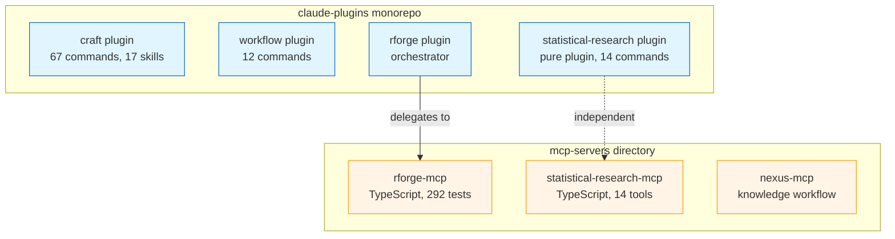
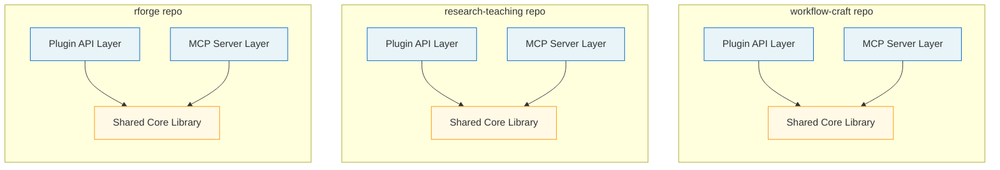
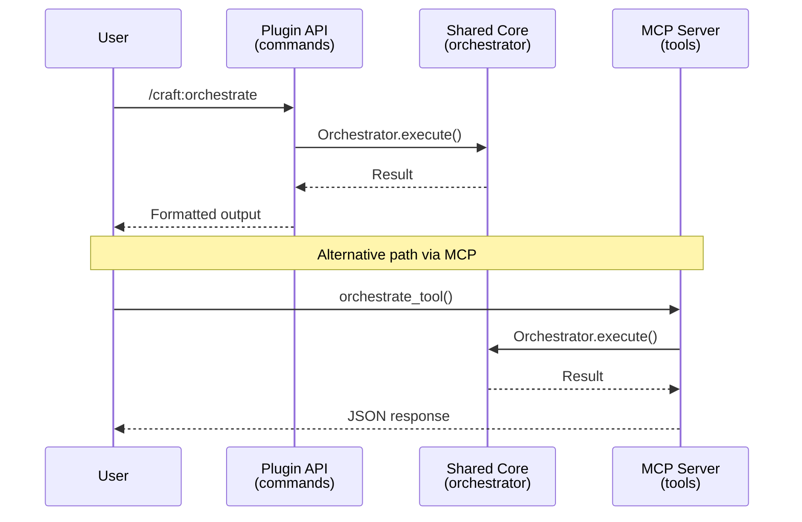
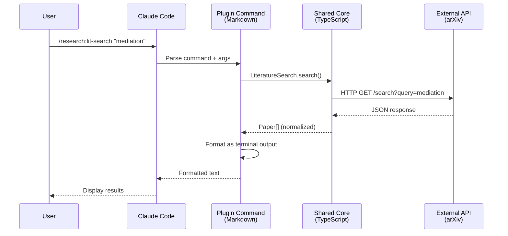
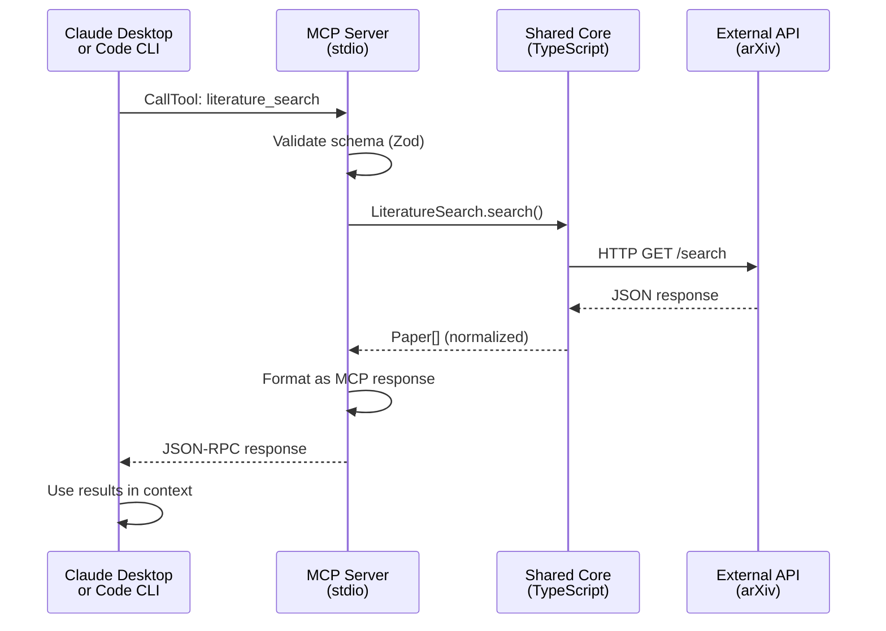
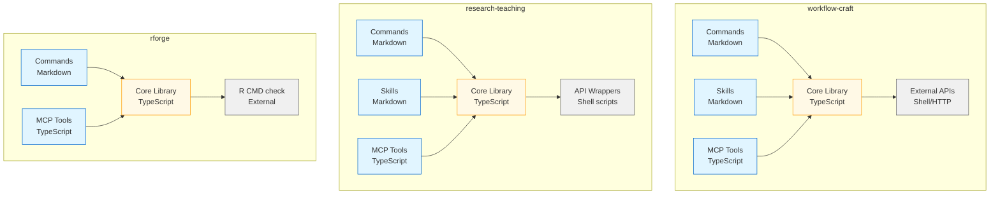
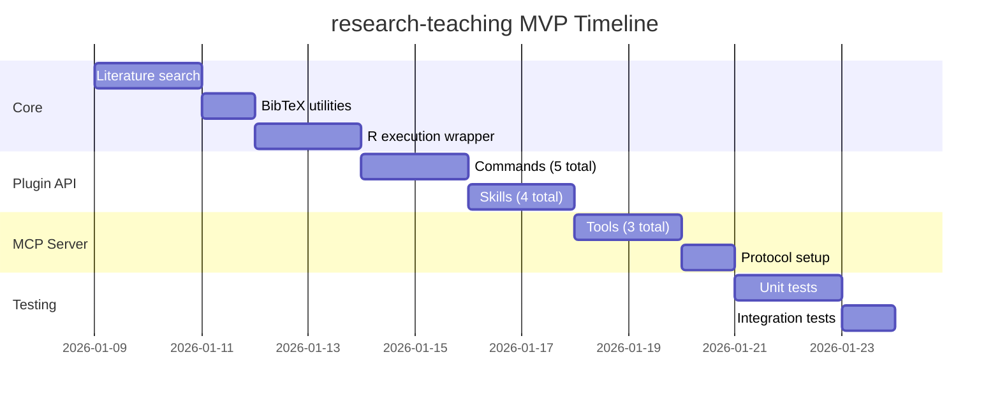
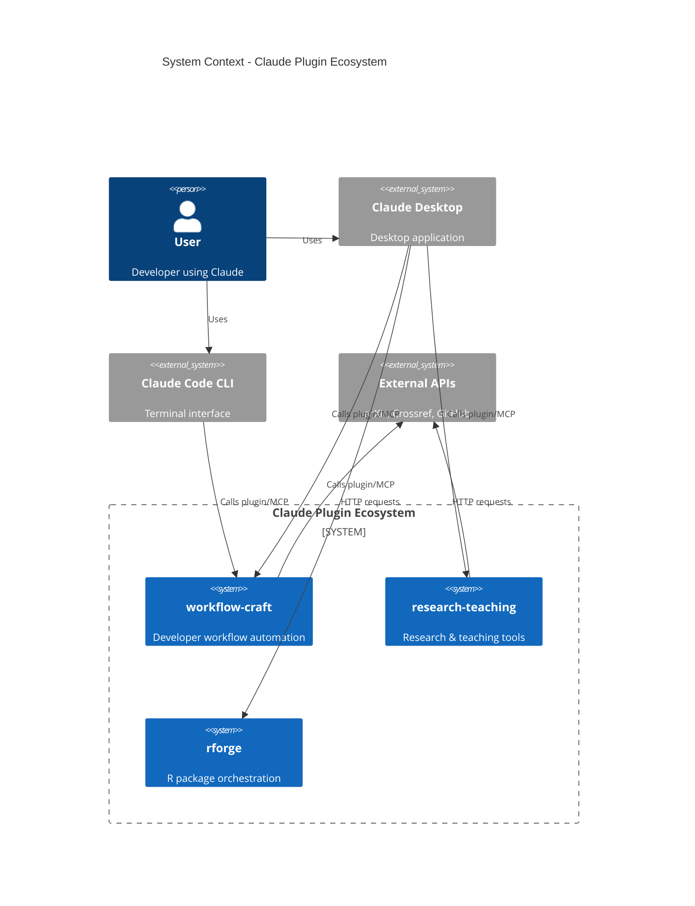
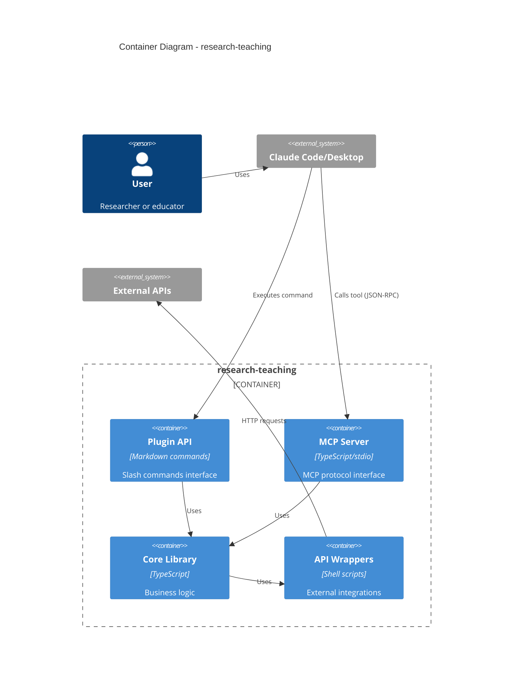

# Architecture Specification: Claude Plugins Reorganization

**Created:** 2026-01-08
**Author:** Backend System Architect
**Status:** Proposal
**Target:** Solo maintainer (DT) - Reduce maintenance burden

---

## Executive Summary

**Current State:** Monorepo with 4 plugins + separate MCP servers directory
**Proposed State:** 3 independent projects, each with Plugin API + MCP Server Protocol
**Primary Goal:** Reduce maintenance burden through clear boundaries and code reuse

**Proposed Structure:**
1. **workflow-craft** - Combined developer toolkit (single codebase with modules)
2. **research-teaching** - All research/teaching capabilities (MVP bootstrapped first)
3. **rforge** - Stays separate (R ecosystem orchestrator)

**Key Principle:** Each project is self-contained with both Claude Plugin interface AND MCP Server Protocol implementation.

---

## 1. Current State Analysis

### Existing Architecture



**Pain Points:**
- Two separate directories with independent lifecycles
- Configuration spread across multiple files
- Documentation drift between plugin and MCP
- Installation requires both plugin AND MCP server
- Unclear boundaries between components

### Current Integration Patterns

| Pattern | Used By | Description | Pros | Cons |
|---------|---------|-------------|------|------|
| **Orchestrator** | rforge | Plugin delegates to MCP via `mcp.call_tool()` | Clear separation | Two packages to maintain |
| **Pure Plugin** | statistical-research | Self-contained, shell-based APIs | Simple, portable | MCP server exists independently |
| **Standalone** | craft, workflow | No MCP dependency | Fast startup | Limited by plugin capabilities |

---

## 2. Proposed Architecture

### Target State



### Three Independent Projects

#### 1. workflow-craft (Combined Developer Toolkit)

**Scope:** All workflow and developer tools consolidated into single codebase
**Rationale:** Frequently used together, significant feature overlap, shared concerns

**Structure:**
```
workflow-craft/
├── .claude-plugin/
│   └── plugin.json              # Single plugin manifest
├── src/
│   ├── core/                    # Shared business logic
│   │   ├── orchestrator/        # Subagent orchestration (from craft)
│   │   ├── workflow-engine/     # Workflow state management
│   │   ├── mode-system/         # Mode resolution (default/debug/optimize)
│   │   ├── formatters/          # Output formatting (terminal/json/markdown)
│   │   ├── validation/          # Input validation, guards
│   │   └── utils/               # Logging, errors, config
│   ├── plugin-api/              # Claude Plugin Interface
│   │   ├── commands/
│   │   │   ├── workflow/        # brainstorm, spec-review, next, done
│   │   │   ├── craft/           # orchestrate, check, do, smart-help
│   │   │   ├── git/             # worktree, clean
│   │   │   ├── ci/              # generate, validate, detect
│   │   │   ├── test/            # cli-gen, cli-run, run
│   │   │   └── arch/            # analyze
│   │   ├── skills/              # Auto-activating skills
│   │   │   ├── orchestration/
│   │   │   └── workflows/
│   │   └── agents/              # Autonomous agents
│   ├── mcp-server/              # MCP Protocol Interface
│   │   ├── index.ts             # MCP server entry point
│   │   ├── tools/               # MCP tool implementations
│   │   │   ├── workflow-tools.ts
│   │   │   ├── orchestration-tools.ts
│   │   │   ├── git-tools.ts
│   │   │   └── ci-tools.ts
│   │   └── schemas/             # Tool schemas (Zod)
│   └── lib/                     # External integrations
│       ├── github/              # GitHub API wrapper
│       └── shell/               # Shell command execution
├── tests/
│   ├── unit/                    # Core logic tests
│   ├── integration/             # Plugin API tests
│   └── mcp/                     # MCP server tests
├── docs/
│   ├── plugin-guide.md
│   ├── mcp-guide.md
│   └── architecture.md
├── scripts/
│   ├── install-plugin.sh        # Install Claude plugin
│   ├── install-mcp.sh           # Install MCP server
│   └── install-all.sh           # Install both
├── package.json                 # Single package definition
├── tsconfig.json
└── README.md
```

**Module Boundaries:**

```typescript
// src/core/orchestrator/types.ts
export interface OrchestratorConfig {
  mode: 'default' | 'debug' | 'optimize' | 'release';
  format: 'terminal' | 'json' | 'markdown';
  maxSubagents?: number;
  timeout?: number;
}

// src/plugin-api/commands/craft/orchestrate.ts
import { Orchestrator } from '@/core/orchestrator';

export async function orchestrateCommand(args: string[]) {
  const orchestrator = new Orchestrator({ mode: 'default' });
  return orchestrator.execute(args);
}

// src/mcp-server/tools/orchestration-tools.ts
import { Orchestrator } from '@/core/orchestrator';

export const orchestrateTool = {
  name: 'orchestrate',
  description: 'Launch orchestrator with subagent delegation',
  schema: z.object({ /* ... */ }),
  handler: async (params) => {
    const orchestrator = new Orchestrator(params);
    return orchestrator.execute();
  }
};
```

**API Boundaries:**



#### 2. research-teaching (Research & Teaching Capabilities)

**Scope:** All statistical research, literature, manuscripts, courses, Zotero
**Bootstrap:** MVP first (core capabilities), then expand

**Structure:**
```
research-teaching/
├── .claude-plugin/
│   └── plugin.json
├── src/
│   ├── core/                    # Shared business logic
│   │   ├── literature/          # arXiv, Crossref, DOI lookup
│   │   ├── bibtex/              # BibTeX parsing, formatting
│   │   ├── zotero/              # Zotero API wrapper
│   │   ├── statistics/          # Statistical utilities
│   │   ├── r-execution/         # R code execution (safe)
│   │   └── utils/               # Common utilities
│   ├── plugin-api/
│   │   ├── commands/
│   │   │   ├── literature/      # lit-search, doi-lookup, bib-add
│   │   │   ├── manuscript/      # write-methods, write-results, reviewer
│   │   │   ├── simulation/      # sim-design, sim-analysis
│   │   │   ├── courses/         # syllabus, exam, homework, rubric
│   │   │   └── research/        # hypothesis, lit-gap, analysis-plan
│   │   └── skills/              # 17 A-grade skills
│   │       ├── mathematical/
│   │       ├── implementation/
│   │       ├── writing/
│   │       └── research/
│   ├── mcp-server/
│   │   ├── index.ts
│   │   ├── tools/
│   │   │   ├── literature-tools.ts
│   │   │   ├── r-execution-tools.ts
│   │   │   ├── zotero-tools.ts
│   │   │   └── courses-tools.ts
│   │   └── schemas/
│   └── lib/                     # API wrappers (pure shell-based)
│       ├── arxiv-api.sh
│       ├── crossref-api.sh
│       ├── bibtex-utils.sh
│       └── zotero-api.sh
├── tests/
├── docs/
├── scripts/
├── package.json
└── README.md
```

**MVP Bootstrap Priority:**

| Phase | Component | Lines | Reason |
|-------|-----------|-------|--------|
| **1** | Core literature tools | ~500 | Most used, well-defined APIs |
| **2** | BibTeX utilities | ~300 | Foundation for citations |
| **3** | R execution wrapper | ~400 | Enables statistical workflows |
| **4** | Manuscript skills | ~600 | High value, existing content |
| **5** | Course tools | ~400 | Teaching semester prep |
| **6** | Zotero integration | ~300 | Nice-to-have, can defer |

**Total MVP:** ~2,500 lines (1-2 weeks for solo maintainer)

#### 3. rforge (R Package Ecosystem)

**Scope:** R package orchestration, dependency management, CRAN workflows
**Rationale:** Distinct audience, mature codebase, already production-ready

**Structure:**
```
rforge/
├── .claude-plugin/
│   └── plugin.json
├── src/
│   ├── core/
│   │   ├── analyzer/            # R package analysis
│   │   ├── detector/            # Project structure detection
│   │   ├── dependency-graph/    # Dependency analysis
│   │   ├── cascade/             # Coordinated updates
│   │   ├── mode-system/         # Mode resolution
│   │   └── formatters/          # Output formatting
│   ├── plugin-api/
│   │   └── commands/
│   │       ├── analyze.md
│   │       ├── status.md
│   │       ├── detect.md
│   │       ├── cascade.md
│   │       ├── impact.md
│   │       ├── release.md
│   │       └── deps.md
│   ├── mcp-server/
│   │   ├── index.ts
│   │   ├── tools/               # 8 MCP tools
│   │   └── schemas/
│   └── lib/
│       ├── r-cmd-check/
│       └── package-parser/
├── tests/                       # 292 tests (already complete)
├── docs/
├── scripts/
└── package.json
```

**Note:** This project is DONE. Just refactor to new structure, preserve tests.

---

## 3. API Design

### Plugin API Layer

**Purpose:** Claude Code plugin interface (slash commands, skills, agents)

**Standards:**
- Markdown-based commands with YAML frontmatter
- Clear user-facing documentation
- Implementation in `<system>` blocks
- Follow-up action suggestions

**Example Command Structure:**
```markdown
---
name: research:lit-search
description: Search academic literature (arXiv, Crossref)
arguments:
  - name: query
    required: true
  - name: source
    required: false
    default: arxiv
---

# Literature Search

Search academic literature across multiple sources.

## Usage
```
/research:lit-search "causal mediation analysis" --source=arxiv
```

<system>
## Implementation

Delegates to core library:

```typescript
import { LiteratureSearch } from '@/core/literature';

const searcher = new LiteratureSearch({ source: 'arxiv' });
const results = await searcher.search(query);
return formatResults(results, 'terminal');
```

## Follow-up Actions
- Offer to add results to BibTeX
- Suggest related papers
- Propose lit review outline
</system>
```

### MCP Server Layer

**Purpose:** Model Context Protocol server interface (stdio, tools, resources)

**Standards:**
- TypeScript with Zod schemas
- JSON-RPC 2.0 protocol
- Tool-based architecture
- Stateless request handling

**Example Tool Definition:**
```typescript
// src/mcp-server/tools/literature-tools.ts
import { z } from 'zod';
import { LiteratureSearch } from '@/core/literature';

export const literatureSearchTool = {
  name: 'literature_search',
  description: 'Search academic literature across multiple sources',
  inputSchema: z.object({
    query: z.string().min(1).describe('Search query'),
    source: z.enum(['arxiv', 'crossref', 'pubmed']).default('arxiv'),
    limit: z.number().min(1).max(50).default(10),
    format: z.enum(['json', 'bibtex']).default('json')
  }),
  handler: async (params: z.infer<typeof inputSchema>) => {
    const searcher = new LiteratureSearch({ source: params.source });
    const results = await searcher.search(params.query, params.limit);

    return {
      content: [
        {
          type: 'text',
          text: JSON.stringify(results, null, 2)
        }
      ]
    };
  }
};
```

**MCP Server Entry Point:**
```typescript
// src/mcp-server/index.ts
import { Server } from '@modelcontextprotocol/sdk/server/index.js';
import { StdioServerTransport } from '@modelcontextprotocol/sdk/server/stdio.js';
import { literatureSearchTool } from './tools/literature-tools.js';
import { rExecutionTool } from './tools/r-execution-tools.js';

const server = new Server(
  {
    name: 'research-teaching',
    version: '1.0.0',
  },
  {
    capabilities: {
      tools: {},
    },
  }
);

// Register tools
server.setRequestHandler(ListToolsRequestSchema, async () => ({
  tools: [
    literatureSearchTool,
    rExecutionTool,
    // ... more tools
  ]
}));

server.setRequestHandler(CallToolRequestSchema, async (request) => {
  const tool = findTool(request.params.name);
  if (!tool) throw new Error(`Tool not found: ${request.params.name}`);

  return await tool.handler(request.params.arguments);
});

// Start server
const transport = new StdioServerTransport();
await server.connect(transport);
```

### Shared Core Library

**Purpose:** Business logic reused by both Plugin API and MCP Server

**Design Principles:**
1. **Framework-agnostic:** No plugin or MCP dependencies
2. **Pure functions preferred:** Easier to test and reason about
3. **Dependency injection:** External services injected via constructor
4. **Type-safe:** Full TypeScript with strict mode
5. **Error handling:** Throw typed errors, let layers handle presentation

**Example Core Module:**
```typescript
// src/core/literature/searcher.ts
export interface LiteratureSearchOptions {
  source: 'arxiv' | 'crossref' | 'pubmed';
  cache?: boolean;
}

export interface Paper {
  id: string;
  title: string;
  authors: string[];
  abstract: string;
  published: Date;
  url: string;
  doi?: string;
}

export class LiteratureSearch {
  constructor(
    private options: LiteratureSearchOptions,
    private apiWrapper: ArxivAPI | CrossrefAPI
  ) {}

  async search(query: string, limit: number = 10): Promise<Paper[]> {
    // Business logic (no presentation concerns)
    const results = await this.apiWrapper.search(query, limit);
    return results.map(r => this.normalize(r));
  }

  private normalize(raw: any): Paper {
    // Transform API response to domain model
  }
}
```

---

## 4. Data Flow & Integration Patterns

### Pattern 1: User via Plugin Command



### Pattern 2: Claude via MCP Tool



### Pattern 3: Plugin delegates to MCP (Orchestrator Pattern)

**Note:** This pattern is DEPRECATED in the new architecture. Instead, both Plugin and MCP use shared core.

**Old Pattern (rforge currently):**
```
Plugin Command → MCP Tool (via IPC) → Core Logic
```

**New Pattern:**
```
Plugin Command → Shared Core ← MCP Tool
```

**Rationale:** Eliminates IPC overhead, simplifies testing, reduces latency.

---

## 5. Module Dependency Graph



**Dependency Rules:**
1. **Interface layers** (commands, skills, MCP tools) depend on **core**
2. **Core** depends on **external APIs** only
3. **Interface layers NEVER import from each other** (prevents coupling)
4. **Core is pure TypeScript** (no plugin or MCP SDK dependencies)

---

## 6. Configuration & State Management

### Project-Level Configuration

**File:** `.claude-plugin/config.json` (each project)

```json
{
  "plugin": {
    "name": "research-teaching",
    "version": "1.0.0",
    "description": "Statistical research and teaching workflows"
  },
  "mcp": {
    "name": "research-teaching-mcp",
    "version": "1.0.0",
    "command": "npx",
    "args": ["research-teaching-mcp"]
  },
  "defaults": {
    "mode": "default",
    "format": "terminal"
  }
}
```

### User Configuration

**File:** `~/.claude/settings.json` (Claude Desktop)

```json
{
  "mcpServers": {
    "research-teaching": {
      "command": "npx",
      "args": ["research-teaching-mcp"]
    },
    "workflow-craft": {
      "command": "npx",
      "args": ["workflow-craft-mcp"]
    },
    "rforge": {
      "command": "npx",
      "args": ["rforge-mcp"]
    }
  }
}
```

**Auto-Generated:** Installation scripts update this file automatically.

### State Management

**Principle:** Stateless by default, optional state via filesystem

**State Storage Locations:**

| State Type | Location | Format | Persistence |
|------------|----------|--------|-------------|
| Session state | `~/.claude/sessions/<session-id>.json` | JSON | Temporary |
| User preferences | `~/.claude/plugins/<plugin>/config.json` | JSON | Permanent |
| Cache | `~/.cache/claude-plugins/<plugin>/` | Various | TTL-based |
| Logs | `~/.cache/claude-plugins/<plugin>/logs/` | JSONL | Rotated |

**Example Session State:**
```json
{
  "sessionId": "abc-123",
  "plugin": "research-teaching",
  "startTime": "2026-01-08T10:00:00Z",
  "lastCommand": "lit-search",
  "context": {
    "currentPaper": "arxiv:2501.12345",
    "bibtexFile": "/path/to/references.bib"
  }
}
```

---

## 7. Testing Strategy

### Test Pyramid

```
          ╱╲
         ╱  ╲
        ╱ E2E╲         10% - Full workflows (plugin + MCP + external)
       ╱______╲
      ╱        ╲
     ╱Integration╲     30% - API boundaries (plugin → core, MCP → core)
    ╱____________╲
   ╱              ╲
  ╱   Unit Tests   ╲   60% - Core logic (pure functions, business rules)
 ╱__________________╲
```

### Test Organization

```
tests/
├── unit/                        # Fast, isolated tests
│   ├── core/
│   │   ├── literature.test.ts   # LiteratureSearch class tests
│   │   ├── bibtex.test.ts       # BibTeX parsing tests
│   │   └── formatters.test.ts   # Output formatting tests
│   └── lib/
│       └── arxiv-api.test.ts    # API wrapper tests (mocked)
├── integration/                 # Slower, tests boundaries
│   ├── plugin-api/
│   │   ├── commands.test.ts     # Command → Core integration
│   │   └── skills.test.ts       # Skill activation tests
│   └── mcp-server/
│       ├── tools.test.ts        # MCP Tool → Core integration
│       └── protocol.test.ts     # MCP protocol compliance
└── e2e/                         # Slowest, full workflows
    ├── lit-search-workflow.test.ts
    └── manuscript-workflow.test.ts
```

### Test Standards

**Unit Tests:**
```typescript
// tests/unit/core/literature.test.ts
import { describe, it, expect } from 'bun:test';
import { LiteratureSearch } from '@/core/literature';

describe('LiteratureSearch', () => {
  it('normalizes arXiv results', async () => {
    const mockAPI = {
      search: () => Promise.resolve([/* mock data */])
    };
    const searcher = new LiteratureSearch({ source: 'arxiv' }, mockAPI);

    const results = await searcher.search('mediation', 10);

    expect(results).toHaveLength(10);
    expect(results[0]).toHaveProperty('doi');
  });
});
```

**Integration Tests:**
```typescript
// tests/integration/mcp-server/tools.test.ts
import { describe, it, expect } from 'bun:test';
import { server } from '@/mcp-server';

describe('MCP Tools', () => {
  it('literature_search tool returns valid papers', async () => {
    const response = await server.callTool({
      name: 'literature_search',
      arguments: { query: 'mediation', source: 'arxiv', limit: 5 }
    });

    expect(response.content[0].type).toBe('text');
    const papers = JSON.parse(response.content[0].text);
    expect(papers).toHaveLength(5);
  });
});
```

**E2E Tests:**
```typescript
// tests/e2e/lit-search-workflow.test.ts
import { describe, it, expect } from 'bun:test';
import { executeCommand } from '@/test-utils';

describe('Literature Search Workflow', () => {
  it('searches arXiv and adds to BibTeX', async () => {
    // Execute plugin command
    const searchResult = await executeCommand(
      '/research:lit-search "causal mediation"'
    );
    expect(searchResult).toContain('Found 10 papers');

    // Add to BibTeX
    const addResult = await executeCommand(
      '/research:bib-add --paper=arxiv:2501.12345 --file=refs.bib'
    );
    expect(addResult).toContain('Added to refs.bib');

    // Verify BibTeX file
    const bibtex = await readFile('refs.bib');
    expect(bibtex).toContain('@article{');
  });
});
```

### Coverage Targets

| Layer | Target | Reason |
|-------|--------|--------|
| Core | 90%+ | Business logic must be robust |
| Plugin API | 70%+ | Commands are thin wrappers |
| MCP Server | 80%+ | Protocol compliance critical |
| Overall | 85%+ | Production-ready standard |

---

## 8. Migration Strategy

### Phase 1: Prepare (1-2 days)

**Goals:** Set up new repositories, create scaffolding

1. **Create repositories:**
```bash
mkdir -p ~/projects/dev-tools/{workflow-craft,research-teaching,rforge-new}
cd ~/projects/dev-tools/workflow-craft
git init
gh repo create Data-Wise/workflow-craft --public --source=. --remote=origin
```

2. **Set up project structure:**
```bash
# Use project template script
./scripts/create-project-scaffold.sh workflow-craft
./scripts/create-project-scaffold.sh research-teaching
```

3. **Initialize package.json:**
```json
{
  "name": "@data-wise/workflow-craft",
  "version": "1.0.0",
  "type": "module",
  "exports": {
    "./plugin": "./dist/plugin-api/index.js",
    "./mcp": "./dist/mcp-server/index.js",
    "./core": "./dist/core/index.js"
  },
  "bin": {
    "workflow-craft-mcp": "./dist/mcp-server/index.js"
  }
}
```

### Phase 2: Bootstrap research-teaching MVP (1-2 weeks)

**Goals:** Create minimal viable product first (learn from implementation)

**Why MVP First:**
- Validate architecture with real code
- Identify pain points early
- Establish patterns for other projects
- Reduce risk (smaller scope)

**MVP Scope:**
1. Core literature tools (arXiv, Crossref)
2. BibTeX utilities (parse, format, add)
3. 5 plugin commands (lit-search, doi-lookup, bib-add, bib-search, arxiv)
4. 3 MCP tools (literature_search, r_execute, bibtex_format)
5. 4 key skills (literature-review, proof-verification, code-implementation, manuscript-writing)

**Implementation Order:**



**Validation Criteria:**
- All 5 commands work via `/research:*`
- All 3 MCP tools work via Claude Desktop
- 85%+ test coverage
- Documentation complete

### Phase 3: Migrate workflow-craft (1 week)

**Goals:** Consolidate craft + workflow into single project

**Steps:**

1. **Copy shared code to core/:**
```bash
# Orchestrator from craft
cp -r claude-plugins/craft/lib/orchestrator workflow-craft/src/core/

# Workflow engine from workflow
cp -r claude-plugins/workflow/lib/workflow-engine workflow-craft/src/core/
```

2. **Migrate commands:**
```bash
# Copy all command files
cp -r claude-plugins/craft/commands/* workflow-craft/src/plugin-api/commands/craft/
cp -r claude-plugins/workflow/commands/* workflow-craft/src/plugin-api/commands/workflow/
```

3. **Create MCP tools:**
```bash
# New MCP server implementation
# Wrap core orchestrator and workflow-engine
```

4. **Update imports:**
```typescript
// Old (craft plugin)
import { orchestrator } from '../lib/orchestrator';

// New (workflow-craft)
import { Orchestrator } from '@/core/orchestrator';
```

5. **Run tests:**
```bash
bun test
# Fix broken tests, update mocks
```

### Phase 4: Migrate rforge (2-3 days)

**Goals:** Refactor existing production-ready code to new structure

**Note:** rforge is DONE. 292 tests passing. Just reorganize.

**Steps:**

1. **Copy existing code:**
```bash
cp -r mcp-servers/rforge/src/* rforge-new/src/core/
cp -r mcp-servers/rforge/tests/* rforge-new/tests/
```

2. **Split MCP and Core:**
```bash
# Separate MCP entry point from core logic
mv rforge-new/src/core/index.ts rforge-new/src/mcp-server/
mv rforge-new/src/core/tools/* rforge-new/src/mcp-server/tools/
```

3. **Add plugin API:**
```bash
cp -r claude-plugins/rforge/commands/* rforge-new/src/plugin-api/commands/
```

4. **Update exports:**
```typescript
// rforge-new/src/core/index.ts
export * from './analyzer';
export * from './detector';
export * from './dependency-graph';
```

5. **Verify tests still pass:**
```bash
cd rforge-new
bun test
# Should see: 292 tests passing
```

### Phase 5: Expand research-teaching (2-3 weeks)

**Goals:** Add remaining features from statistical-research plugin

**Post-MVP Additions:**
1. Remaining commands (9 more: manuscript-*, simulation-*, research-*)
2. Remaining skills (13 more: advanced proofs, simulations, methods)
3. Zotero integration
4. Course tools (syllabus, exam, homework, rubric)

**Incremental Rollout:**
```bash
# Week 1: Manuscript tools
# Week 2: Simulation + research tools
# Week 3: Course tools + Zotero
```

### Phase 6: Cleanup & Archive (1 day)

**Goals:** Archive old monorepo, update documentation

1. **Archive monorepo:**
```bash
cd ~/projects/dev-tools/claude-plugins
git tag archive/monorepo-final
git push origin archive/monorepo-final

# Add deprecation notice
echo "DEPRECATED: Moved to separate repositories" > DEPRECATED.md
```

2. **Update documentation:**
```bash
# Add migration guide to each new repo
./scripts/generate-migration-guide.sh > MIGRATION.md
```

3. **Update installation instructions:**
```bash
# Old
npm install -g @data-wise/rforge-plugin
# Install MCP separately

# New
npm install -g @data-wise/rforge  # Includes both plugin + MCP
```

---

## 9. Trade-off Analysis

### Decision 1: Monorepo → Multi-Repo

| Aspect | Monorepo (Current) | Multi-Repo (Proposed) | Winner |
|--------|-------------------|----------------------|--------|
| **Maintenance** | Single CI/CD, shared tooling | 3 separate CI/CD configs | Monorepo |
| **Versioning** | Coordinated releases | Independent releases | Multi-repo |
| **Discoverability** | Suite-first | Project-first | Multi-repo |
| **Code Sharing** | Easy (local imports) | Harder (npm dependencies) | Monorepo |
| **Onboarding** | Large surface area | Smaller, focused projects | Multi-repo |
| **Breaking Changes** | Cross-plugin impact | Isolated impact | Multi-repo |

**Verdict:** Multi-repo wins for solo maintainer (clear boundaries, independent lifecycles)

### Decision 2: Plugin + MCP Separation → Unified Project

| Aspect | Separate (Current) | Unified (Proposed) | Winner |
|--------|-------------------|-------------------|--------|
| **Installation** | Two packages | One package | Unified |
| **Documentation** | Drift risk | Single source of truth | Unified |
| **Configuration** | Spread across files | Centralized | Unified |
| **Code Reuse** | Duplicate logic | Shared core | Unified |
| **Testing** | Two test suites | Unified test suite | Unified |
| **MCP Independence** | Can use MCP alone | Bundled with plugin | Separate |

**Verdict:** Unified wins for maintainability (DT's primary goal)

### Decision 3: workflow + craft Merge → Separate

| Aspect | Merged (Proposed) | Separate | Winner |
|--------|------------------|----------|--------|
| **Maintenance** | Single codebase | Two codebases | Merged |
| **Feature Overlap** | High (orchestration, git, ci) | N/A | Merged |
| **User Perception** | Unified toolkit | Specialized tools | Depends |
| **Installation** | One command | Two commands | Merged |
| **Complexity** | Larger project | Smaller projects | Separate |

**Verdict:** Merged wins (reduces maintenance, acknowledges overlap)

### Decision 4: MVP Bootstrap → Full Migration

| Aspect | MVP First (Proposed) | Full Migration | Winner |
|--------|---------------------|----------------|--------|
| **Risk** | Low (validate early) | High (big bang) | MVP |
| **Time to Value** | 1-2 weeks | 6-8 weeks | MVP |
| **Learning** | Iterative | Late feedback | MVP |
| **Parallelization** | Sequential | Could be parallel | Full |
| **Motivation** | Quick wins | Long slog | MVP |

**Verdict:** MVP wins (ADHD-friendly, reduces risk for solo maintainer)

---

## 10. Scalability Considerations

### Adding New Features

**Scenario:** Add "PDF annotation" feature to research-teaching

**Steps:**
1. Create core module: `src/core/pdf-annotation/annotator.ts`
2. Add plugin command: `src/plugin-api/commands/literature/annotate-pdf.md`
3. Add MCP tool: `src/mcp-server/tools/pdf-tools.ts`
4. Write tests: `tests/unit/core/pdf-annotation.test.ts`
5. Update docs: `docs/features/pdf-annotation.md`

**Estimated Effort:** 4-8 hours (clear patterns established)

### Adding New Projects

**Scenario:** Create "data-analysis" project (Python-focused)

**Steps:**
1. Clone template: `./scripts/create-project-scaffold.sh data-analysis`
2. Define core modules: pandas wrappers, visualization, stats
3. Create plugin commands: `/data:*`
4. Create MCP tools: `data_*`
5. Publish: `npm publish @data-wise/data-analysis`

**Estimated Effort:** 2-4 weeks (following established patterns)

### Supporting Multiple Languages

**Current:** TypeScript + Shell + R
**Future:** Python, Rust, Go?

**Strategy:**
- Core stays TypeScript (Node.js ecosystem well-established for MCP)
- Language-specific wrappers in `src/lib/`
- Use child processes for external runtimes
- Keep subprocess communication minimal (JSON over stdio)

**Example:**
```typescript
// src/core/python-executor/executor.ts
import { spawn } from 'child_process';

export class PythonExecutor {
  async execute(code: string): Promise<any> {
    const proc = spawn('python3', ['-c', code]);
    // Handle stdout/stderr
  }
}
```

---

## 11. Documentation Architecture

### Per-Project Documentation

```
docs/
├── README.md                    # Project overview
├── getting-started.md           # Installation + quick start
├── plugin-guide.md              # Using via Claude Code
├── mcp-guide.md                 # Using via MCP protocol
├── architecture.md              # System design (this doc)
├── api-reference/               # Generated API docs
│   ├── plugin-commands.md
│   ├── mcp-tools.md
│   └── core-modules.md
├── guides/
│   ├── common-workflows.md
│   ├── troubleshooting.md
│   └── contributing.md
└── examples/
    ├── literature-search.md
    ├── manuscript-workflow.md
    └── course-creation.md
```

### Cross-Project Documentation

**Location:** `~/projects/dev-tools/claude-ecosystem/` (NEW)

**Purpose:** Umbrella documentation site for all projects

```
claude-ecosystem/
├── docs/
│   ├── index.md                 # Overview of all projects
│   ├── choosing-a-tool.md       # Decision guide
│   ├── installation.md          # Install all tools
│   └── projects/
│       ├── workflow-craft.md
│       ├── research-teaching.md
│       └── rforge.md
└── mkdocs.yml
```

**Deployment:** `data-wise.github.io/claude-ecosystem/`

---

## 12. Deployment & Release Strategy

### Versioning

**Semantic Versioning:** `MAJOR.MINOR.PATCH`

- **MAJOR:** Breaking changes (API incompatible)
- **MINOR:** New features (backward compatible)
- **PATCH:** Bug fixes

**Independent Versioning:**
- workflow-craft: v1.x.x
- research-teaching: v1.x.x
- rforge: v1.x.x (already at v1.1.0)

### Release Process

```bash
# 1. Update version in package.json
npm version minor  # Or major/patch

# 2. Build distributions
npm run build

# 3. Run tests
npm test

# 4. Create git tag
git tag v1.2.0
git push origin v1.2.0

# 5. Publish to npm
npm publish --access public

# 6. Create GitHub release
gh release create v1.2.0 --generate-notes
```

### CI/CD

**GitHub Actions workflows:**

```yaml
# .github/workflows/ci.yml
name: CI
on: [push, pull_request]
jobs:
  test:
    runs-on: ubuntu-latest
    steps:
      - uses: actions/checkout@v3
      - uses: oven-sh/setup-bun@v1
      - run: bun install
      - run: bun test
      - run: bun run build

  publish:
    if: startsWith(github.ref, 'refs/tags/v')
    needs: test
    runs-on: ubuntu-latest
    steps:
      - uses: actions/checkout@v3
      - uses: actions/setup-node@v3
      - run: npm publish --access public
```

### Distribution Channels

| Channel | Target Users | Update Frequency |
|---------|-------------|------------------|
| **npm** | Primary (developers) | Every release |
| **Homebrew** | macOS users (DT's tap) | Manual sync |
| **GitHub Releases** | All users | Every release |
| **Documentation Site** | All users | On main push |

---

## 13. Tooling & Development Workflow

### Development Setup

```bash
# Clone repository
git clone https://github.com/Data-Wise/research-teaching.git
cd research-teaching

# Install dependencies
bun install

# Run in development mode (watch + rebuild)
bun dev

# Run tests (watch mode)
bun test --watch

# Type check
bun run typecheck

# Build for production
bun run build
```

### Project Scripts

```json
{
  "scripts": {
    "dev": "bun --watch run src/mcp-server/index.ts",
    "build": "bun build src/mcp-server/index.ts --outdir dist --target node --minify",
    "test": "bun test",
    "test:unit": "bun test tests/unit",
    "test:integration": "bun test tests/integration",
    "test:e2e": "bun test tests/e2e",
    "typecheck": "tsc --noEmit",
    "lint": "bunx @biomejs/biome check src",
    "format": "bunx @biomejs/biome format --write src",
    "install:plugin": "./scripts/install-plugin.sh",
    "install:mcp": "./scripts/install-mcp.sh",
    "install:all": "./scripts/install-all.sh",
    "inspect": "npx @modelcontextprotocol/inspector bun dist/mcp-server/index.js"
  }
}
```

### Recommended Tools

| Tool | Purpose | Why |
|------|---------|-----|
| **Bun** | Runtime + test | Fast, TypeScript native |
| **Biome** | Linter + formatter | Fast, zero-config |
| **Zod** | Schema validation | Type-safe, MCP standard |
| **MCP Inspector** | MCP debugging | Official Anthropic tool |
| **TypeScript** | Type safety | Catch errors early |

---

## 14. Success Metrics

### Implementation Success

**Phase 1 (MVP) Success Criteria:**
- [ ] research-teaching MVP works (5 commands, 3 tools, 4 skills)
- [ ] 85%+ test coverage
- [ ] Documentation complete
- [ ] Both plugin and MCP interfaces functional
- [ ] Zero breaking changes for end users

**Phase 3 (workflow-craft) Success Criteria:**
- [ ] All craft + workflow commands migrated
- [ ] Orchestrator working
- [ ] Git worktree workflows functional
- [ ] CI/CD passing

**Phase 4 (rforge) Success Criteria:**
- [ ] 292 tests still passing
- [ ] No performance regression
- [ ] Mode system working
- [ ] Format options working

### Maintenance Success

**6 Months After Migration:**
- [ ] Reduced cognitive load (easier to context switch)
- [ ] Faster feature additions (clear patterns)
- [ ] Independent release cycles (no coordination overhead)
- [ ] Lower bug count (clear boundaries)
- [ ] Documentation stays in sync (single source of truth)

### User Success

**End User Perspective:**
- [ ] Simpler installation (one command per project)
- [ ] Clearer documentation (project-focused)
- [ ] Faster bug fixes (isolated codebases)
- [ ] Better feature discovery (project websites)

---

## 15. Risk Mitigation

### Risk 1: Breaking Changes During Migration

**Mitigation:**
- Keep old monorepo functional during migration
- Publish new projects under new npm scope: `@data-wise/workflow-craft` (vs old `@data-wise/craft-plugin`)
- Provide migration guide with side-by-side comparison
- Deprecate old packages gradually (6-month sunset)

### Risk 2: Code Duplication

**Mitigation:**
- Create shared utilities package: `@data-wise/plugin-core` (if needed)
- Extract common patterns (mode system, formatters) to npm package
- Use git submodules for truly shared code (e.g., test utilities)

### Risk 3: Documentation Drift

**Mitigation:**
- Single source of truth per project
- Auto-generate API docs from code (TypeDoc)
- CI/CD checks for broken links
- Monthly documentation review (calendar reminder)

### Risk 4: Testing Overhead

**Mitigation:**
- Shared test utilities package
- Template tests (copy/paste for new features)
- CI/CD runs all tests automatically
- Fail fast on test failures (block PRs)

---

## 16. Future Enhancements

### Post-Migration Improvements

1. **Shared Core Package** (Optional)
   - Extract mode system, formatters, validation
   - Publish as `@data-wise/plugin-core`
   - Use in all three projects

2. **CLI Generator** (Nice-to-have)
   - `npx create-claude-plugin my-plugin`
   - Scaffolds new project with best practices
   - Includes tests, docs, CI/CD

3. **Plugin Registry** (Long-term)
   - Central discovery: `data-wise.github.io/plugins`
   - Auto-updated from GitHub releases
   - Search/filter by capabilities

4. **Cross-Plugin Communication** (If needed)
   - Standardized event bus
   - Plugins can subscribe to events
   - Example: "paper added to BibTeX" → "update Obsidian note"

---

## 17. Recommended Next Steps

### This Week (January 8-12, 2026)

1. **Create research-teaching repository** (1 hour)
2. **Set up project scaffold** (2 hours)
3. **Implement literature search core** (4 hours)
4. **Add first plugin command** (2 hours)
5. **Add first MCP tool** (2 hours)
6. **Write initial tests** (4 hours)

**Total:** ~15 hours → **MVP by end of week**

### Next Week (January 13-19, 2026)

1. **Complete research-teaching MVP** (remaining features)
2. **Test with real workflows** (literature search → BibTeX → manuscript)
3. **Document patterns learned**
4. **Start workflow-craft migration** (using MVP as template)

### Week 3-4 (January 20-31, 2026)

1. **Complete workflow-craft migration**
2. **Migrate rforge** (should be fast, code is done)
3. **Archive old monorepo**
4. **Update all documentation**

**Total Migration Timeline:** ~4 weeks

---

## Appendix A: File Structure Templates

### Research-Teaching Project Template

```
research-teaching/
├── .claude-plugin/
│   ├── plugin.json
│   └── config.json
├── src/
│   ├── core/
│   │   ├── index.ts
│   │   ├── literature/
│   │   │   ├── index.ts
│   │   │   ├── searcher.ts
│   │   │   ├── normalizer.ts
│   │   │   └── types.ts
│   │   ├── bibtex/
│   │   │   ├── index.ts
│   │   │   ├── parser.ts
│   │   │   ├── formatter.ts
│   │   │   └── types.ts
│   │   └── utils/
│   │       ├── logger.ts
│   │       ├── errors.ts
│   │       └── config.ts
│   ├── plugin-api/
│   │   ├── commands/
│   │   │   ├── literature/
│   │   │   │   ├── lit-search.md
│   │   │   │   ├── doi-lookup.md
│   │   │   │   └── arxiv.md
│   │   │   └── bibtex/
│   │   │       ├── bib-add.md
│   │   │       └── bib-search.md
│   │   └── skills/
│   │       ├── literature-review.md
│   │       ├── proof-verification.md
│   │       └── manuscript-writing.md
│   ├── mcp-server/
│   │   ├── index.ts
│   │   ├── tools/
│   │   │   ├── literature-tools.ts
│   │   │   ├── bibtex-tools.ts
│   │   │   └── r-tools.ts
│   │   └── schemas/
│   │       └── literature-schema.ts
│   └── lib/
│       ├── arxiv-api.sh
│       ├── crossref-api.sh
│       └── bibtex-utils.sh
├── tests/
│   ├── unit/
│   ├── integration/
│   └── e2e/
├── docs/
│   ├── README.md
│   ├── getting-started.md
│   ├── plugin-guide.md
│   ├── mcp-guide.md
│   └── architecture.md
├── scripts/
│   ├── install-plugin.sh
│   ├── install-mcp.sh
│   └── install-all.sh
├── package.json
├── tsconfig.json
├── .gitignore
├── LICENSE
└── README.md
```

---

## Appendix B: Component Diagrams

### System Context Diagram



### Container Diagram (research-teaching)



---

## Appendix C: Technology Stack

| Layer | Technology | Version | Reason |
|-------|-----------|---------|--------|
| **Runtime** | Bun | 1.x | Fast, TypeScript native, built-in test runner |
| **Language** | TypeScript | 5.x | Type safety, better tooling |
| **MCP SDK** | @modelcontextprotocol/sdk | 1.x | Official Anthropic SDK |
| **Schema Validation** | Zod | 3.x | Type-safe validation, MCP standard |
| **Testing** | Bun Test | Built-in | Fast, zero-config |
| **Linting** | Biome | 1.x | Fast, zero-config |
| **Build** | Bun | Built-in | Fast builds, minification |
| **Shell Scripts** | Bash | 5.x | Portable, simple APIs |
| **R Execution** | R | 4.x | Statistical computing |

---

**End of Architecture Specification**

**Next Action:** Review with DT → Approve → Begin Phase 1 (research-teaching MVP)
