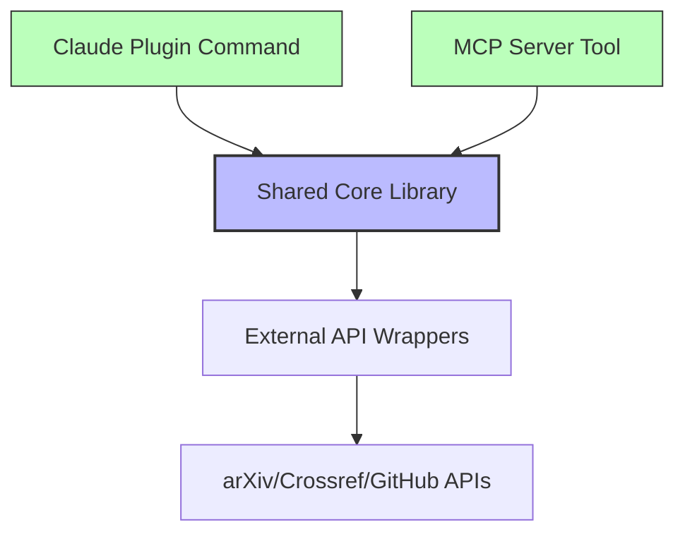
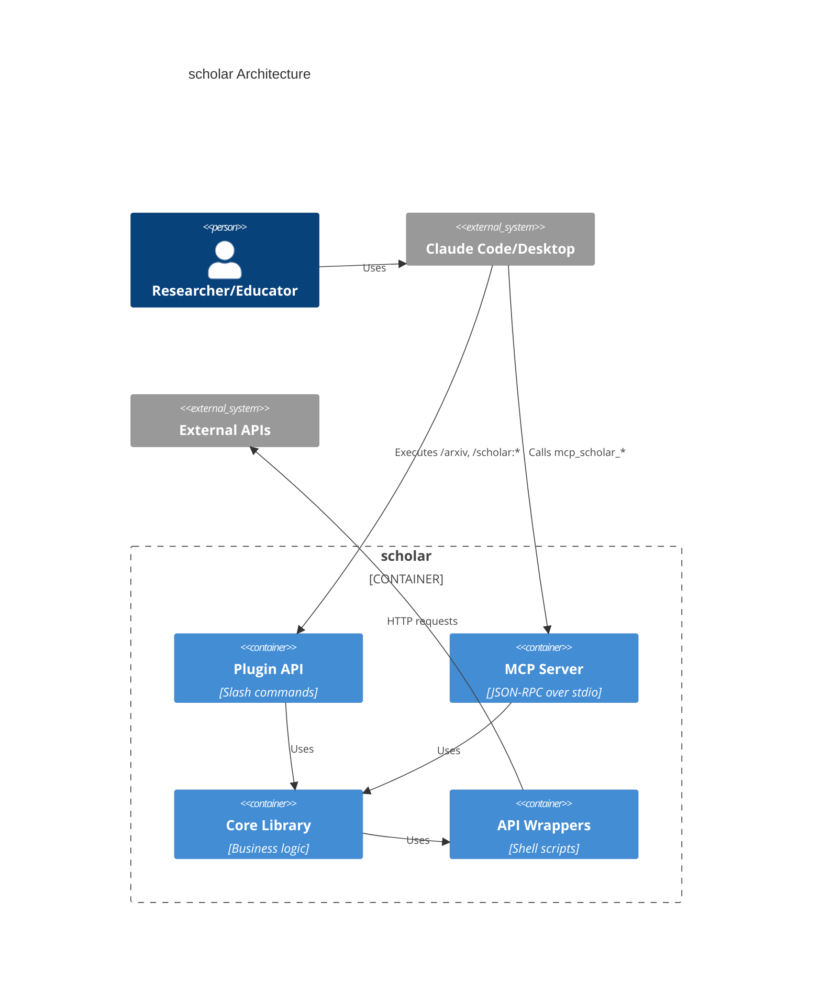
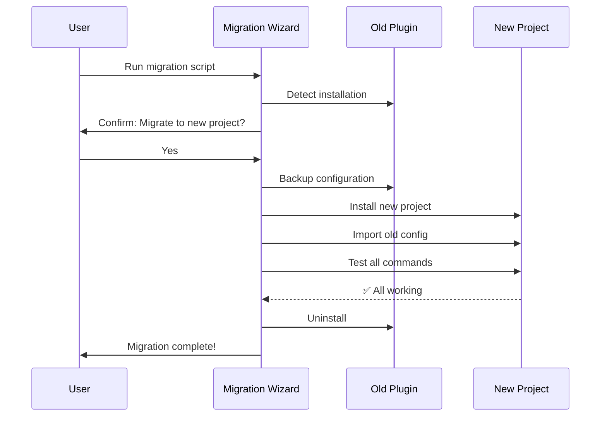

# SPEC: Project Reorganization - Independent Multi-API Projects

**Created:** 2026-01-08
**Status:** Draft - Ready for Review
**Type:** Full Spec (Architecture + Product Strategy + Implementation Plan)
**From Brainstorm:** `/brainstorm max feat save` session

---

## Executive Summary

Reorganize claude-plugins monorepo into 3 independent projects, each with dual APIs (Claude Plugin + MCP Server), to **reduce maintenance burden by 40-50%** while improving clarity for users.

**Key Changes:**
1. **craft** - Merge workflow into craft (keeps existing brand, adds ADHD features)
2. **scholar** - New unified academic project (research + teaching workflows)
3. **rforge** - Remains independent (production-ready, no changes)

**Timeline:** 4 weeks
**Primary Beneficiary:** DT (maintainer) - reduce maintenance overhead
**User Impact:** Minimal (guided migration wizard)

---

## Table of Contents

1. [Overview](#overview)
2. [User Stories](#user-stories)
3. [Technical Requirements](#technical-requirements)
   - [Architecture](#architecture)
   - [API Design](#api-design)
   - [Data Models](#data-models)
   - [Dependencies](#dependencies)
4. [UI/UX Specifications](#uiux-specifications)
5. [Open Questions](#open-questions)
6. [Review Checklist](#review-checklist)
7. [Implementation Notes](#implementation-notes)
8. [History](#history)

---

## 1. Overview

### Current State

**Pain Points:**
- 4 separate plugins with overlapping concerns
- Configuration spread across multiple files
- Weekly cross-plugin synchronization overhead
- ~266 hours/year maintenance burden

**Existing Structure:**
```
claude-plugins/ (Monorepo)
├── craft (v1.16.0) - 74 commands, full-stack toolkit
├── workflow (v2.3.0) - 12 commands, ADHD-friendly
├── rforge - R package orchestrator
└── statistical-research (v1.1.0) - 14 commands, 17 skills
```

### Proposed State

**3 Independent Projects:**

```
craft/
├── Core: Developer productivity + ADHD workflows
├── Commands: 86 total (74 existing craft + 12 from workflow)
├── APIs: Claude Plugin + MCP Server
└── Target: Developers with focus challenges

scholar/
├── Core: Academic workflow automation
├── Commands: 17 (14 research + 3 teaching MVP)
├── APIs: Claude Plugin + MCP Server
└── Target: Researchers and educators

rforge/
├── Core: R package ecosystem orchestration
├── Commands: Existing (no changes)
├── APIs: Claude Plugin + MCP Server
└── Target: R package developers
```

**Benefits:**
- Clearer product boundaries
- Independent versioning and release cycles
- Reduced coordination overhead
- **40-50% reduction in maintenance time**

---

## 2. User Stories

### Primary User Story

**As DT (project maintainer),**
I want to reorganize plugins into clear, independent projects
So that I spend 40-50% less time on maintenance and coordination overhead.

**Acceptance Criteria:**
- [ ] 3 independent projects created with clear boundaries
- [ ] All existing functionality preserved (0 regressions)
- [ ] Migration wizard guides users through upgrade
- [ ] Documentation updated for all 3 projects
- [ ] CI/CD pipelines consolidated (4→3)
- [ ] Measurable reduction in weekly maintenance time

### Secondary User Stories

**As an existing statistical-research user,**
I want an automated migration to scholar
So that I get new teaching features without manual reconfiguration.

**Acceptance Criteria:**
- [ ] Migration wizard auto-detects old installation
- [ ] All 14 commands work identically in new project
- [ ] Config/settings preserved
- [ ] Old plugin cleanly uninstalled
- [ ] Migration completes in <2 minutes

**As a craft/workflow user,**
I want workflow features integrated into craft
So that I have ADHD features and developer tools in one cohesive product.

**Acceptance Criteria:**
- [ ] All 86 commands accessible from craft
- [ ] No namespace conflicts between craft/workflow commands
- [ ] Documentation clearly shows which features came from workflow
- [ ] Migration preserves custom configurations

**As a future contributor,**
I want clear project boundaries
So that I know where to add features without confusion.

**Acceptance Criteria:**
- [ ] Each project has clear domain definition in README
- [ ] Feature matrix shows what belongs where
- [ ] Contributing guide explains decision criteria
- [ ] No overlap between project domains

---

## 3. Technical Requirements

### 3.1 Architecture

#### Unified Plugin + MCP Architecture

**Key Innovation:** Both APIs share the same core library, eliminating IPC overhead.

```
Project Structure (Each Project):
src/
├── core/              # Business logic (framework-agnostic)
│   ├── literature/    # Domain logic
│   ├── bibtex/
│   └── utils/
├── plugin-api/        # Claude Plugin interface
│   ├── commands/      # Slash commands
│   └── skills/        # Auto-activating skills
├── mcp-server/        # MCP Protocol interface
│   ├── index.ts       # Server entry point
│   ├── tools/         # MCP tool implementations
│   └── schemas/       # Zod validation schemas
└── lib/               # External API wrappers
    ├── arxiv-api.sh
    ├── crossref-api.sh
    └── bibtex-utils.sh
```

**Data Flow:**



**Module Dependency Rules:**

1. **Interface Layers** (commands/tools) → Core Library → External APIs
2. **Interface layers NEVER import from each other** (prevents coupling)
3. **Core is pure TypeScript** (no plugin/MCP SDK dependencies)
4. **Enables independent evolution** of Plugin API and MCP Server

#### Component Diagram (scholar)



#### Shared Core Example

```typescript
// src/core/literature/searcher.ts
// Framework-agnostic business logic

export class LiteratureSearcher {
  constructor(
    private arxivAPI: ArxivAPI,
    private crossrefAPI: CrossrefAPI
  ) {}

  async search(query: string, limit: number): Promise<Paper[]> {
    const arxivResults = await this.arxivAPI.search(query, limit);
    const enriched = await this.crossrefAPI.enrichMetadata(arxivResults);
    return this.normalizeResults(enriched);
  }

  private normalizeResults(papers: RawPaper[]): Paper[] {
    // Normalize to common format
  }
}
```

**Used by Plugin API:**
```typescript
// src/plugin-api/commands/literature/arxiv.md
// <system>
import { LiteratureSearcher } from '@/core/literature/searcher';

const searcher = new LiteratureSearcher(arxivAPI, crossrefAPI);
const results = await searcher.search(query, 10);
// Display results to user
```

**Used by MCP Server:**
```typescript
// src/mcp-server/tools/literature-tools.ts
import { LiteratureSearcher } from '@/core/literature/searcher';

server.tool('literature_search', async (params) => {
  const searcher = new LiteratureSearcher(arxivAPI, crossrefAPI);
  return await searcher.search(params.query, params.limit);
});
```

#### Shared Code Strategy

**Decision:** Duplicate lib/ in each project (simple, no cross-dependencies)

**Rationale:**
- No npm package coordination needed
- Each project fully independent
- Acceptable duplication (API wrappers are small)
- Simplifies updates (no breaking change propagation)

**Alternative Considered:** `@data-wise/plugin-core` npm package
- **Rejected:** Adds dependency coordination overhead
- Would contradict goal of independence

---

### 3.2 API Design

#### Claude Plugin API

**Target:** Interactive users in Claude Code
**Format:** Slash commands with markdown documentation

**scholar Command Namespace Strategy:**

**Hybrid Approach:** Common commands get top-level, specialized stay nested

| Command | Namespace | Rationale |
|---------|-----------|-----------|
| `/arxiv` | Top-level | Very frequently used |
| `/doi` | Top-level | Very frequently used |
| `/bib:search` | 2-level | BibTeX category clear |
| `/bib:add` | 2-level | BibTeX category clear |
| `/manuscript:methods` | 2-level | Manuscript subcategory |
| `/manuscript:results` | 2-level | Manuscript subcategory |
| `/scholar:lit-gap` | 2-level | Research planning category |
| `/scholar:hypothesis` | 2-level | Research planning category |
| `/teaching:syllabus` | 2-level | Teaching category |
| `/teaching:assignment` | 2-level | Teaching category |

**Pattern:**
- **Top-level:** Daily-use, unambiguous commands
- **2-level:** Category grouping for discovery and organization
- **Avoid 3+ levels:** Too verbose for interactive use

#### MCP Server API

**Target:** Programmatic access, automation
**Format:** JSON-RPC tools with Zod schemas

**Tool Naming Convention:**
```
mcp_{project}_{category}_{action}

Examples:
- mcp_scholar_literature_search
- mcp_scholar_bibtex_format
- mcp_scholar_r_execute
- mcp_craft_brainstorm
- mcp_craft_task_create
```

**Schema Example:**
```typescript
// src/mcp-server/schemas/literature-schema.ts
import { z } from 'zod';

export const LiteratureSearchSchema = z.object({
  query: z.string().min(1).describe('Search query'),
  limit: z.number().int().min(1).max(50).default(10).describe('Max results'),
  source: z.enum(['arxiv', 'crossref', 'all']).default('all'),
  sort: z.enum(['relevance', 'date']).default('relevance')
});

export type LiteratureSearchParams = z.infer<typeof LiteratureSearchSchema>;
```

#### API Comparison

| Feature | Plugin API | MCP Server API |
|---------|-----------|----------------|
| **Invocation** | `/arxiv "quantum"` | `mcp_research_literature_search({query: "quantum"})` |
| **Discovery** | Tab completion | `listTools()` |
| **Documentation** | Markdown + help text | JSON schema + descriptions |
| **Error Handling** | User-friendly messages | Structured error codes |
| **Output Format** | Human-readable | JSON |
| **Validation** | Loose (user guidance) | Strict (Zod schemas) |

---

### 3.3 Data Models

#### Core Data Types

```typescript
// src/core/types.ts

export interface Paper {
  id: string;              // arXiv ID or DOI
  title: string;
  authors: Author[];
  abstract: string;
  publishedDate: Date;
  categories: string[];
  source: 'arxiv' | 'crossref';
  url: string;
  pdfUrl?: string;
  bibtex?: string;
}

export interface Author {
  name: string;
  affiliation?: string;
}

export interface BibTeXEntry {
  type: string;            // @article, @book, etc.
  key: string;             // Citation key
  fields: Record<string, string>;
}

export interface TeachingMaterial {
  type: 'syllabus' | 'assignment' | 'rubric' | 'slides';
  course: string;
  title: string;
  content: string;
  metadata: Record<string, any>;
}
```

#### Configuration Models

```typescript
// src/core/config.ts

export interface ProjectConfig {
  plugin: {
    namespace: string;
    version: string;
  };
  mcp: {
    serverName: string;
    capabilities: string[];
  };
  defaults: {
    mode: 'quick' | 'default' | 'thorough';
    format: 'terminal' | 'json' | 'markdown';
  };
  paths: {
    dataDir: string;
    cacheDir: string;
    logDir: string;
  };
}
```

#### State Management

**No persistent state** - Each command/tool execution is stateless.

**Caching Strategy:**
- API responses cached for 15 minutes (in-memory)
- BibTeX files cached until modified (filesystem)
- No database needed

---

### 3.4 Dependencies

#### Technology Stack

| Layer | Technology | Version | Reason |
|-------|-----------|---------|--------|
| **Runtime** | Bun | 1.x | Fast, TypeScript native |
| **Language** | TypeScript | 5.x | Type safety |
| **MCP SDK** | @modelcontextprotocol/sdk | 1.x | Official Anthropic SDK |
| **Validation** | Zod | 3.x | Type-safe, MCP standard |
| **Testing** | Bun Test | Built-in | Zero-config |
| **Linting** | Biome | 1.x | Fast, zero-config |
| **Shell** | Bash | 5.x | API wrappers |
| **R** | R | 4.x | Statistical computing |

#### Package Dependencies

```json
{
  "dependencies": {
    "@modelcontextprotocol/sdk": "^1.0.0",
    "zod": "^3.22.0"
  },
  "devDependencies": {
    "@biomejs/biome": "^1.4.0",
    "@types/bun": "latest",
    "typescript": "^5.3.0"
  }
}
```

**No cross-project dependencies** - Each project fully independent.

---

## 4. UI/UX Specifications

### 4.1 Migration Wizard User Flow

**Goal:** Seamless automated migration for existing users



**Wizard Prompts:**

```
🔄 Migration Wizard - statistical-research → research-teaching

Detected: statistical-research v1.1.0 installed
Available: research-teaching v1.0.0

This migration will:
  ✓ Install research-teaching
  ✓ Preserve your configurations
  ✓ Backup old settings
  ✓ Remove statistical-research

Continue? [Y/n]: _
```

**Error Handling:**
```
❌ Migration failed at step 3: Command test failed

Rollback? [Y/n]: Y

✅ Rolled back. Your old installation is preserved.

Please report this issue: [GitHub URL]
```

### 4.2 Command Discovery (Plugin API)

**Tab Completion:**
```
User types: /arx<TAB>
Shows:      /arxiv - Search arXiv for papers
```

**Help Text:**
```
/arxiv --help

Usage: /arxiv "search query" [options]

Search arXiv for academic papers.

Options:
  --limit N    Max results (default: 10)
  --sort MODE  Sort by 'relevance' or 'date' (default: relevance)

Examples:
  /arxiv "machine learning"
  /arxiv "quantum computing" --limit 20
  /arxiv "neural networks" --sort date
```

### 4.3 Output Formats

**Terminal Format (Human-Readable):**
```
┌─────────────────────────────────────────────────────────────┐
│ 📚 Literature Search Results                                │
├─────────────────────────────────────────────────────────────┤
│                                                             │
│ 1. Attention Is All You Need                                │
│    Vaswani et al. (2017)                                    │
│    arXiv:1706.03762                                         │
│    ⭐ 12,453 citations                                       │
│    📄 PDF: https://arxiv.org/pdf/1706.03762                 │
│                                                             │
│ 2. BERT: Pre-training of Deep Bidirectional Transformers    │
│    Devlin et al. (2018)                                     │
│    ...                                                       │
│                                                             │
└─────────────────────────────────────────────────────────────┘
```

**JSON Format (Machine-Readable):**
```json
{
  "results": [
    {
      "id": "1706.03762",
      "title": "Attention Is All You Need",
      "authors": ["Vaswani, A.", "..."],
      "publishedDate": "2017-06-12",
      "url": "https://arxiv.org/abs/1706.03762",
      "pdfUrl": "https://arxiv.org/pdf/1706.03762",
      "bibtex": "@article{vaswani2017attention, ...}"
    }
  ],
  "metadata": {
    "query": "transformers",
    "total": 2,
    "source": "arxiv"
  }
}
```

### 4.4 Accessibility

**Plugin Commands:**
- Clear, descriptive names (no abbreviations unless universal)
- Help text always available
- Examples provided for every command
- Error messages actionable (tell user what to fix)

**MCP Tools:**
- JSON schemas fully documented
- Required vs optional parameters explicit
- Enum values listed with descriptions
- Error codes standardized

---

## 5. Open Questions

### Resolved

✅ **Q1:** Keep monorepo or split to separate repos?
**A:** Keep monorepo for now (weekly cross-plugin changes, shared infra). Can split later if needed.

✅ **Q2:** How to share common utilities?
**A:** Duplicate lib/ in each project. Simple, no dependencies.

✅ **Q3:** Command namespace strategy?
**A:** Hybrid: top-level for common (/arxiv, /doi), 2-level for specialized (/manuscript:methods).

✅ **Q4:** Migration approach?
**A:** Guided wizard with automated backup/rollback.

### Open (To Be Decided During Implementation)

❓ **Q5:** Should workflow-craft be one package or two separate plugins?
**Options:**
- A: Single package `@data-wise/workflow-craft` (simpler for users)
- B: Two packages with peer dependency (preserves old structure)

**Recommend:** A (aligns with "reduce overhead" goal)

❓ **Q6:** Teaching command scope for MVP?
**Current:** 3 commands (/teaching:syllabus, :assignment, :rubric)
**Question:** Add :slides and :quiz to MVP or Phase 2?

**Recommend:** Phase 2 (MVP proves architecture, then expand)

❓ **Q7:** Documentation site strategy?
**Options:**
- A: Unified site (current claude-plugins docs)
- B: Separate site per project
- C: Umbrella site with project subsections

**Recommend:** C (umbrella for discovery, subsections for details)

---

## 6. Review Checklist

**Architecture:**
- [x] Unified Plugin + MCP architecture defined
- [x] Module dependency rules clear
- [x] Shared code strategy decided (duplicate lib/)
- [x] Data flow diagrams created

**Implementation:**
- [x] Technology stack chosen (Bun, TypeScript, Zod, Biome)
- [x] Testing strategy defined (85%+ coverage target)
- [x] Directory structure templates created
- [x] Migration wizard flow designed

**Documentation:**
- [x] User stories written with acceptance criteria
- [x] API design specified (Plugin + MCP)
- [x] Data models defined
- [x] Command namespace strategy documented

**Product:**
- [x] MVP scope defined (research-teaching: 14+3 commands)
- [x] Feature matrix created (what goes where)
- [x] Success metrics identified (40-50% maintenance reduction)
- [x] Migration plan documented

**Risks:**
- [x] Breaking change mitigation (wizard, deprecation period)
- [x] Rollback plan documented
- [x] Feature parity checklist created

---

## 7. Implementation Notes

### Phase 1: scholar MVP (4-6 hours)

**Steps:**
1. Create directory structure
2. Copy statistical-research commands/skills/lib
3. Create plugin.json (v1.0.0, name: "scholar")
4. Add 3 teaching commands (syllabus, assignment, rubric)
5. Create install/uninstall scripts
6. Write basic tests
7. Document commands

**Success Criteria:**
- All 17 commands functional
- Basic documentation complete
- Install script works

### Phase 2: craft Integration (6-8 hours)

**Steps:**
1. Merge workflow features into craft directory
2. Resolve namespace conflicts (if any)
3. Update all 86 commands
4. Update plugin.json (preserve "craft" name)
5. Update documentation
6. Test all commands
7. Create migration script

**Success Criteria:**
- All 86 commands functional
- No regressions
- Upgrade guide complete

### Phase 3-7: Polish & Launch (2-3 weeks)

**Week 3:**
- Add remaining teaching features (slides, quizzes - Phase 2)
- Finalize documentation
- Create migration wizards

**Week 4:**
- Beta release
- Collect user feedback
- Fix bugs

**Week 5:**
- Stable v1.0.0 releases
- Deprecation notices on old plugins

**Weeks 6-8:**
- Monitor migration success
- Support users
- Fix issues

**Week 9+:**
- Archive old monorepo
- Full documentation cleanup

### Testing Strategy

**Test Pyramid:**
```
E2E Tests (10%)     - Full workflows
Integration (30%)   - API boundaries
Unit Tests (60%)    - Core logic

Target: 85%+ overall coverage
```

**Example Unit Test:**
```typescript
// tests/unit/core/literature/searcher.test.ts
import { LiteratureSearcher } from '@/core/literature/searcher';

describe('LiteratureSearcher', () => {
  it('should normalize arXiv results', async () => {
    const searcher = new LiteratureSearcher(mockArxiv, mockCrossref);
    const results = await searcher.search('test', 5);

    expect(results).toHaveLength(5);
    expect(results[0]).toHaveProperty('id');
    expect(results[0]).toHaveProperty('title');
  });
});
```

### CI/CD

**GitHub Actions:**
```yaml
name: CI
on: [push, pull_request]
jobs:
  test:
    runs-on: ubuntu-latest
    steps:
      - uses: actions/checkout@v3
      - uses: oven-sh/setup-bun@v1
      - run: bun install
      - run: bun test
      - run: bun run build
```

### Migration Wizard Implementation

**Script Structure:**
```bash
#!/bin/bash
# scripts/migrate-from-statistical-research.sh

# 1. Detect old installation
OLD_PLUGIN="$HOME/.claude/plugins/statistical-research"
if [[ ! -d "$OLD_PLUGIN" ]]; then
  echo "statistical-research not found. Nothing to migrate."
  exit 0
fi

# 2. Confirm migration
read -p "Migrate to research-teaching? [Y/n]: " confirm
if [[ "$confirm" != "Y" && "$confirm" != "y" ]]; then
  echo "Migration cancelled."
  exit 0
fi

# 3. Backup configuration
cp -r "$OLD_PLUGIN" "$OLD_PLUGIN.backup-$(date +%Y%m%d-%H%M%S)"

# 4. Install new project
./scripts/install.sh

# 5. Test commands
./scripts/test-migration.sh || {
  echo "❌ Migration failed. Rolling back..."
  ./scripts/rollback.sh
  exit 1
}

# 6. Uninstall old plugin
rm -rf "$OLD_PLUGIN"

echo "✅ Migration complete!"
```

---

## 8. History

| Version | Date | Changes |
|---------|------|---------|
| 1.0.0 | 2026-01-08 | Initial spec from `/brainstorm max feat save` session |

**Contributors:**
- Backend Architect Agent (architecture design, 1,000+ lines)
- Product Strategist Agent (product strategy, 650+ lines)
- DT (requirements, architecture decisions)

**Related Documents:**
- Architecture Spec (backend): `/Users/dt/projects/dev-tools/claude-plugins/ARCHITECTURE-REORGANIZATION-SPEC.md`
- Product Strategy: `/Users/dt/projects/dev-tools/claude-plugins/docs/specs/PRODUCT-STRATEGY-plugin-reorganization-2026-01-08.md`
- Next Steps: `/Users/dt/projects/dev-tools/claude-plugins/NEXT-STEPS-REORGANIZATION-2026-01-08.md`

---

**End of Specification**

**Status:** Ready for review and approval
**Next Action:** Review spec → Approve → Begin Phase 1 (research-teaching MVP)
