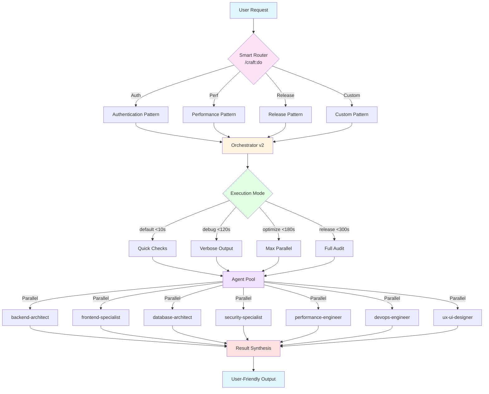

# Craft Architecture

Craft is a comprehensive full-stack development toolkit built on intelligent orchestration, mode-aware execution, and multi-agent coordination.

## Architecture Overview



## Core Components

### 1. Smart Routing System

The `/craft:do` command uses AI to route tasks to appropriate workflows:

```
"add authentication" → backend-architect + security-specialist
"optimize queries" → performance-engineer + database-architect
"prepare release" → orchestrator (release mode, all agents)
```

### 2. Orchestrator v2

Enhanced multi-agent orchestration with:
- **Mode-aware execution** - Adapts behavior based on mode
- **Context tracking** - Monitors token usage and budget
- **Timeline view** - Visualizes agent execution
- **Subagent monitoring** - Tracks agent progress
- **Result synthesis** - Combines agent outputs

### 3. Mode System

Four execution modes control depth and time:

| Mode | Time | Agents | Use Case |
|------|------|--------|----------|
| default | <10s | 1-2 | Quick checks |
| debug | <120s | 2-3 | Verbose diagnostics |
| optimize | <180s | 3-4 | Parallel performance |
| release | <300s | 4+ | Comprehensive audit |

### 4. Agent Coordination

Agents execute in parallel with automatic coordination:

```python
async def orchestrate(task, mode):
    # Pattern recognition
    pattern = recognize_pattern(task)

    # Agent selection
    agents = select_agents(pattern, mode)

    # Parallel execution
    results = await Promise.all([
        agent1.execute(),
        agent2.execute(),
        agent3.execute()
    ])

    # Synthesis
    return synthesize(results)
```

## Command Organization

Commands organized in 13 categories:

```
craft/commands/
├── arch/          # Architecture analysis
├── ci/            # CI/CD automation
├── code/          # Code quality
├── dist/          # Distribution
├── docs/          # Documentation
├── git/           # Git operations
├── plan/          # Planning
├── site/          # Static sites
├── test/          # Testing
├── check.md       # Pre-flight checks
├── do.md          # Smart routing
├── hub.md         # Discovery
└── orchestrate.md # Orchestration
```

## Python Testing Framework

Craft includes comprehensive Python-based testing:

```
tests/
├── unit/              # Unit tests
├── integration/       # Integration tests
├── performance/       # Performance benchmarks
└── test_craft.py      # Main test suite
```

**Run tests:**
```bash
cd craft
pytest tests/
pytest tests/ --cov=craft
```

## Performance

- **Parallel execution:** 3-4× faster than sequential
- **Smart caching:** Reduces redundant operations
- **Incremental analysis:** Only checks changed code
- **Token-efficient:** Optimized prompts and context

## Extensibility

Craft is designed for easy extension:

1. **Add commands:** Create markdown in `commands/category/`
2. **Add skills:** Create skill definitions in `skills/domain/`
3. **Add agents:** Define agents in `agents/`
4. **Add modes:** Extend mode system with custom time budgets

## See Also

- **[Commands Reference](commands.md)** - All commands
- **[Skills & Agents](skills-agents.md)** - 17 skills, 7 agents
- **[Orchestrator Guide](orchestrator.md)** - Coordination details

---

**Last Updated:** 2026-01-09
**Document Version:** v1.10.0
**Status:** ✅ Production ready - Smart routing and delegation patterns
