# Workflows & Examples

Practical workflows and real-world examples for Craft full-stack development toolkit.

## Smart Routing Workflows

### Workflow 1: Universal Task Execution

The `/craft:do` command is your starting point for any task. It uses AI to route to the best workflow.

```mermaid
flowchart TD
    A[User Task Request] --> B[/craft:do]
    B --> C{AI Pattern Recognition}
    C -->|Authentication| D[backend-architect + security-specialist]
    C -->|Performance| E[performance-engineer + database-architect]
    C -->|UI/UX| F[ux-ui-designer + frontend-specialist]
    C -->|Release| G[orchestrator release mode]

    D --> H[Parallel Execution]
    E --> H
    F --> H
    G --> H

    H --> I[Result Synthesis]
    I --> J[Actionable Recommendations]

    style B fill:#ffe1f5
    style C fill:#fff4e1
    style H fill:#e1ffe1
    style J fill:#e1f5ff
```

**Example Usage:**

=== "Authentication"

    ```bash
    /craft:do "add user authentication with JWT"
    ```

    **Routed to:** backend-architect + security-specialist

    **Output:**
    ```
    🎯 Authentication Implementation Plan

    1. Install dependencies: jsonwebtoken, bcrypt
    2. Create auth middleware
    3. Implement login/register endpoints
    4. Add token refresh mechanism
    5. Secure existing routes

    Estimated time: 2-3 hours
    ```

=== "Performance"

    ```bash
    /craft:do "optimize database queries"
    ```

    **Routed to:** performance-engineer + database-architect

    **Output:**
    ```
    ⚡ Performance Optimization Plan

    1. Add indexes to users.email, orders.user_id
    2. Implement query result caching (Redis)
    3. Use SELECT specific columns (not *)
    4. Add connection pooling

    Expected improvement: 60% faster queries
    ```

=== "Release"

    ```bash
    /craft:do "prepare for production release"
    ```

    **Routed to:** orchestrator (release mode, all agents)

    **Output:**
    ```
    🚀 Release Checklist

    ✅ Tests: 287/287 passing
    ✅ Coverage: 92%
    ✅ No security vulnerabilities
    ⚠️  Update CHANGELOG.md
    ⚠️  Bump version in package.json

    Ready for release after addressing 2 items
    ```

### Workflow 2: Pre-Flight Checks

Fast validation before committing or deploying.

```mermaid
sequenceDiagram
    participant Dev as Developer
    participant Craft as Craft Plugin
    participant Agents as Specialized Agents

    Dev->>Craft: /craft:check
    Craft->>Agents: Parallel checks

    par Code Quality
        Agents->>Agents: Lint
    and Tests
        Agents->>Agents: Run tests
    and Security
        Agents->>Agents: Vulnerability scan
    end

    Agents-->>Craft: Results
    Craft-->>Dev: ✅ Ready to commit (5s)
```



**Steps:**

1. **Quick check** (default mode)

   ```bash
   /craft:check
   ```

   Output:
   ```
   ✅ Lint: No issues
   ✅ Tests: 287 passing
   ✅ Types: No errors
   ⚠️  1 TODO comment added

   Safe to commit!
   ```

2. **Release audit** (release mode)

   ```bash
   /craft:check --for release
   ```

   Output:
   ```
   📋 Release Audit

   ✅ All tests passing
   ✅ Coverage > 80%
   ✅ No security issues
   ✅ Dependencies up to date
   ✅ Documentation complete
   ⚠️  CHANGELOG.md needs update
   ⚠️  Version bump required

   2 items to address before release
   ```

## Orchestrated Workflows

### Workflow 3: Multi-Agent Orchestration

Complex tasks with multiple agents working in parallel.


**Example:**

```bash
/craft:orchestrate "add user authentication" optimize
```

**Execution Flow:**

1. **Analysis** (2s)
   - Recognizes authentication pattern
   - Selects agents: backend-architect, security-specialist, database-architect

2. **Parallel Execution** (8s)
   - Agent 1: Design auth endpoints
   - Agent 2: Security best practices
   - Agent 3: Database schema for users

3. **Synthesis** (2s)
   - Combines recommendations
   - Generates implementation plan
   - Provides code scaffolding

**Monitor Progress:**

```bash
# Check status
/craft:orchestrate status

## 🔄 AGENT STATUS
| Agent | Task | Progress | Context |
|-------|------|----------|---------|
| backend-1 | endpoints | 75% | 12% |
| security-1 | auth flow | 100% ✅ | 8% |
| database-1 | schema | 50% | 10% |

# View timeline
/craft:orchestrate timeline

## ⏱️ EXECUTION TIMELINE
backend-1  ████████░░ 8s
security-1 ██████████ 6s ✅
database-1 ███████░░░ 7s
```

## Command Category Workflows

### Architecture Design

```bash
# Analyze existing architecture
/craft:arch:analyze

# Review for scalability
/craft:arch:review

# Generate architecture diagrams
/craft:docs:mermaid
```

### CI/CD Automation

```mermaid
flowchart LR
    A[Detect Project] --> B[/craft:ci:detect]
    B --> C{Type Detected}
    C -->|Node.js| D[Generate Node CI]
    C -->|Python| E[Generate Python CI]
    C -->|R Package| F[Generate R CI]

    D --> G[/craft:ci:generate]
    E --> G
    F --> G

    G --> H[Validate Workflow]
    H --> I[/craft:ci:validate]
    I --> J{Valid?}
    J -->|Yes| K[Commit .github/workflows/]
    J -->|No| L[Fix Issues]
    L --> I
```

**Example:**

```bash
# 1. Detect project type
/craft:ci:detect

# Output:
# 📦 Project Type: Node.js (TypeScript)
# 🔧 Build Tool: npm
# 🧪 Test Framework: Jest
# 📊 Coverage: Jest + Codecov

# 2. Generate CI workflow
/craft:ci:generate

# Creates: .github/workflows/ci.yml

# 3. Validate
/craft:ci:validate

# Output:
# ✅ Workflow syntax valid
# ✅ All jobs defined correctly
# ✅ Secrets configured
# Ready to commit!
```

### Code Quality

```bash
# Run linter
/craft:code:lint

# Fix auto-fixable issues
/craft:code:lint --fix

# Review code quality
/craft:code:review
```

### Testing

```bash
# Run tests with coverage
/craft:test:run --coverage

# Run specific test file
/craft:test:run auth.test.ts

# Generate test report
/craft:test:coverage
```

### Documentation

```bash
# Generate API docs
/craft:docs:api-documenter

# Create Mermaid diagrams
/craft:docs:mermaid

# Generate architecture diagrams
/craft:arch:analyze
```

## Real-World Examples

### Example 1: Building a REST API

**Goal:** Create a production-ready REST API with authentication, database, and tests

**Workflow:**

```bash
# Step 1: Plan architecture
/craft:do "design REST API with auth and PostgreSQL"

# Step 2: Generate CI/CD
/craft:ci:generate

# Step 3: Implement with orchestration
/craft:orchestrate "implement REST API" optimize

# Step 4: Add tests
/craft:test:cli-gen

# Step 5: Pre-release check
/craft:check --for release

# Step 6: Deploy
/craft:do "deploy to production"
```

**Timeline:**

| Phase | Duration | Tasks |
|-------|----------|-------|
| Planning | 5 min | Architecture design, tech stack selection |
| Setup | 10 min | CI/CD, project structure, dependencies |
| Implementation | 2-3 hours | Endpoints, auth, database, tests |
| Testing | 30 min | Unit tests, integration tests, E2E |
| Deployment | 15 min | Docker, CI/CD, production deploy |

**Total:** ~4 hours for production-ready API

### Example 2: Refactoring Legacy Code

**Goal:** Modernize codebase with better architecture and test coverage

**Workflow:**

```bash
# Step 1: Analyze current architecture
/craft:arch:analyze

# Output identifies issues:
# ⚠️ Tight coupling between modules
# ⚠️ Missing tests (only 35% coverage)
# ⚠️ No dependency injection

# Step 2: Plan refactoring
/craft:do "plan refactoring to improve architecture"

# Step 3: Execute with debug mode (verbose)
/craft:orchestrate "refactor to clean architecture" debug

# Step 4: Add tests incrementally
/craft:test:cli-gen

# Step 5: Verify improvements
/craft:arch:analyze
```

### Example 3: Homebrew Formula Publishing

**Goal:** Create and publish Homebrew formula for CLI tool

**Workflow:**

```bash
# Step 1: Generate formula
/craft:dist:curl-install

# Creates installation script

# Step 2: Create Homebrew formula
/craft:do "create Homebrew formula for my-cli"

# Output:
# Generated: Formula/my-cli.rb
# Tap repository: homebrew-tap

# Step 3: Validate formula
brew install --formula ./Formula/my-cli.rb

# Step 4: Publish to tap
/craft:do "publish to Homebrew tap"
```

## Mode-Specific Workflows

### Default Mode (<10s)

Fast, lightweight checks:

```bash
# Quick validation
/craft:check

# Fast lint
/craft:code:lint

# Status check
/craft:orchestrate status
```

### Debug Mode (<120s)

Verbose output for troubleshooting:

```bash
# Detailed diagnostics
/craft:orchestrate "debug login issue" debug

# Verbose test output
/craft:test:run --verbose

# Detailed architecture analysis
/craft:arch:analyze --mode debug
```

### Optimize Mode (<180s)

Maximum parallelization:

```bash
# Fast parallel execution
/craft:orchestrate "implement feature" optimize

# Parallel test execution
/craft:test:run --parallel

# Fast CI generation
/craft:ci:generate --mode optimize
```

### Release Mode (<300s)

Comprehensive audit:

```bash
# Full release preparation
/craft:orchestrate "prepare release" release

# Complete validation
/craft:check --for release

# Thorough testing
/craft:test:run --coverage --mode release
```

## Tips & Best Practices

### Smart Routing

**Always start with `/craft:do`:**

```bash
# ✅ Good: Let AI route
/craft:do "add authentication"

# ❌ Less efficient: Manual routing
/craft:backend:design-auth
/craft:security:review
# ... multiple commands
```

### Orchestration

**Use appropriate modes:**

| Scenario | Mode | Reason |
|----------|------|--------|
| Pre-commit check | default | Fast feedback |
| Debugging issue | debug | Verbose output |
| Feature implementation | optimize | Parallel execution |
| Release preparation | release | Comprehensive audit |

**Monitor context usage:**

```bash
# Check token budget
/craft:orchestrate budget

# Force compression if needed
/craft:orchestrate compress
```

### CI/CD

**Automate checks in GitHub Actions:**

```yaml
- name: Craft Pre-Flight
  run: /craft:check --format json > check-results.json
```

### Testing

**Generate comprehensive test suites:**

```bash
# Interactive CLI test generation
/craft:test:cli-gen

# Automated test creation
/craft:test:cli-run automated
```

## Troubleshooting

### Common Issues

**Issue: Orchestrator context limit**

```bash
/craft:orchestrate <task>
# Warning: Context at 85%, compression recommended
```

**Solution:**

```bash
/craft:orchestrate compress
```

**Issue: Agent not responding**

```bash
/craft:orchestrate status
# Agent backend-1: ⏸️ Paused
```

**Solution:**

```bash
/craft:orchestrate resume backend-1
```

**Issue: Wrong mode selected**

```bash
/craft:orchestrate "quick check" release
# Takes 5 minutes (too slow)
```

**Solution:**

```bash
/craft:orchestrate "quick check" default
# Completes in <10s
```

## Integration Examples

### Git Workflow

```bash
# Pre-commit hook
#!/bin/bash
/craft:check || exit 1

# Pre-push hook
#!/bin/bash
/craft:test:run --coverage || exit 1
```

### VS Code Tasks

```json
{
  "tasks": [
    {
      "label": "Craft Check",
      "type": "shell",
      "command": "/craft:check"
    },
    {
      "label": "Craft Test",
      "type": "shell",
      "command": "/craft:test:run"
    }
  ]
}
```

### npm Scripts

```json
{
  "scripts": {
    "precommit": "/craft:check",
    "test": "/craft:test:run",
    "release": "/craft:check --for release"
  }
}
```

## Related Documentation

- **[Commands Reference](commands.md)** - All 67 commands across 13 categories
- **[Skills & Agents](skills-agents.md)** - 17 skills and 7 specialized agents
- **[Orchestrator Guide](orchestrator.md)** - Deep dive into multi-agent orchestration
- **[Architecture](architecture.md)** - Technical implementation details

---

**Last Updated:** 2026-01-09
**Document Version:** v1.0.0
**Status:** ✅ Comprehensive workflows for all 13 command categories
