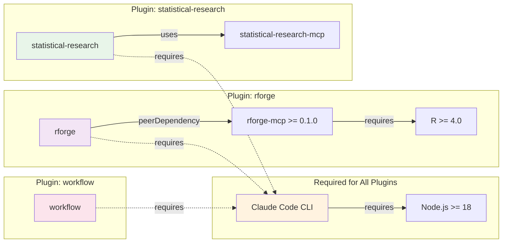

# Plugin Dependencies

**Auto-generated:** 2025-12-24 11:10:12

## Dependency Graph

```mermaid
graph LR
    subgraph "Required for All Plugins"
        CLAUDE[Claude Code CLI]
        NODE[Node.js >= 18]
    end

    subgraph "Plugin: rforge"
        RFORGE[rforge]
        RFORGE_MCP[rforge-mcp >= 0.1.0]
        R_ENV[R >= 4.0]
    end

    subgraph "Plugin: statistical-research"
        RESEARCH[statistical-research]
        STAT_MCP[statistical-research-mcp]
    end

    subgraph "Plugin: workflow"
        WORKFLOW[workflow]
    end

    RFORGE -.->|requires| CLAUDE
    RFORGE -->|peerDependency| RFORGE_MCP
    RFORGE_MCP -->|requires| R_ENV

    RESEARCH -.->|requires| CLAUDE
    RESEARCH -->|uses| STAT_MCP

    WORKFLOW -.->|requires| CLAUDE

    CLAUDE -->|requires| NODE

    style CLAUDE fill:#fff3e0
    style RFORGE fill:#f3e5f5
    style RESEARCH fill:#e8f5e9
    style WORKFLOW fill:#fce4ec
```
