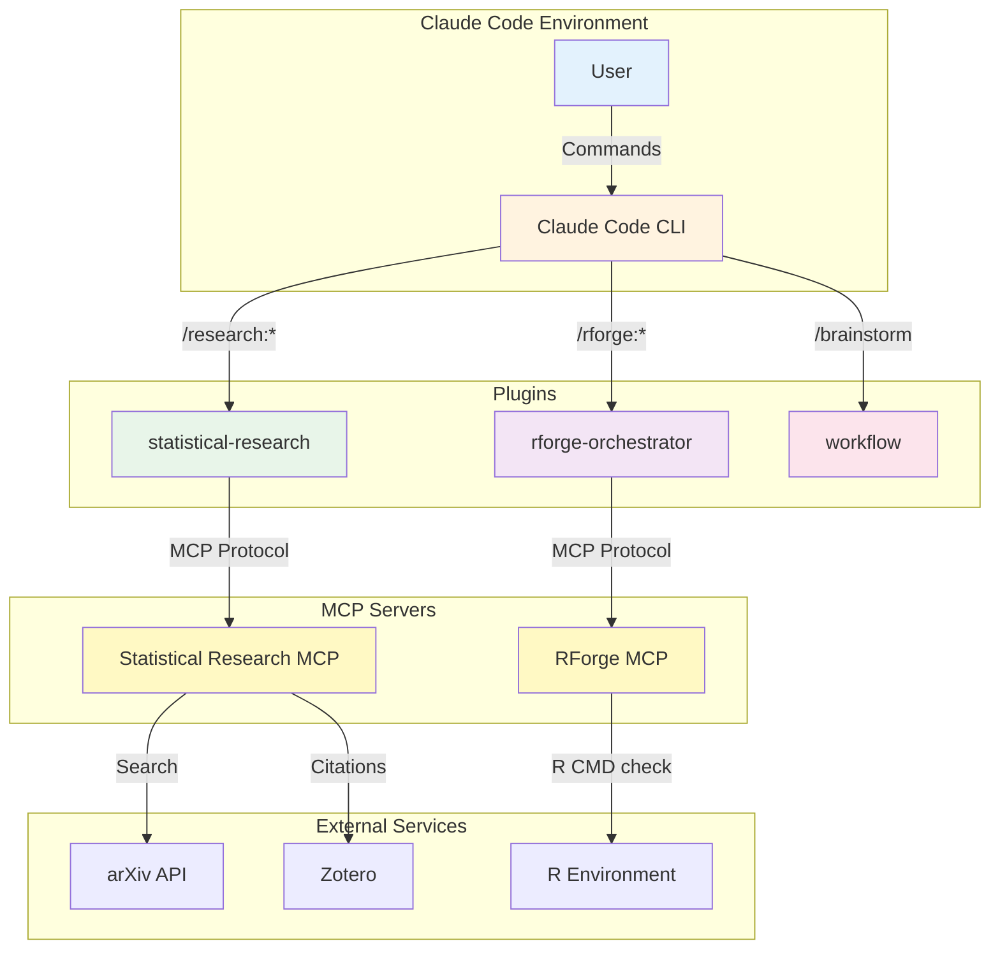

# Plugin Ecosystem

**Auto-generated:** 2025-12-24 11:10:12

## Overview

```mermaid
graph TB
    subgraph "Claude Code Environment"
        USER[User]
        CLAUDE[Claude Code CLI]
    end

    subgraph "Plugins"
        RFORGE[rforge-orchestrator]
        RESEARCH[statistical-research]
        WORKFLOW[workflow]
    end

    subgraph "MCP Servers"
        RFORGE_MCP[RForge MCP]
        STAT_MCP[Statistical Research MCP]
    end

    subgraph "External Services"
        ARXIV[arXiv API]
        ZOTERO[Zotero]
        R[R Environment]
    end

    USER -->|Commands| CLAUDE
    CLAUDE -->|/rforge:*| RFORGE
    CLAUDE -->|/research:*| RESEARCH
    CLAUDE -->|/brainstorm| WORKFLOW

    RFORGE -->|MCP Protocol| RFORGE_MCP
    RESEARCH -->|MCP Protocol| STAT_MCP

    RFORGE_MCP -->|R CMD check| R
    STAT_MCP -->|Search| ARXIV
    STAT_MCP -->|Citations| ZOTERO

    style USER fill:#e3f2fd
    style CLAUDE fill:#fff3e0
    style RFORGE fill:#f3e5f5
    style RESEARCH fill:#e8f5e9
    style WORKFLOW fill:#fce4ec
    style RFORGE_MCP fill:#fff9c4
    style STAT_MCP fill:#fff9c4
```
