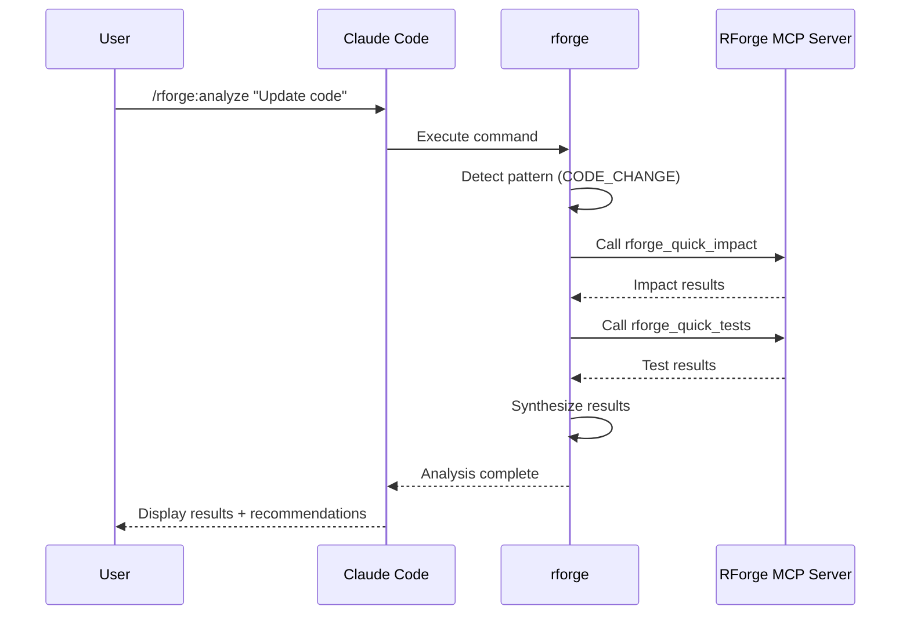

# Rforge Orchestrator Command Flow

**Auto-generated:** 2025-12-23 22:09:57

## Example Command Execution

```mermaid
sequenceDiagram
    participant User
    participant Claude as Claude Code
    participant Plugin as rforge
    participant MCP as RForge MCP Server

    User->>Claude: /rforge:analyze "Update code"
    Claude->>Plugin: Execute command
    Plugin->>Plugin: Detect pattern (CODE_CHANGE)
    Plugin->>MCP: Call rforge_quick_impact
    MCP-->>Plugin: Impact results
    Plugin->>MCP: Call rforge_quick_tests
    MCP-->>Plugin: Test results
    Plugin->>Plugin: Synthesize results
    Plugin-->>Claude: Analysis complete
    Claude-->>User: Display results + recommendations
```
