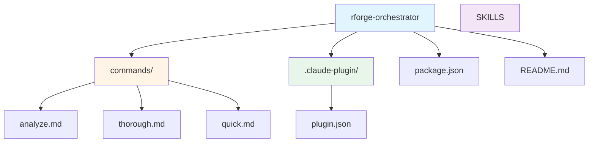

# Rforge Orchestrator Structure

**Auto-generated:** 2025-12-23 21:52:13

## Directory Structure

```mermaid
graph TD
    ROOT[rforge-orchestrator]
    ROOT --> COMMANDS[commands/]
    COMMANDS --> CMD0["analyze.md"]
    COMMANDS --> CMD1["thorough.md"]
    COMMANDS --> CMD2["quick.md"]
    ROOT --> PLUGIN[.claude-plugin/]
    PLUGIN --> PLUGIN_JSON[plugin.json]
    ROOT --> PKG[package.json]
    ROOT --> README[README.md]

    style ROOT fill:#e1f5ff
    style COMMANDS fill:#fff4e6
    style SKILLS fill:#f3e5f5
    style PLUGIN fill:#e8f5e9
```
