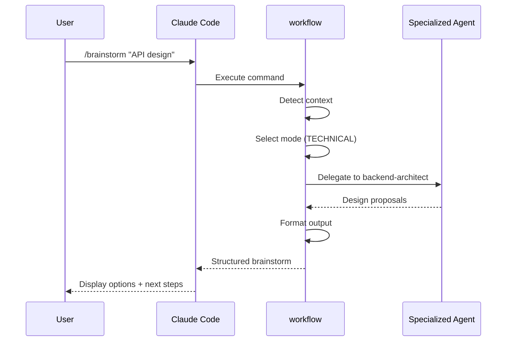

# Workflow Command Flow

**Auto-generated:** 2025-12-23 21:52:13

## Example Command Execution

```mermaid
sequenceDiagram
    participant User
    participant Claude as Claude Code
    participant Plugin as workflow
    participant Agent as Specialized Agent

    User->>Claude: /brainstorm "API design"
    Claude->>Plugin: Execute command
    Plugin->>Plugin: Detect context
    Plugin->>Plugin: Select mode (TECHNICAL)
    Plugin->>Agent: Delegate to backend-architect
    Agent-->>Plugin: Design proposals
    Plugin->>Plugin: Format output
    Plugin-->>Claude: Structured brainstorm
    Claude-->>User: Display options + next steps
```
