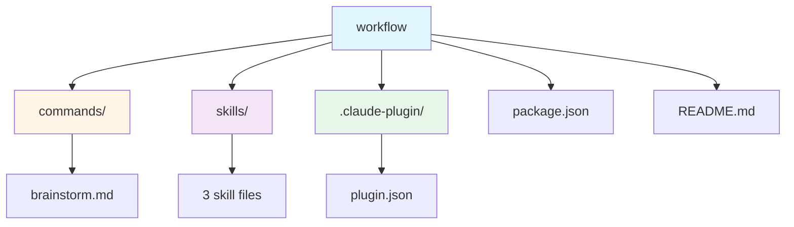

# Workflow Structure

**Auto-generated:** 2025-12-23 22:09:57

## Directory Structure

```mermaid
graph TD
    ROOT[workflow]
    ROOT --> COMMANDS[commands/]
    COMMANDS --> CMD0["brainstorm.md"]
    ROOT --> SKILLS[skills/]
    SKILLS --> SKILL_COUNT["3 skill files"]
    ROOT --> PLUGIN[.claude-plugin/]
    PLUGIN --> PLUGIN_JSON[plugin.json]
    ROOT --> PKG[package.json]
    ROOT --> README[README.md]

    style ROOT fill:#e1f5ff
    style COMMANDS fill:#fff4e6
    style SKILLS fill:#f3e5f5
    style PLUGIN fill:#e8f5e9
```
