# Workflows & Examples

Practical workflows and real-world examples for RForge R package ecosystem management.

## Common Workflows

### Workflow 1: New Package Setup


**Steps:**

1. **Create package structure**

   ```r
   # In R
   usethis::create_package("~/my-r-package")
   ```

2. **Detect ecosystem type**

   ```bash
   cd ~/my-r-package
   /rforge:detect
   ```

   Expected output:

   ```
   📦 Package Detection Results

   Structure: Single Package
   Name: mypackage
   Version: 0.1.0
   Dependencies: 2 imports, 3 suggests
   ```

3. **Check initial health**

   ```bash
   /rforge:status
   ```

   Expected output:

   ```
   📊 Package Health: 85/100
   ✅ 15 functions, 12 tests
   ⚠️  Coverage: 75% (target: 80%)
   📝 2 warnings, 0 errors
   ```

4. **Address issues**

   Based on health report, improve:
   - Test coverage
   - Documentation
   - Code quality

### Workflow 2: Pre-Commit Checks

Fast validation before committing changes.

```mermaid
sequenceDiagram
    participant Dev as Developer
    participant RForge as RForge Plugin
    participant MCP as RForge MCP Server
    participant R as R Environment

    Dev->>RForge: /rforge:analyze default
    RForge->>MCP: Delegate analysis
    MCP->>R: R CMD check (quick)
    R-->>MCP: Results
    MCP->>RForge: Package health
    RForge-->>Dev: ✅ Ready to commit (8s)
```



**Steps:**

1. **Make code changes**
2. **Quick validation** (<10s)

   ```bash
   /rforge:analyze default
   ```

3. **Review output**

   === "Healthy Package"

       ```
       ✅ Health Score: 92/100
       📊 All checks passed
       🚀 Ready to commit
       ```

       **Action:** Commit changes

   === "Issues Found"

       ```
       ⚠️  Health Score: 65/100
       ❌ 2 test failures
       📝 Fix before committing
       ```

       **Action:** Address issues first

4. **Commit**

   ```bash
   git add .
   git commit -m "feat: add new feature"
   ```

### Workflow 3: CRAN Release Preparation

Comprehensive checks before CRAN submission.

```mermaid
flowchart LR
    A[Ready for CRAN?] --> B[/rforge:analyze release]
    B --> C{All checks passed?}
    C -->|Yes| D[Update NEWS.md]
    C -->|No| E[Fix issues]
    E --> B
    D --> F[Bump version]
    F --> G[/rforge:release]
    G --> H{Ecosystem?}
    H -->|Yes| I[Plan submission order]
    H -->|No| J[Submit to CRAN]
    I --> J
```

**Steps:**

1. **Comprehensive analysis** (<300s)

   ```bash
   /rforge:analyze release --format markdown
   ```

2. **Review checklist**

   ```markdown
   ## CRAN Submission Checklist

   ### Documentation
   - [x] All functions documented
   - [x] README.md complete
   - [x] NEWS.md updated
   - [x] vignettes build successfully

   ### Testing
   - [x] All tests pass
   - [x] Coverage > 80%
   - [x] No warnings or notes

   ### CRAN Policy
   - [x] Title case in DESCRIPTION
   - [x] Valid Authors@R
   - [x] LICENSE file correct
   - [x] No \dontrun{} in examples
   ```

3. **Address any issues**
4. **Plan release** (for ecosystems)

   ```bash
   /rforge:release
   ```

   Output:

   ```
   📦 Release Sequence (dependency order):

   1. rmediation (no dependencies)
   2. rmediationpath (depends on: rmediation)
   3. rmediationsens (depends on: rmediation)

   Estimated total time: 2-3 weeks
   ```

5. **Submit to CRAN**

### Workflow 4: Ecosystem Cascade Updates

Update dependent packages when base package changes.

```mermaid
graph TB
    A[Change rmediation] --> B[/rforge:cascade 'update dependency']
    B --> C[Analyze Impact]
    C --> D{Breaking changes?}
    D -->|Yes| E[Update dependents]
    D -->|No| F[No action needed]
    E --> G[/rforge:impact]
    G --> H[Review changes]
    H --> I[Update all packages]
```

**Steps:**

1. **Make changes to base package**

   ```r
   # Edit rmediation/R/mediate.R
   ```

2. **Analyze cascade impact**

   ```bash
   /rforge:cascade "update mediate() function"
   ```

   Output:

   ```
   🔄 Cascade Analysis

   Base: rmediation v1.2.0
   Affected: 2 packages

   Impact:
   - rmediationpath: Update 3 function calls
   - rmediationsens: Update 2 function calls

   Estimated effort: 2-3 hours
   ```

3. **Review detailed impact**

   ```bash
   /rforge:impact --format json > impact.json
   ```

4. **Update dependent packages**

5. **Re-test ecosystem**

   ```bash
   cd /path/to/ecosystem
   /rforge:analyze default
   ```

## Real-World Examples

### Example 1: mediationverse Ecosystem

**Context:** 5-package R ecosystem for mediation analysis

**Structure:**

```
mediationverse/
├── rmediation/           # Base package
├── rmediationpath/       # Path-specific methods
├── rmediationsens/       # Sensitivity analysis
├── rmediationpower/      # Power analysis
└── rmediationboot/       # Bootstrap methods
```

**Typical Workflow:**

1. **Daily status check**

   ```bash
   /rforge:status
   ```

   Output shows ecosystem health: 67/100

2. **Identify bottleneck**

   Package `rmediationboot` has low coverage (45%)

3. **Focus on improving one package**

   ```bash
   cd rmediationboot
   /rforge:analyze debug --format terminal
   ```

4. **Add tests to improve coverage**

5. **Verify improvement**

   ```bash
   /rforge:status
   ```

   New health score: 78/100 ✅

### Example 2: Single Package Development

**Package:** `sensitivity-analysis` (new package)

**Day 1: Setup**

```bash
# Create package
usethis::create_package("sensitivity-analysis")

# Initial check
/rforge:detect
/rforge:status
```

**Week 1-2: Development**

```bash
# Before each commit
/rforge:analyze default

# Fix any issues
# Commit changes
```

**Week 3: Prepare for CRAN**

```bash
# Comprehensive check
/rforge:analyze release --format markdown > release-checklist.md

# Review checklist
# Address all items

# Final check
/rforge:analyze release

# Submit to CRAN
```

## Output Format Examples

### Terminal Format (Default)

Rich colors, emojis, formatted tables:

```
╔════════════════════════════════════════════════╗
║ 📦 RForge Analysis Results                    ║
╠════════════════════════════════════════════════╣
║                                                ║
║ Package: rmediation v1.2.0                     ║
║ Health Score: 85/100 ⭐⭐⭐⭐                   ║
║                                                ║
║ ✅ Tests: 92 passing (100%)                    ║
║ ✅ Coverage: 87% (target: 80%)                 ║
║ ⚠️  Documentation: 2 functions missing roxygen  ║
║                                                ║
╚════════════════════════════════════════════════╝
```

### JSON Format

Machine-readable for automation:

=== "Health Status"

    ```json
    {
      "package": "rmediation",
      "version": "1.2.0",
      "health_score": 85,
      "timestamp": "2026-01-09T14:30:00Z",
      "tests": {
        "total": 92,
        "passing": 92,
        "failing": 0,
        "coverage": 0.87
      },
      "warnings": [
        "Missing documentation for mediate_boot()",
        "Missing documentation for sensitivity_plot()"
      ]
    }
    ```

=== "Cascade Impact"

    ```json
    {
      "base_package": "rmediation",
      "affected_packages": [
        {
          "name": "rmediationpath",
          "impact_level": "medium",
          "changes_required": 3,
          "estimated_hours": 2
        },
        {
          "name": "rmediationsens",
          "impact_level": "low",
          "changes_required": 1,
          "estimated_hours": 0.5
        }
      ],
      "total_effort_hours": 2.5
    }
    ```

### Markdown Format

Documentation-ready:

````markdown
# RForge Analysis Results

**Package:** rmediation v1.2.0
**Analysis Mode:** release
**Timestamp:** 2026-01-09 14:30:00

## Health Score: 85/100

### Tests
- Total: 92
- Passing: 92 (100%)
- Coverage: 87% ✅

### Documentation
- Functions documented: 28/30
- Missing:
  - `mediate_boot()`
  - `sensitivity_plot()`

### CRAN Policy
- ✅ Title case in DESCRIPTION
- ✅ Valid Authors@R
- ✅ LICENSE correct
- ⚠️  2 examples use \dontrun{}

## Next Steps

1. Add documentation for 2 missing functions
2. Replace \dontrun{} with \donttest{} in examples
3. Re-run release check
4. Submit to CRAN
````

## Tips & Best Practices

### Performance

**Use appropriate modes:**

- `default` (<10s) for quick checks
- `debug` (<120s) when diagnosing issues
- `release` (<300s) before CRAN submission

**Parallel execution:**

RForge executes MCP tools in parallel:

```
Serial:   Tool1 (8s) + Tool2 (8s) + Tool3 (8s) = 24s
Parallel: max(8s, 8s, 8s) = 8s
```

### Ecosystem Management

**Use cascade analysis before major changes:**

```bash
/rforge:cascade "proposed change description"
```

This prevents breaking dependent packages.

**Plan releases in dependency order:**

```bash
/rforge:release
```

CRAN requires dependencies to be on CRAN before dependents.

### Automation

**Integrate with CI/CD:**

```yaml
# GitHub Actions
- name: RForge Health Check
  run: |
    /rforge:analyze default --format json > health.json
    cat health.json
```

**Pre-commit hooks:**

```bash
#!/bin/bash
# .git/hooks/pre-commit

/rforge:analyze default || {
  echo "❌ RForge checks failed. Fix issues before committing."
  exit 1
}
```

## Troubleshooting

### Common Issues

**Issue: "Package not detected"**

```bash
/rforge:detect
# Error: No R package found
```

**Solution:** Ensure DESCRIPTION file exists:

```bash
test -f DESCRIPTION || echo "DESCRIPTION file missing"
```

**Issue: "MCP server not responding"**

```bash
/rforge:status
# Error: rforge-mcp server timeout
```

**Solution:** Restart MCP server:

```bash
npx rforge-mcp configure
```

**Issue: "Health score unexpectedly low"**

Review detailed analysis:

```bash
/rforge:analyze debug --format terminal
```

Common causes:

- Low test coverage
- Missing documentation
- R CMD check warnings

## Related Documentation

- **[Commands Reference](commands.md)** - All RForge commands
- **[Architecture](architecture.md)** - Technical implementation
- **[Mode System](../MODE-USAGE-GUIDE.md)** - Analysis modes deep dive

---

**Last Updated:** 2026-01-09
**Document Version:** v1.0.0
**Status:** ✅ Foundation template for Workflows & Examples
