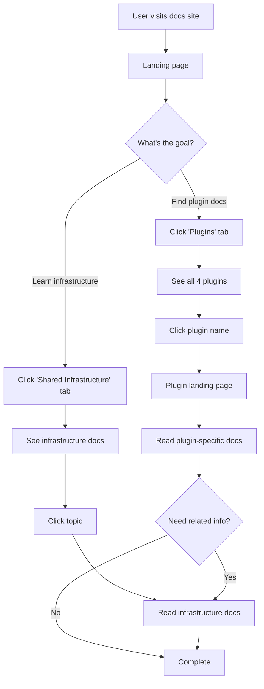

# SPEC: Documentation Architecture Reorganization

**Status:** draft
**Created:** 2026-01-09
**From Brainstorm:** [BRAINSTORM-plugin-organization-architecture-2026-01-09.md](../../BRAINSTORM-plugin-organization-architecture-2026-01-09.md)
**Priority:** HIGH
**Effort:** 10-14 hours
**Target Completion:** 2026-01-16

---

## Overview

Reorganize the claude-plugins documentation to create clear plugin boundaries within a unified MkDocs site, solving content gaps and navigation confusion while preserving mono-repo development velocity.

**Problem Statement:**
Current documentation mixes mono-repo infrastructure docs (MODE-SYSTEM, CI/CD) with plugin-specific documentation in a flat structure, making it hard for users to find plugin information and for developers to maintain documentation.

**Solution:**
Hybrid mono-repo approach with plugin-scoped documentation sections within a unified MkDocs site.

---

## Primary User Story

**As a** Claude Code user looking for plugin documentation,
**I want** clear navigation that separates plugin-specific docs from shared infrastructure,
**So that** I can quickly find information about a specific plugin without wading through unrelated content.

**Acceptance Criteria:**
- [ ] User can navigate to any plugin's documentation within 30 seconds
- [ ] Plugin landing pages exist for all 4 plugins
- [ ] MkDocs navigation has distinct "Plugins" and "Shared Infrastructure" sections
- [ ] Documentation builds without errors (`mkdocs build --strict`)
- [ ] All internal links work correctly
- [ ] CI/CD automatically deploys updated documentation

---

## Secondary User Stories

### Developer Contributing to Plugin

**As a** developer adding features to a plugin,
**I want** a clear location to add plugin-specific documentation,
**So that** I don't have to guess where new docs should go.

**Acceptance Criteria:**
- [ ] Each plugin has `docs/` directory for plugin-specific content
- [ ] Template structure exists for new plugin documentation
- [ ] Contributing guide explains documentation structure

### Documentation Maintainer

**As a** documentation maintainer,
**I want** automated navigation generation,
**So that** adding new documentation doesn't require manual mkdocs.yml updates.

**Acceptance Criteria:**
- [ ] Script exists to regenerate navigation from file structure
- [ ] Script runs in < 5 seconds
- [ ] Script documented in CLAUDE.md

---

## Technical Requirements

### Architecture

**Directory Structure:**
```
claude-plugins/
├── docs/
│   ├── mono-repo/                # Shared infrastructure docs
│   │   ├── MODE-SYSTEM.md
│   │   ├── CICD.md
│   │   └── PUBLISHING.md
│   └── plugins/                  # Plugin landing pages
│       ├── index.md              # Plugins overview
│       ├── rforge.md
│       ├── craft.md
│       ├── workflow.md
│       └── statistical-research.md
│
├── rforge/
│   ├── docs/                     # RForge-specific docs
│   │   ├── quickstart.md
│   │   ├── commands.md
│   │   ├── architecture.md
│   │   └── development.md
│   └── package.json
│
├── craft/docs/                   # Craft-specific docs
├── workflow/docs/                # Workflow-specific docs
├── statistical-research/docs/    # Statistical Research-specific docs
│
├── mkdocs.yml                    # Unified site config
└── scripts/
    └── update-mkdocs-nav.py      # Navigation generator
```

**Navigation Structure (mkdocs.yml):**
```yaml
nav:
  - Home: index.md
  - Getting Started:
      - Installation: installation.md
      - Quick Start: quick-start.md
  - Developer Guide: CLAUDE.md

  # PLUGIN SECTIONS
  - Plugins:
      - Overview: plugins/index.md
      - 'RForge - R Package Ecosystem':
          - Overview: plugins/rforge.md
          - Quick Start: rforge/docs/quickstart.md
          - Commands:
              - Status: rforge/commands/status.md
              - Analyze: rforge/commands/analyze.md
          - Architecture: rforge/docs/architecture.md

      - 'Craft - Workflow Orchestration':
          - Overview: plugins/craft.md
          - Commands: craft/docs/commands.md

      - 'Workflow - ADHD-Friendly Tools':
          - Overview: plugins/workflow.md
          - Commands: workflow/docs/commands.md

      - 'Statistical Research':
          - Overview: plugins/statistical-research.md
          - Tools: statistical-research/docs/tools.md

  # SHARED INFRASTRUCTURE
  - Shared Infrastructure:
      - Mode System: mono-repo/MODE-SYSTEM.md
      - CI/CD: mono-repo/CICD.md
      - Publishing: mono-repo/PUBLISHING.md
```

---

### API Design

N/A - No API changes (documentation-only change)

---

### Data Models

N/A - No data model changes (documentation-only change)

---

### Dependencies

**Required:**
- mkdocs-material (existing)
- pymdown-extensions (existing)

**Optional (for automation):**
- PyYAML (for navigation generator script)

**Installation:**
```bash
pip install mkdocs-material pymdown-extensions pyyaml
```

---

## UI/UX Specifications

### User Flow



**Key Interactions:**
1. Material theme tabs at top: Home | Getting Started | Plugins | Shared Infrastructure
2. Clicking "Plugins" tab expands plugin list in sidebar
3. Each plugin section expandable (Quick Start, Commands, Architecture)
4. Cross-links between plugin docs and infrastructure docs

---

### Wireframes

**Landing Page (`index.md`):**
```
┌─────────────────────────────────────────────────────────────┐
│ Home | Getting Started | Plugins | Shared Infrastructure   │ ← Tabs
├─────────────────────────────────────────────────────────────┤
│                                                             │
│  # Claude Code Plugins                                      │
│                                                             │
│  Specialized tools for Claude Code workflows.              │
│                                                             │
│  ## Available Plugins                                       │
│                                                             │
│  ┌──────────────────────────┐ ┌──────────────────────────┐│
│  │ RForge                   │ │ Craft                    ││
│  │ R Package Ecosystem      │ │ Workflow Orchestration   ││
│  │ [Learn More →]           │ │ [Learn More →]           ││
│  └──────────────────────────┘ └──────────────────────────┘│
│                                                             │
│  ┌──────────────────────────┐ ┌──────────────────────────┐│
│  │ Workflow                 │ │ Statistical Research     ││
│  │ ADHD-Friendly Tools      │ │ Research Toolkit         ││
│  │ [Learn More →]           │ │ [Learn More →]           ││
│  └──────────────────────────┘ └──────────────────────────┘│
│                                                             │
└─────────────────────────────────────────────────────────────┘
```

**Plugin Landing Page (`docs/plugins/rforge.md`):**
```
┌─────────────────────────────────────────────────────────────┐
│ Plugins ▼                                                   │ ← Sidebar
│   Overview                                                  │
│   > RForge - R Package Ecosystem    ← Current page         │
│       Overview                                              │
│       Quick Start                                           │
│       Commands                                              │
│       Architecture                                          │
│   Craft - Workflow Orchestration                            │
│   ...                                                       │
├─────────────────────────────────────────────────────────────┤
│                                                             │
│  # RForge - R Package Ecosystem Management                 │
│                                                             │
│  ## Overview                                                │
│  Comprehensive R package ecosystem orchestrator...          │
│                                                             │
│  ## Key Features                                            │
│  • Auto-detect project structure                           │
│  • Dependency analysis and cascade updates                 │
│  • Production-ready with 292 passing tests                 │
│                                                             │
│  ## Quick Start                                             │
│  [Installation instructions]                                │
│                                                             │
│  ## Documentation                                           │
│  • [Quick Start](../rforge/docs/quickstart.md)             │
│  • [Commands](../rforge/docs/commands.md)                  │
│  • [Architecture](../rforge/docs/architecture.md)          │
│                                                             │
└─────────────────────────────────────────────────────────────┘
```

**Shared Infrastructure Page (`docs/mono-repo/MODE-SYSTEM.md`):**
```
┌─────────────────────────────────────────────────────────────┐
│ Shared Infrastructure ▼                                     │ ← Sidebar
│   Mode System           ← Current page                      │
│   CI/CD                                                     │
│   Publishing                                                │
│   Architecture                                              │
├─────────────────────────────────────────────────────────────┤
│                                                             │
│  # Mode System                                              │
│                                                             │
│  ## Overview                                                │
│  The mode system provides 4 analysis modes shared across   │
│  all plugins.                                               │
│                                                             │
│  ## Used By                                                 │
│  • [RForge](../plugins/rforge.md#mode-support)             │
│  • [Craft](../plugins/craft.md#mode-integration)           │
│                                                             │
│  ## Modes                                                   │
│  • default (<10s) - Quick status checks                    │
│  • debug (<120s) - Detailed diagnostics                    │
│  ...                                                        │
│                                                             │
└─────────────────────────────────────────────────────────────┘
```

---

### Accessibility Checklist

- [x] Navigation structure is keyboard-accessible (Material theme default)
- [x] Semantic HTML headings (H1 → H2 → H3 hierarchy)
- [x] Alt text for any diagrams (use Mermaid with descriptions)
- [x] Color contrast meets WCAG AA standards (Material theme default)
- [x] Search functionality accessible (Material theme built-in)
- [x] Mobile-responsive navigation (Material theme default)

**Notes:**
- Material theme handles most accessibility out-of-the-box
- Focus on semantic markdown structure
- Use Mermaid diagrams (accessible, text-based)

---

## Open Questions

1. **Plugin Icon/Logo System?**
   - Should each plugin have a visual icon in navigation?
   - If yes, where to store icons? (`docs/assets/plugins/`?)
   - Defer to Phase 2 or implement now?

2. **Version Selector for Plugin Docs?**
   - RForge is at v1.0.0 (Phase 1 complete)
   - Other plugins may have different versions
   - Should docs support version selection (mkdocs-material versioning)?
   - Defer to later or plan now?

3. **Documentation Contribution Workflow?**
   - Should plugin docs live in plugin directory or centralized `docs/plugins/`?
   - Current spec: Plugin docs in `<plugin>/docs/`, landing pages in `docs/plugins/`
   - Alternative: All docs in `docs/plugins/<plugin>/` (centralized)
   - Decision needed before Phase 1

4. **Navigation Automation Priority?**
   - Phase 4 (automation) is optional
   - Should it be mandatory for maintainability?
   - If not automated, document manual update process clearly

---

## Review Checklist

### Technical Review

- [ ] Directory structure aligns with mono-repo best practices
- [ ] MkDocs navigation structure is valid YAML
- [ ] No circular dependencies in documentation cross-links
- [ ] File naming conventions are consistent
- [ ] All referenced paths exist or will exist after implementation

### UX Review

- [ ] User can find any plugin within 30 seconds (usability test)
- [ ] Navigation hierarchy is logical and predictable
- [ ] Plugin landing pages clearly explain purpose
- [ ] Cross-links between related docs are present
- [ ] Search functionality works for plugin-specific terms

### Content Review

- [ ] All 4 plugins have landing pages (`docs/plugins/<plugin>.md`)
- [ ] Each plugin has minimum viable documentation (Quick Start, Commands)
- [ ] Shared infrastructure docs clearly linked from plugin docs
- [ ] No duplicate content between plugin docs and mono-repo docs
- [ ] Examples and code samples are accurate

### Deployment Review

- [ ] `mkdocs build --strict` passes with zero errors
- [ ] No broken internal links (check with link validator)
- [ ] GitHub Actions workflow deploys automatically
- [ ] Deployed site accessible at data-wise.github.io/claude-plugins
- [ ] Navigation works correctly on deployed site

---

## Implementation Notes

### Phase 1: Reorganize Documentation Structure (2-3 hours)

**Files to Create:**
```bash
# New directories
mkdir -p docs/mono-repo docs/plugins

# Plugin landing pages (copy from brainstorm examples)
touch docs/plugins/index.md
touch docs/plugins/rforge.md
touch docs/plugins/craft.md
touch docs/plugins/workflow.md
touch docs/plugins/statistical-research.md
```

**Files to Move:**
```bash
# Move shared infrastructure docs
mv docs/MODE-SYSTEM.md docs/mono-repo/
mv docs/CICD.md docs/mono-repo/
mv docs/PUBLISHING.md docs/mono-repo/

# Update internal links in moved files
# Use sed or manual find-replace
```

**Files to Update:**
```bash
# Update mkdocs.yml (see Architecture section for new nav structure)
# Test build: mkdocs build --strict
```

**Success Criteria:**
- `mkdocs build --strict` passes
- New directory structure exists
- No 404 errors when navigating site locally

---

### Phase 2: Update MkDocs Navigation (1-2 hours)

**Implementation:**
1. Backup current `mkdocs.yml`: `cp mkdocs.yml mkdocs.yml.backup`
2. Update `nav:` section with new structure (see Architecture)
3. Test build: `mkdocs build --strict`
4. Fix any broken links reported
5. Test navigation locally: `mkdocs serve`
6. Verify all sections expandable and linkable

**Success Criteria:**
- Material theme tabs display correctly
- Plugin sections expandable in sidebar
- Shared Infrastructure section separate
- All internal links work

---

### Phase 3: Fill Content Gaps (4-6 hours)

**Priority Order:**
1. RForge (most mature) - 2 hours
2. Craft (active development) - 1.5 hours
3. Workflow (ADHD tools) - 1.5 hours
4. Statistical Research (research toolkit) - 1 hour

**For Each Plugin:**

**Create Landing Page Template:**
```markdown
# <Plugin Name>

## Overview
[2-3 sentence description of what the plugin does]

## Key Features
- Feature 1
- Feature 2
- Feature 3

## Installation

\`\`\`bash
npm install <plugin-name>
\`\`\`

## Quick Start

\`\`\`bash
# Minimal working example
\`\`\`

## Documentation
- [Quick Start](<plugin>/docs/quickstart.md)
- [Commands](<plugin>/docs/commands.md)
- [Architecture](<plugin>/docs/architecture.md)

## Status
**Version:** <version>
**Status:** Production-Ready / Beta / Alpha
**Tests:** <test-count> passing

## Related
- [Mode System](../mono-repo/MODE-SYSTEM.md) - Shared mode system
```

**Create Plugin-Specific Docs:**
- `<plugin>/docs/quickstart.md` - 5-minute getting started guide
- `<plugin>/docs/commands.md` - Command reference
- `<plugin>/docs/architecture.md` - How it works internally

**Success Criteria:**
- All 4 landing pages complete
- Minimum 3 docs per plugin (quickstart, commands, architecture)
- All plugin docs linked from landing pages
- Cross-links to shared infrastructure present

---

### Phase 4: Automate Navigation Generation (Optional - 2 hours)

**Script Requirements:**
- Scan plugin directories for `docs/*.md` files
- Generate hierarchical navigation structure
- Update `mkdocs.yml` programmatically
- Preserve custom sections (Getting Started, Shared Infrastructure)

**Implementation:**
```python
#!/usr/bin/env python3
"""
Auto-generate MkDocs navigation from plugin structure.
Usage: python scripts/update-mkdocs-nav.py
"""

import os
import yaml
from pathlib import Path

PLUGINS = ['rforge', 'craft', 'workflow', 'statistical-research']

def scan_plugin_docs(plugin_name):
    """Scan plugin docs and return nav structure."""
    plugin_path = Path(plugin_name) / 'docs'
    if not plugin_path.exists():
        return None

    nav = {
        f'{plugin_name.title()}': [
            {'Overview': f'plugins/{plugin_name}.md'}
        ]
    }

    # Scan for quickstart, commands, architecture
    for doc in ['quickstart', 'commands', 'architecture']:
        doc_path = plugin_path / f'{doc}.md'
        if doc_path.exists():
            nav[f'{plugin_name.title()}'].append({
                doc.title(): f'{plugin_name}/docs/{doc}.md'
            })

    return nav

def generate_nav():
    """Generate full navigation structure."""
    nav = [
        {'Home': 'index.md'},
        {'Getting Started': [
            {'Installation': 'installation.md'},
            {'Quick Start': 'quick-start.md'}
        ]},
        {'Developer Guide': 'CLAUDE.md'}
    ]

    # Add plugin sections
    plugin_nav = {'Plugins': [{'Overview': 'plugins/index.md'}]}
    for plugin in PLUGINS:
        plugin_docs = scan_plugin_docs(plugin)
        if plugin_docs:
            plugin_nav['Plugins'].append(plugin_docs)

    nav.append(plugin_nav)

    # Add shared infrastructure
    nav.append({
        'Shared Infrastructure': [
            {'Mode System': 'mono-repo/MODE-SYSTEM.md'},
            {'CI/CD': 'mono-repo/CICD.md'},
            {'Publishing': 'mono-repo/PUBLISHING.md'}
        ]
    })

    return nav

if __name__ == '__main__':
    nav = generate_nav()

    # Load existing config
    with open('mkdocs.yml', 'r') as f:
        config = yaml.safe_load(f)

    # Update navigation
    config['nav'] = nav

    # Write back
    with open('mkdocs.yml', 'w') as f:
        yaml.safe_dump(config, f, default_flow_style=False, sort_keys=False)

    print("✅ Updated mkdocs.yml navigation")
    print(f"   Generated {len(nav)} top-level sections")
    print(f"   Scanned {len(PLUGINS)} plugins")
```

**Usage:**
```bash
python scripts/update-mkdocs-nav.py
mkdocs build --strict  # Verify
```

**Success Criteria:**
- Script runs in < 5 seconds
- Generated navigation matches manual navigation
- Script documented in CLAUDE.md
- CI/CD can run script if needed

---

### Phase 5: Update CI/CD (1 hour)

**Update `.github/workflows/deploy-docs.yml`:**
```yaml
name: Deploy Documentation

on:
  push:
    branches: [main]
    paths:
      - 'docs/**'
      - '*/docs/**'          # NEW: Trigger on plugin doc changes
      - 'mkdocs.yml'
      - 'scripts/update-mkdocs-nav.py'

jobs:
  deploy:
    runs-on: ubuntu-latest
    steps:
      - uses: actions/checkout@v3

      - name: Setup Python
        uses: actions/setup-python@v4
        with:
          python-version: '3.11'

      - name: Install dependencies
        run: |
          pip install mkdocs-material
          pip install pymdown-extensions
          pip install pyyaml          # NEW: For nav generator

      - name: Generate navigation (optional)
        run: |
          # Uncomment if using Phase 4 automation
          # python scripts/update-mkdocs-nav.py

      - name: Build docs
        run: mkdocs build --strict

      - name: Check for broken links
        run: |
          # Optional: Add link checker
          # npm install -g broken-link-checker
          # blc http://localhost:8000 --recursive

      - name: Deploy to GitHub Pages
        run: mkdocs gh-deploy --force
```

**Validation:**
1. Create feature branch
2. Make small doc change
3. Push and verify workflow runs
4. Check deployed site updates
5. Test navigation on deployed site

**Success Criteria:**
- Workflow triggers on doc changes
- Build passes with `--strict`
- Deployment succeeds
- Site updates within 5 minutes

---

## History

**2026-01-09:**
- Initial spec created from deep brainstorm
- Decision: Hybrid mono-repo approach (Option A)
- Rationale: Preserves mono-repo velocity, unified docs site, addresses content gaps
- Status: draft → awaiting review

**Review Requested From:**
- Primary maintainer (architecture review)
- Plugin developers (usability review)
- Documentation team (content review)

---

## Documentation Standards

### Adopted from flow-cli

This project adopts ADHD-friendly documentation standards from flow-cli's proven approach (100% command documentation standardization achieved in Phase 3).

**Reference:** `~/projects/dev-tools/flow-cli/docs/conventions/DOCUMENTATION-MAKING-GUIDE.md`

**Full Spec:** [SPEC-documentation-standards-update-2026-01-09.md](SPEC-documentation-standards-update-2026-01-09.md)

### Core Standards

#### 1. Template Markers

**Format:** Blockquote after title
**Length:** One sentence, under 15 words
**Purpose:** Immediate context for what reader will learn

```markdown
# Document Title

> Complete R package ecosystem orchestrator with 15 commands for dependency analysis
```

#### 2. Standard Footers

**Format:** Three-line footer with emoji status
**Location:** End of document

```markdown
---

**Last Updated:** 2026-01-09
**Document Version:** v1.1.0
**Status:** ✅ Production ready with [key features]
```

#### 3. Markdown List Spacing

**Rule:** Always add blank line before and after lists

```markdown
✅ Good:
### Heading

Content paragraph.

- List item 1
- List item 2

Next paragraph.

❌ Bad:
### Heading
- List item 1
```

**Current Issues:** 128 spacing violations across documentation

#### 4. Synopsis Sections (Commands)

**Location:** After description, before detailed content
**Contents:** Command syntax + 2-3 quick examples
**Purpose:** Show usage before explaining

#### 5. See Also Sections

**Format:** Category prefix, link, brief context
**Location:** Before footer

```markdown
## See Also

- **Command:** [Related Command](../commands/related.md) - Why it's related
- **Tutorial:** [Tutorial Name](../tutorials/01-name.md) - What it teaches
```

### Implementation Status

**Completed:** 2026-01-09

1. ✅ **Phase 1:** Fix 128 markdown spacing issues (44 files modified)
2. ✅ **Phase 2:** Add template markers to 5 landing pages
3. ✅ **Phase 3:** Add standard footers to 18 documentation files
4. ✅ **Phase 4:** Update spec with validation checklist

**Effort:** 2.5 hours (under 3-4 hour estimate)
**Impact:** Improved scannability, consistency, and maintainability

### Validation Checklist

**Template Markers (5/5 files):**
- ✅ docs/plugins/index.md
- ✅ docs/plugins/rforge.md
- ✅ docs/plugins/craft.md
- ✅ docs/plugins/workflow.md
- ✅ docs/plugins/statistical-research.md

**Standard Footers (18/18 files):**
- ✅ 5 plugin landing pages
- ✅ 3 RForge docs (quickstart, commands, architecture)
- ✅ 4 Craft docs (commands, skills-agents, architecture, orchestrator)
- ✅ 4 Statistical Research docs (commands, skills, api-wrappers, examples)
- ✅ 2 Workflow docs (commands, skills-agents)

**Markdown Spacing:**
- ✅ Zero spacing violations (44 files fixed)
- ✅ Script created: scripts/fix-markdown-spacing.py
- ✅ mkdocs build succeeds

**Quality Checks:**
- ✅ All template markers under 15 words
- ✅ All template markers action-oriented
- ✅ All footers include: Last Updated, Version, Status
- ✅ All status lines include emoji indicator (✅)
- ✅ Documentation builds without errors

---

## Related Documents

**Planning:**
- [Brainstorm Analysis](../../BRAINSTORM-plugin-organization-architecture-2026-01-09.md)
- [PROJECT-ROADMAP.md](../../PROJECT-ROADMAP.md)
- [TODO.md](../../TODO.md)
- [Documentation Standards Spec](SPEC-documentation-standards-update-2026-01-09.md) - NEW

**Infrastructure:**
- [Mode System](../../docs/MODE-SYSTEM.md) - Will move to `docs/mono-repo/`
- [CI/CD Guide](../../docs/CICD.md) - Will move to `docs/mono-repo/`

**Templates:**
- [Plugin Landing Page Template](#create-landing-page-template) - In Implementation Notes
- [Plugin Docs Structure](#for-each-plugin) - In Implementation Notes
- [flow-cli DOCUMENTATION-MAKING-GUIDE.md](~/projects/dev-tools/flow-cli/docs/conventions/DOCUMENTATION-MAKING-GUIDE.md) - Reference standards

---

## Appendix: Alternative Approaches Considered

### Why Not Multi-Repo? (Option B)

**Rejected Because:**
- User makes frequent cross-plugin changes (weekly+)
- Git submodules notoriously painful to work with
- CI/CD duplication across 4+ repos
- High implementation effort (20-30 hours) for marginal benefit

**When to Reconsider:**
- Cross-plugin changes become rare (quarterly or less)
- Each plugin has dedicated maintainer/team
- Plugins diverge significantly in purpose/audience

---

### Why Not Per-Plugin Sites? (Option C)

**Rejected Because:**
- User prefers unified documentation site
- Fragments user experience (jumping between sites)
- Shared documentation (MODE-SYSTEM, CI/CD) has no clear home
- Duplicates navigation/theme configuration

**When to Reconsider:**
- Plugins mature and need distinct branding
- Audiences diverge (developers vs researchers vs data scientists)
- One plugin becomes flagship product

---

### Why Not MkDocs Monorepo Plugin? (Option D)

**Deferred (Not Rejected):**
- Adds third-party dependency complexity
- Learning curve for new tooling
- Can migrate to this later if plugin count grows (5+)

**Future Migration Path:**
- Start with manual navigation (Option A)
- If plugin count exceeds 5, consider mkdocs-monorepo-plugin
- Migration effort: ~4-6 hours (install plugin, create per-plugin configs)

---

**End of Spec**
