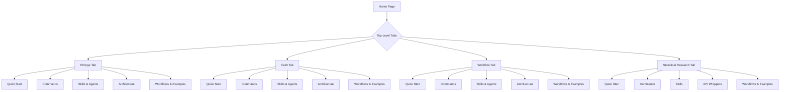
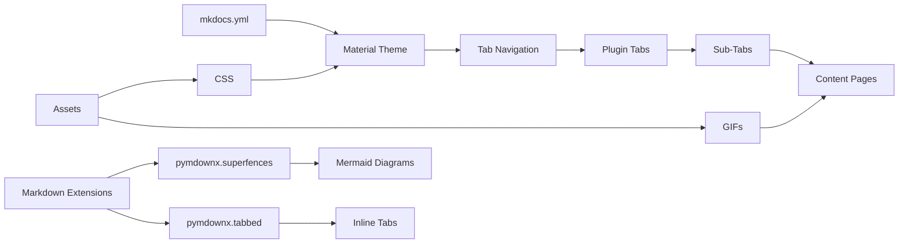
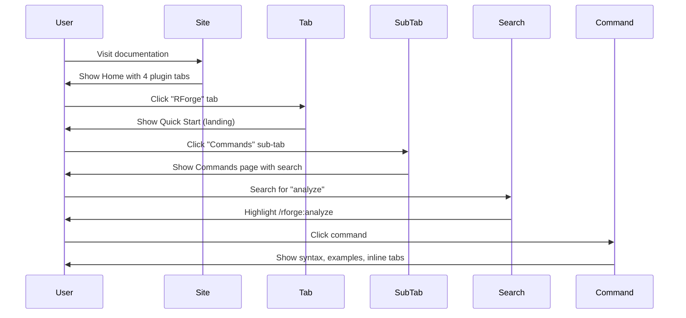
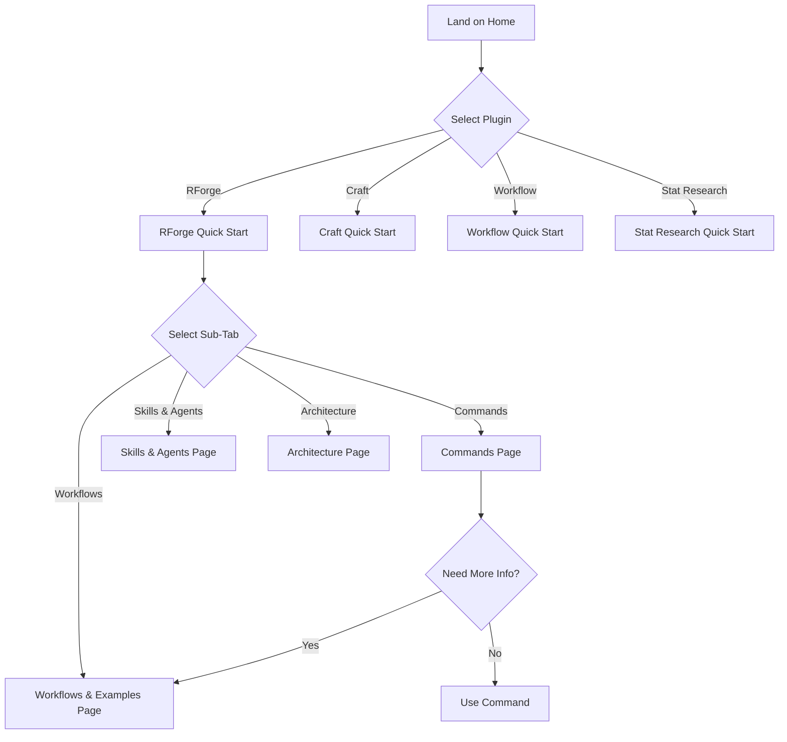

# SPEC: Plugin Documentation Tabs Redesign

**Status:** draft
**Created:** 2026-01-09
**From Brainstorm:** BRAINSTORM-plugin-documentation-tabs-2026-01-09.md
**Priority:** MEDIUM
**Effort:** 14-20 hours (core + GIFs)
**Target Completion:** 2026-01-15

---

## Overview

Transform the hierarchical plugin documentation navigation into a tabbed interface where each plugin is a top-level tab with consistent sub-sections. This redesign eliminates redundant Overview pages, reduces clicks to access content, and adds rich visual content (Mermaid diagrams, animated GIFs, inline tabbed examples) to enhance learning.

**Key Changes:**
- Material theme tabs: 4 plugin tabs (RForge, Craft, Workflow, Statistical Research)
- 5 sub-tabs per plugin: Quick Start, Commands, Skills & Agents, Architecture, Workflows & Examples
- Merge Overview landing pages into Quick Start sub-tabs
- Add visual content: Mermaid diagrams, GIFs, inline code tabs
- Mobile-responsive with hamburger menu

---

## Primary User Story

**As a** developer exploring Claude Code plugins

**I want** a tabbed interface where each plugin is a top-level tab with consistent sub-sections (Quick Start, Commands, Skills & Agents, Architecture, Workflows & Examples)

**So that** I can quickly navigate to specific aspects across different plugins without excessive clicking through hierarchical menus

**Acceptance Criteria:**
1. Clicking a plugin tab immediately shows Quick Start (landing page)
2. 5 sub-tabs visible under each plugin tab
3. Visual content enhances learning:
   - Mermaid diagrams in Architecture sections
   - Animated GIFs in Workflows & Examples
   - Inline tabbed content for command output formats
4. Mobile experience uses Material default hamburger menu
5. No more than 2 clicks to reach any documentation page
6. mkdocs build succeeds with all visual enhancements
7. GitHub Pages deployment successful

---

## Secondary User Stories

### User Story 2: Content Creator

**As a** plugin maintainer

**I want** a consistent template for Workflows & Examples sections

**So that** I can easily add visual demonstrations across all plugins with uniform structure

**Acceptance Criteria:**
- Template includes Mermaid diagram, GIF, and code example sections
- Applied to all 4 plugins
- Documentation on creating GIFs and diagrams

---

### User Story 3: Mobile User

**As a** mobile developer browsing documentation on a tablet

**I want** the tabbed navigation to collapse into a responsive menu

**So that** I can access all content on smaller screens without horizontal scrolling

**Acceptance Criteria:**
- Hamburger menu on screens < 768px
- All tabs and sub-tabs accessible via collapsed menu
- Content readable without zooming

---

## Technical Requirements

### Architecture

**Navigation Structure:**



**Component Diagram:**



---

### API Design

N/A - No API changes. This is a documentation structure redesign using existing MkDocs/Material theme capabilities.

---

### Data Models

**mkdocs.yml Navigation Structure:**

```yaml
nav:
  - Home: index.md
  - Getting Started:
      - Installation: installation.md
      - Quick Start: quick-start.md

  # PLUGIN TABS (4 top-level tabs)
  - RForge:
      - Quick Start: rforge/quick-start.md      # Landing page
      - Commands: rforge/commands.md
      - Skills & Agents: rforge/skills-agents.md
      - Architecture: rforge/architecture.md
      - Workflows & Examples: rforge/workflows.md  # NEW

  - Craft:
      - Quick Start: craft/quick-start.md
      - Commands: craft/commands.md
      - Skills & Agents: craft/skills-agents.md
      - Architecture: craft/architecture.md
      - Workflows & Examples: craft/workflows.md

  - Workflow:
      - Quick Start: workflow/quick-start.md
      - Commands: workflow/commands.md
      - Skills & Agents: workflow/skills-agents.md
      - Architecture: workflow/architecture.md
      - Workflows & Examples: workflow/workflows.md

  - Statistical Research:
      - Quick Start: statistical-research/quick-start.md
      - Commands: statistical-research/commands.md
      - Skills: statistical-research/skills.md
      - API Wrappers: statistical-research/api-wrappers.md
      - Workflows & Examples: statistical-research/workflows.md

  # NON-PLUGIN SECTIONS (keep separate)
  - Developer Guide: CLAUDE.md
  - Publishing: PUBLISHING.md
```

**Material Theme Configuration:**

```yaml
theme:
  name: material
  features:
    - navigation.tabs              # Enable tabs
    - navigation.tabs.sticky       # Keep tabs visible on scroll
    - navigation.sections          # Collapsible sections
    - navigation.indexes           # Index pages for tabs
    - navigation.expand            # Expand sections by default
    - search.suggest               # Search suggestions
    - search.highlight             # Highlight search terms
    - content.code.copy            # Copy code button
    - content.tabs.link            # Link tabbed content
```

**Markdown Extensions:**

```yaml
markdown_extensions:
  - pymdownx.highlight:
      use_pygments: true
  - pymdownx.superfences:
      custom_fences:
        - name: mermaid
          class: mermaid
          format: !!python/name:pymdownx.superfences.fence_code_format
  - pymdownx.tabbed:
      alternate_style: true
  - pymdownx.details
  - admonition
  - tables
  - attr_list
  - def_list
```

---

### Dependencies

**Existing:**
- mkdocs (already installed)
- mkdocs-material (already installed)
- pymdownx extensions (already configured)

**New:**
- None (all features supported by existing dependencies)

**GIF Creation Tools (optional, for content creators):**
- asciinema (terminal recording) - `brew install asciinema`
- agg (asciinema to GIF) - `cargo install agg`
- gifsicle (GIF optimization) - `brew install gifsicle`
- ffmpeg (screen recording conversion) - `brew install ffmpeg`

---

## UI/UX Specifications

### User Flow

**User Journey: Finding a Command**



**Flow Diagram:**



---

### Wireframes (ASCII)

**Desktop View:**

```
┌────────────────────────────────────────────────────────────┐
│ Claude Code Plugins                            🔍 Search   │
├─────┬──────┬──────────┬────────────────┬────────┬──────────┤
│ Home│RForge│  Craft   │   Workflow     │ Stat R.│  Dev     │  ← Tabs
├─────┴──────┴──────────┴────────────────┴────────┴──────────┤
│                                                            │
│  RForge Tab                                                │
│  ┌──────────────────────────────────────────────────────┐ │
│  │ Quick Start │ Commands │ Skills │ Arch │ Workflows   │ │  ← Sub-tabs
│  └──────────────────────────────────────────────────────┘ │
│                                                            │
│  # Quick Start                                             │
│                                                            │
│  > Complete R package ecosystem orchestrator with 15 cmds  │
│                                                            │
│  ## Installation                                           │
│  ```bash                                                   │
│  npm install -g @data-wise/rforge-plugin                   │
│  ```                                                       │
│                                                            │
│  ## First Command                                          │
│  ...                                                       │
│                                                            │
└────────────────────────────────────────────────────────────┘
```

**Mobile View (< 768px):**

```
┌─────────────────────────────────┐
│ Claude Code Plugins      ☰      │  ← Hamburger menu
├─────────────────────────────────┤
│                                 │
│  # Quick Start                  │
│                                 │
│  > Complete R package...        │
│                                 │
│  ## Installation                │
│  ...                            │
│                                 │
└─────────────────────────────────┘

[Hamburger Menu Expanded]
┌─────────────────────────────────┐
│ ☰ Navigation                    │
├─────────────────────────────────┤
│ ▼ RForge                        │
│   • Quick Start                 │
│   • Commands                    │
│   • Skills & Agents             │
│   • Architecture                │
│   • Workflows & Examples        │
│ ▸ Craft                         │
│ ▸ Workflow                      │
│ ▸ Statistical Research          │
│ • Developer Guide               │
└─────────────────────────────────┘
```

---

### Accessibility Checklist

- [ ] **Keyboard Navigation:**
  - [ ] Tab key cycles through plugin tabs
  - [ ] Arrow keys navigate between sub-tabs
  - [ ] Enter key activates selected tab
  - [ ] Escape key closes mobile menu

- [ ] **Screen Readers:**
  - [ ] Tab roles: `role="navigation"` on tab container
  - [ ] Active tab: `aria-current="page"`
  - [ ] Tab labels: Clear, descriptive text
  - [ ] Images: Alt text for all GIFs and diagrams

- [ ] **Visual:**
  - [ ] Color contrast ratio ≥ 4.5:1 (WCAG AA)
  - [ ] Focus indicators visible on all interactive elements
  - [ ] Text size adjustable without breaking layout
  - [ ] No information conveyed by color alone

- [ ] **Mermaid Diagrams:**
  - [ ] Alternative text descriptions provided
  - [ ] High contrast colors used
  - [ ] Diagrams scalable without pixelation

- [ ] **GIFs:**
  - [ ] Autoplay disabled or pauseable
  - [ ] Alternative static image or description provided
  - [ ] No flashing content (seizure risk)

---

## Open Questions

### Q1: Mode System Documentation Location

**Question:** Should Mode System docs stay in separate section or integrate into RForge tab?

**Current State:** Separate "Mode System" section in top-level nav

**Options:**
- **A) Keep separate** (Recommended)
  - **Pros:** Mode System is RForge-specific but documented at monorepo level, other plugins may adopt in future
  - **Cons:** Adds extra top-level item outside tabs

- **B) Move to RForge tab as sub-tab**
  - **Pros:** Mode System is RForge-specific, keeps all RForge content in one tab
  - **Cons:** Hides Mode System from other plugins that might benefit

**Recommendation:** Keep separate (Option A)
- Mode System could be adopted by other plugins
- Keeping it monorepo-level signals it's a shared pattern
- Doesn't clutter RForge tab with cross-cutting concern

**Decision:** ✅ Keep separate (Option A)
- Mode System stays in separate section at monorepo level
- Other plugins may adopt Mode System pattern in future

---

### Q2: Plugin-Agnostic Documentation

**Question:** How to organize CI/CD Guide, Publishing, and Plugin Development docs?

**Current State:** Separate top-level items

**Options:**
- **A) Keep as separate top-level items** (Recommended)
  - **Pros:** Clear separation of plugin content vs meta-docs
  - **Cons:** More items outside tabs

- **B) Create "Developer" tab for all development docs**
  - **Pros:** Consolidates meta-documentation
  - **Cons:** Developer tab doesn't fit plugin-focused tab structure

- **C) Distribute to relevant plugins** (e.g., CI/CD → Craft)
  - **Pros:** Colocates related content
  - **Cons:** These docs apply to all plugins, not just one

**Recommendation:** Keep separate (Option A)
- These docs are monorepo-level, not plugin-specific
- Publishing applies to all plugins
- Developer Guide is meta-documentation

**Decision:** ✅ Keep as separate top-level items (Option A)
- Clear separation between plugin content and meta-documentation
- Publishing, CI/CD, and Plugin Development remain accessible outside tabs

---

### Q3: GIF File Hosting

**Question:** Where to host GIF files for best performance?

**Options:**
- **A) In repo: docs/assets/gifs/** (Recommended)
  - **Pros:** Version controlled, always available, no external dependencies
  - **Cons:** Increases repo size (~10-20MB for 8 GIFs)

- **B) External CDN (e.g., GitHub releases, Cloudinary)**
  - **Pros:** Doesn't bloat repo, faster loading
  - **Cons:** External dependency, broken links if service fails

- **C) Git LFS (Large File Storage)**
  - **Pros:** Version controlled, doesn't bloat git history
  - **Cons:** Requires LFS setup, GitHub bandwidth limits

**Recommendation:** Option A (docs/assets/gifs/)
- Simplest solution, no external dependencies
- GIFs optimized to < 1MB each (8 GIFs = ~8MB total)
- GitHub Pages has 1GB soft limit (plenty of room)

**Decision:** ✅ In repo: docs/assets/gifs/ (Option A)
- GIFs stored in repository under docs/assets/gifs/
- Version controlled, no external dependencies
- ~8MB total (8 GIFs optimized to <1MB each)

---

### Q4: Architecture Diagrams Migration

**Question:** Should centralized diagrams (docs/diagrams/) be integrated into plugin tabs?

**Current State:** Separate "Architecture" section with all diagrams

**Options:**
- **A) Integrate into each plugin's Architecture sub-tab** (Recommended)
  - **Pros:** All plugin content in one tab, reduces navigation complexity
  - **Cons:** Requires moving files and updating links

- **B) Keep centralized for cross-plugin viewing**
  - **Pros:** Easy comparison across plugins
  - **Cons:** Doesn't align with tabbed structure

- **C) Hybrid: Keep centralized + duplicate in plugin tabs**
  - **Pros:** Best of both worlds
  - **Cons:** Duplicate maintenance, content drift risk

**Recommendation:** Option A (integrate)
- Each diagram is plugin-specific (rforge-flow, craft-structure, etc.)
- Embedding diagrams in Architecture pages improves context
- Users can still compare by opening multiple tabs

**Migration:**
- docs/diagrams/rforge-flow.md → embed in docs/rforge/architecture.md
- docs/diagrams/craft-structure.md → embed in docs/craft/architecture.md
- etc.

**Decision:** ✅ Integrate into each plugin's Architecture sub-tab (Option A)
- Move docs/diagrams/rforge-flow.md → embed in docs/rforge/architecture.md
- Move docs/diagrams/craft-structure.md → embed in docs/craft/architecture.md
- All plugin content consolidated within plugin tabs

---

## Review Checklist

### Planning
- [ ] User stories validated with stakeholders
- [ ] Technical approach reviewed and approved
- [ ] Open questions resolved or deferred
- [ ] Effort estimates reviewed (14-20 hours core + GIFs)

### Design
- [ ] Wireframes reviewed (desktop + mobile)
- [ ] Accessibility requirements documented
- [ ] Visual content standards defined (Mermaid, GIFs, inline tabs)
- [ ] Navigation structure validated

### Implementation
- [ ] mkdocs.yml configuration drafted
- [ ] File operations documented (merge, create, move, delete)
- [ ] Custom CSS requirements identified (optional)
- [ ] GIF creation workflow defined

### Testing
- [ ] mkdocs build validation plan
- [ ] Cross-browser testing plan (Chrome, Firefox, Safari)
- [ ] Mobile responsive testing plan
- [ ] Accessibility testing plan (keyboard, screen reader)

### Documentation
- [ ] Implementation phases documented
- [ ] Success criteria defined and measurable
- [ ] GIF creation guide written (for content creators)
- [ ] Migration guide for existing content

---

## Implementation Notes

### Phase 1: Foundation (2 hours)

**Goal:** Enable tabs and consolidate content

**Tasks:**
1. Update mkdocs.yml with tab configuration (15 min)
2. Merge Overview pages into Quick Start (1.5 hours):
   - docs/plugins/rforge.md → docs/rforge/quick-start.md
   - docs/plugins/craft.md → docs/craft/quick-start.md
   - docs/plugins/workflow.md → docs/workflow/quick-start.md
   - docs/plugins/statistical-research.md → docs/statistical-research/quick-start.md
3. Test build and deployment (15 min)

**Validation:**
- mkdocs build succeeds
- Tabs visible in local preview
- Quick Start pages render correctly

---

### Phase 2: Navigation (2 hours)

**Goal:** Implement full tab structure

**Tasks:**
1. Update mkdocs.yml with complete nav structure (1 hour)
2. Move files to align with new structure (30 min):
   - docs/rforge/docs/* → docs/rforge/*
   - docs/craft/docs/* → docs/craft/*
   - docs/workflow/docs/* → docs/workflow/*
   - docs/statistical-research/docs/* → docs/statistical-research/*
3. Fix internal links (30 min)
4. Delete obsolete directories (docs/plugins/, docs/*/docs/)

**Validation:**
- All sub-tabs accessible
- No broken links
- Mobile menu works

---

### Phase 3: Visual Content Foundation (2 hours)

**Goal:** Establish visual content patterns

**Tasks:**
1. Create Workflows & Examples template (30 min)
2. Implement template for RForge (30 min)
3. Add Mermaid diagram to RForge Architecture (1 hour)

**Template:** docs/rforge/workflows.md

**Validation:**
- Mermaid diagram renders
- Inline tabs work
- Template reusable for other plugins

---

### Phase 4: Content Rollout (6 hours)

**Goal:** Apply visual content to all plugins

**Tasks:**
1. Create Workflows & Examples for Craft (1 hour)
2. Create Workflows & Examples for Workflow (1 hour)
3. Create Workflows & Examples for Statistical Research (1 hour)
4. Add Mermaid diagrams to all Architecture pages (2 hours)
5. Add inline tabbed content to Commands pages (1 hour)

**Validation:**
- All 4 plugins have Workflows section
- All Architecture pages have diagrams
- Inline tabs functional

---

### Phase 5: Polish (6+ hours, ongoing)

**Goal:** Add animations and optimize

**Tasks:**
1. Create 2 GIFs per plugin (4-6 hours):
   - Record terminal sessions with asciinema
   - Convert to GIF with agg
   - Optimize with gifsicle
   - Target: < 1MB per GIF
2. Add search keywords to frontmatter (1 hour)
3. Implement "See Also" cross-plugin links (1 hour)

**Validation:**
- GIFs load quickly
- Search results relevant
- Cross-links functional

---

## History

### 2026-01-09
- Created from brainstorm session
- Deep feature analysis completed
- User answered 8 expert questions
- Spec drafted with all required sections

---

**Last Updated:** 2026-01-09
**Spec Version:** 1.0.0
**Status:** 📝 Draft - Ready for review and implementation
