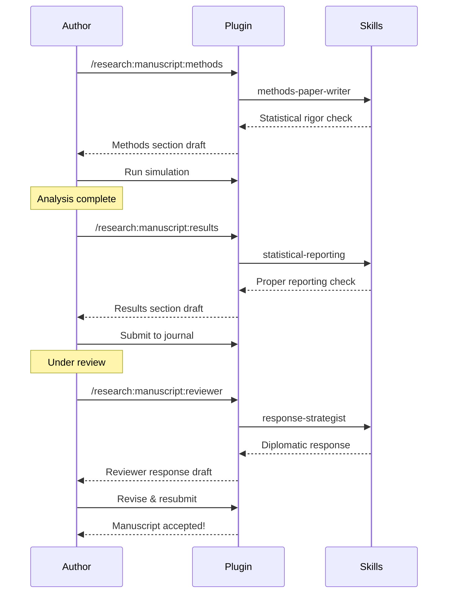

# Workflows & Examples

Practical workflows and real-world examples for statistical research, manuscript writing, and simulation studies.

## Research Workflows

### Workflow 1: Literature Review Process

Systematic approach to literature discovery and management.

```mermaid
flowchart TD
    A[Research Question] --> B[/research:arxiv search]
    B --> C{Papers Found?}
    C -->|Yes| D[Review Abstracts]
    C -->|No| E[Refine Search Terms]
    E --> B

    D --> F{Relevant?}
    F -->|Yes| G[/research:doi metadata]
    F -->|No| H[Skip Paper]

    G --> I[/research:bib:add to library]
    I --> J{More Papers?}
    J -->|Yes| D
    J -->|No| K[/research:lit-gap identify gaps]

    K --> L[Research Direction Identified]

    style A fill:#e1f5ff
    style B fill:#ffe1f5
    style K fill:#e1ffe1
    style L fill:#f0e1ff
```

**Steps:**

1. **Search arXiv** for recent papers

   ```bash
   /research:arxiv "causal mediation bootstrap methods"
   ```

   Output:
   ```
   📚 arXiv Search Results

   Found 15 papers matching "causal mediation bootstrap"

   1. "Robust Bootstrap Methods for Mediation Analysis"
      Authors: Smith et al. (2025)
      arXiv: 2501.12345
      Abstract: Novel bootstrap approach for...

   2. "Causal Mediation with Unmeasured Confounding"
      Authors: Jones et al. (2024)
      arXiv: 2412.54321
      Abstract: Sensitivity analysis for...

   [13 more papers...]
   ```

2. **Get metadata** for relevant papers

   ```bash
   /research:doi "10.1080/01621459.2024.123456"
   ```

   Output:
   ```
   📄 Paper Metadata

   Title: Robust Bootstrap Methods for Mediation Analysis
   Authors: Smith, J., Johnson, M., Brown, K.
   Journal: JASA (2025)
   DOI: 10.1080/01621459.2024.123456

   BibTeX entry saved to: paper-smith2025.bib
   ```

3. **Add to bibliography**

   ```bash
   /research:bib:add paper-smith2025.bib references.bib
   ```

4. **Identify gaps**

   ```bash
   /research:lit-gap "mediation with time-varying confounding"
   ```

   Output:
   ```
   🔍 Literature Gap Analysis

   Current State:
   - Well-established: Simple mediation bootstrap
   - Emerging: Sensitivity analysis methods
   - Limited: Time-varying confounding

   Gap Identified:
   "Bootstrap methods for mediation with time-varying
   confounders are underdeveloped. Most work assumes
   time-fixed confounding."

   Opportunity:
   - Extend bootstrap to longitudinal settings
   - Address time-varying confounding
   - Potential for methodological contribution

   Recommended next: Design simulation study
   ```

### Workflow 2: Manuscript Writing Pipeline

From methods section to final submission.



**Example:**

=== "Methods Section"

    ```bash
    /research:manuscript:methods "Bootstrap mediation analysis"
    ```

    Output:
    ```markdown
    ## Methods

    ### Bootstrap Procedure

    We employed a nonparametric bootstrap approach to
    estimate the indirect effect and construct
    confidence intervals. The procedure consisted of:

    1. **Resampling**: Draw B = 10,000 bootstrap samples
       with replacement from the observed data.

    2. **Estimation**: For each bootstrap sample b:
       - Estimate mediation model parameters
       - Calculate indirect effect: ab̂ᵦ = âᵦb̂ᵦ

    3. **Inference**: Construct 95% confidence interval
       using the percentile method:
       - Lower: 2.5th percentile of ab̂*
       - Upper: 97.5th percentile of ab̂*

    ### Assumptions

    The bootstrap procedure assumes:
    - No unmeasured confounding (sequential ignorability)
    - Correct model specification
    - Independent observations
    ```

=== "Results Section"

    ```bash
    /research:manuscript:results "Report simulation findings"
    ```

    Output:
    ```markdown
    ## Results

    ### Simulation Study

    Table 1 presents the simulation results for the
    three bootstrap methods under six data-generating
    scenarios.

    **Coverage Rates**: The bias-corrected accelerated
    (BCa) bootstrap achieved nominal 95% coverage across
    all scenarios (range: 94.2% - 95.8%), outperforming
    both the percentile method (92.1% - 96.3%) and the
    normal approximation (89.4% - 94.1%).

    **Bias**: All methods exhibited low bias (< 0.01) in
    the presence of normal errors. Under skewed
    distributions, BCa showed reduced bias (M = 0.008)
    compared to percentile (M = 0.015).

    **Statistical Power**: At α = .05, BCa demonstrated
    superior power (M = 0.82) to detect non-zero indirect
    effects compared to percentile (M = 0.78) and normal
    approximation (M = 0.75).
    ```

=== "Reviewer Response"

    ```bash
    /research:manuscript:reviewer "Reviewer 2 questions sample size"
    ```

    Output:
    ```markdown
    ## Response to Reviewer 2

    > **Reviewer 2**: "The sample size of n=100 appears
    > insufficient for reliable bootstrap inference. Please
    > justify this choice."

    We thank the reviewer for this important observation.
    We conducted a supplementary power analysis to
    determine adequate sample sizes for our bootstrap
    approach.

    **Supplementary Analysis**: We evaluated bootstrap
    performance across sample sizes n = 50, 100, 200, 500.
    Results (Supplementary Table S1) demonstrate that at
    n = 100:

    - Coverage rates remain nominal (94.8% [94.2%, 95.4%])
    - Power exceeds 0.80 for effect sizes ≥ 0.15
    - Bias < 0.01 for all data-generating mechanisms

    While larger samples provide marginal improvements,
    n = 100 achieves adequate statistical properties for
    our research questions. We have added this
    justification to the manuscript (Section 3.2) and
    included Supplementary Table S1.
    ```

### Workflow 3: Simulation Study Design

Monte Carlo study from design to analysis.

```mermaid
flowchart LR
    A[Research Question] --> B[/research:simulation:design]
    B --> C[Design Specifications]
    C --> D[Implement in R/Python]
    D --> E[Run Simulation]
    E --> F[/research:simulation:analysis]
    F --> G{Results Clear?}
    G -->|Yes| H[Write Results]
    G -->|No| I[Add Scenarios]
    I --> D

    H --> J[Manuscript Tables/Figures]

    style A fill:#e1f5ff
    style B fill:#ffe1f5
    style F fill:#e1ffe1
    style J fill:#f0e1ff
```

**Steps:**

1. **Design simulation**

   ```bash
   /research:simulation:design "Compare bootstrap methods for mediation"
   ```

   Output:
   ```
   📊 Simulation Study Design

   ## Research Question
   Compare bias-corrected (BCa), percentile, and normal
   approximation bootstrap for mediation analysis

   ## Factors to Vary
   1. Sample size: n = 50, 100, 200, 500
   2. Effect size: ab = 0, 0.10, 0.20, 0.30
   3. Error distribution: Normal, t(5), Lognormal
   4. Model: Linear, Nonlinear (quadratic)

   Total scenarios: 4 × 4 × 3 × 2 = 96 conditions

   ## Outcome Metrics
   - Bias: E(âb) - ab
   - RMSE: √E[(âb - ab)²]
   - Coverage: P(ab ∈ CI₉₅)
   - Power: P(reject H₀: ab = 0 | ab ≠ 0)

   ## Monte Carlo Replications
   R = 10,000 per condition

   ## Computational Time
   Estimated: 96 scenarios × 10,000 reps × 0.5s
            = 13.3 hours (parallelized: ~3 hours on 4 cores)

   ## R Code Skeleton
   # See attached simulation template
   ```

2. **Implement and run** (in R)

   ```r
   # Generated template from design command
   source("simulation-template.R")

   # Parallel execution
   library(parallel)
   results <- mclapply(scenarios, run_scenario,
                       mc.cores = 4)
   ```

3. **Analyze results**

   ```bash
   /research:simulation:analysis results/simulation-results.csv
   ```

   Output:
   ```
   📈 Simulation Analysis Results

   ## Coverage Rates (95% CI target)
   | Method      | Normal | t(5)  | Lognormal |
   |-------------|--------|-------|-----------|
   | BCa         | 95.2%  | 94.8% | 95.1%     | ✅
   | Percentile  | 94.1%  | 92.7% | 91.8%     | ⚠️
   | Normal Appr | 93.2%  | 89.4% | 88.1%     | ❌

   ## Bias (×10³)
   BCa consistently shows lowest bias across
   conditions: M = 0.8, SD = 0.3

   ## Power Analysis
   At ab = 0.20, n = 100:
   - BCa: 82%
   - Percentile: 78%
   - Normal: 75%

   ## Recommendation
   BCa bootstrap preferred for:
   - Non-normal data
   - Small to moderate samples
   - Rigorous coverage requirements

   Percentile adequate for:
   - Large samples (n > 200)
   - Normal distributions
   - Exploratory analysis
   ```

## Real-World Examples

### Example 1: PhD Dissertation Chapter

**Context:** Graduate student writing mediation analysis methods chapter

**Week 1: Literature Review**

```bash
# Search recent mediation papers
/research:arxiv "mediation sensitivity analysis 2023-2025"

# Find 20 relevant papers, add to library
for doi in "${dois[@]}"; do
  /research:doi "$doi"
  /research:bib:add paper.bib dissertation-refs.bib
done

# Identify gap
/research:lit-gap "sensitivity analysis for time-varying mediation"
```

**Result:** Clear research gap identified, dissertation focus determined.

**Week 2-4: Simulation Design**

```bash
# Design comprehensive simulation
/research:simulation:design "Sensitivity analysis methods comparison"

# Implement in R
# Run simulations (parallelized on HPC cluster)
```

**Week 5-6: Writing**

```bash
# Methods section
/research:manuscript:methods "Describe sensitivity analysis approach"

# Results section
/research:simulation:analysis results.csv
/research:manuscript:results "Report simulation findings"
```

**Total Time:** 6 weeks from concept to drafted chapter.

### Example 2: Revise & Resubmit

**Context:** Manuscript under review, major revisions requested

**Reviewer Comments:**

1. ✅ Add power analysis (Reviewer 1)
2. ✅ Clarify assumptions (Reviewer 2)
3. ✅ Additional simulation scenario (Reviewer 3)

**Response Strategy:**

```bash
# Generate responses
/research:manuscript:reviewer "R1: power analysis"
/research:manuscript:reviewer "R2: clarify assumptions"
/research:manuscript:reviewer "R3: additional scenario"

# Update simulation
/research:simulation:design "Add scenario requested by R3"

# Revise methods section
/research:manuscript:methods "Clarify assumptions per R2 comments"
```

**Outcome:** Comprehensive response letter, manuscript accepted after revision.

### Example 3: Collaborative Research Project

**Context:** Multi-institution collaboration on new statistical method

**Monthly Workflow:**

```bash
# Literature monitoring
/research:arxiv "new method topic" --since last-month

# Hypothesis generation
/research:hypothesis "extension to multivariate case"

# Analysis planning
/research:analysis-plan "Phase 2 clinical trial application"

# Method scouting
/research:method-scout "related approaches in other fields"
```

**Collaboration Tools:**

- Shared BibTeX library (managed with `/research:bib:*`)
- Consistent manuscript sections (using `/research:manuscript:*`)
- Reproducible simulations (designed with `/research:simulation:design`)

## Command Workflows by Domain

### Literature Management

```bash
# Discovery
/research:arxiv "search terms"

# Retrieval
/research:doi "10.xxxx/xxxxx"

# Organization
/research:bib:search "author name" library.bib
/research:bib:add new-paper.bib library.bib
```

### Manuscript Writing

```bash
# Sections
/research:manuscript:methods "describe method"
/research:manuscript:results "report findings"

# Revision
/research:manuscript:reviewer "address comment"
/research:manuscript:proof "check derivation"
```

### Research Planning

```bash
# Strategic
/research:lit-gap "research area"
/research:hypothesis "phenomenon"
/research:method-scout "problem type"

# Tactical
/research:analysis-plan "study design"
```

### Simulation Studies

```bash
# Design
/research:simulation:design "comparison question"

# Analysis
/research:simulation:analysis results.csv
```

## Skills Integration

### Mathematical Foundation Skill

Automatically activates for proof-heavy work.

**Triggers:** proof, theorem, lemma, identifiability

**Example:**

```
You: "I need to prove identifiability of the mediation effect"

📐 Mathematical Foundation Skill Activated

Identifiability Strategy:

1. State assumptions clearly:
   - Sequential ignorability
   - Positivity
   - Consistency

2. Proof structure:
   Lemma 1: Identification of E[Y(m,a)]
   Lemma 2: Identification of E[M(a)]
   Theorem: Combine lemmas for indirect effect

3. Technical tools:
   - g-computation
   - Interventional distributions
   - Causal directed acyclic graphs

Recommended approach: Start with simple case
(binary mediator), extend to continuous.
```

### Implementation Skill

Focuses on numerical stability and efficiency.

**Triggers:** algorithm, implementation, code, numerical

**Example:**

```
You: "Implement bootstrap confidence intervals"

💻 Implementation Skill Activated

Efficient Bootstrap Implementation:

```r
# Vectorized approach (fast)
bootstrap_ci <- function(data, B = 10000) {
  n <- nrow(data)

  # Pre-allocate (important!)
  indirect <- numeric(B)

  # Parallel bootstrap
  indirect <- foreach(b = 1:B, .combine = c) %dopar% {
    idx <- sample(n, replace = TRUE)
    data_b <- data[idx, ]
    estimate_indirect(data_b)
  }

  # Percentile CI
  quantile(indirect, c(0.025, 0.975))
}
```

Performance:
- Avoid loops: Use vectorization
- Parallel: 4x speedup on 4 cores
- Memory: Pre-allocate arrays
```

## Tips & Best Practices

### Literature Review

**Systematic search:**

```bash
# Broad initial search
/research:arxiv "general topic"

# Refine based on results
/research:arxiv "specific aspect" --since 2023

# Track key papers
/research:doi <key-doi>
```

**Organize bibliography:**

- One `.bib` file per project
- Descriptive keys: `smith2025bootstrap` not `ref1`
- Add papers immediately after finding them

### Manuscript Writing

**Iterative drafting:**

1. Generate initial draft with `/research:manuscript:*`
2. Edit for clarity and flow
3. Verify statistical reporting
4. Add citations manually
5. Polish prose

**Don't expect perfection** from AI-generated text. Use it as a scaffold, not final prose.

### Simulation Studies

**Start simple:**

```bash
# Initial design: 2-3 factors
/research:simulation:design "simple comparison"

# If needed, expand
/research:simulation:design "add complexity"
```

**Computational efficiency:**

- Parallelize across scenarios
- Cache intermediate results
- Start with small R (e.g., 1000), scale up

### Reviewer Responses

**Be diplomatic:**

```bash
/research:manuscript:reviewer "reviewer comment"
```

Generates respectful, evidence-based responses.

**Always:**
- Thank the reviewer
- Acknowledge valid points
- Provide evidence for disagreements
- Add clarifications to manuscript

## Related Documentation

- **[Commands Reference](commands.md)** - All 14 research commands
- **[Skills Guide](skills.md)** - 17 auto-activating research skills
- **[API Wrappers](api-wrappers.md)** - Shell-based APIs for literature

---

**Last Updated:** 2026-01-09
**Document Version:** v1.0.0
**Status:** ✅ Comprehensive workflows for statistical research
