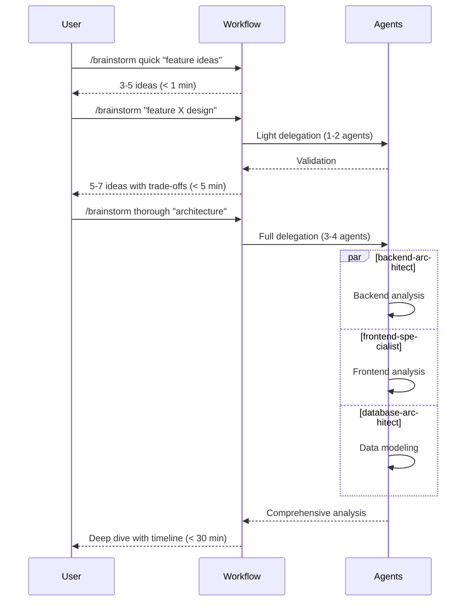

# Workflows & Examples

Practical ADHD-friendly workflows and real-world examples for focus, task management, and decision support.

## Daily Workflows

### Workflow 1: Morning Planning Routine

Start your day with clarity and focus.

```mermaid
flowchart TD
    A[Start Day] --> B[/recap]
    B --> C{Have context?}
    C -->|Yes| D[Review yesterday]
    C -->|No| E[Fresh start]

    D --> F[/next]
    E --> F

    F --> G{Task suggested?}
    G -->|Clear choice| H[/focus task]
    G -->|Uncertain| I[/brainstorm quick 'priorities']

    I --> F

    H --> J[Work on task]
    J --> K{Stuck?}
    K -->|Yes| L[/stuck]
    K -->|No| M{Done?}

    L --> N[Apply solution]
    N --> J

    M -->|Yes| O[/done 'achievement']
    M -->|No| J

    style A fill:#e1f5ff
    style F fill:#ffe1f5
    style H fill:#e1ffe1
    style O fill:#f0e1ff
```

**Steps:**

1. **Restore context** (< 10s)

   ```bash
   /recap
   ```

   Output:
   ```
   📋 Yesterday's Context

   ✅ Completed: OAuth implementation
   📝 Progress: 85% test coverage
   🔄 Next: Error handling for edge cases

   Time since last session: 16 hours
   ```

2. **Get recommendation** (< 5s)

   ```bash
   /next
   ```

   Output:
   ```
   🎯 SUGGESTED NEXT STEP

   Add error handling to OAuth flow

   📁 File: src/auth/oauth.ts
   ⏱️  Est. time: 30-45 min

   Why this? Maintains momentum from yesterday,
   unblocked and ready to execute.

   💡 ALTERNATIVES:
   A) Quick win: Update README (10 min) ⚡
   B) Switch context: Review PR #42 (20 min)
   ```

3. **Enter focus mode**

   ```bash
   /focus "Add OAuth error handling"
   ```

   Output:
   ```
   📍 Focus Mode Activated

   Objective: Add OAuth error handling
   Success: Errors caught and logged properly
   Time budget: 45 minutes
   Distractions: Minimized

   Starting now...
   ```

### Workflow 2: Brainstorming Session

Quick ideation to thorough analysis.



**Example:**

=== "Quick Mode (<1 min)"

    ```bash
    /brainstorm quick "User dashboard features"
    ```

    Output:
    ```
    💡 Quick Ideas (30 seconds)

    1. Activity feed with recent actions
    2. Customizable widgets for key metrics
    3. Quick actions bar for common tasks
    4. Notification center
    5. Profile completion progress bar

    💬 Next: Pick one and run deeper analysis
    ```

=== "Default Mode (<5 min)"

    ```bash
    /brainstorm "Activity feed design"
    ```

    Output:
    ```
    📊 Analysis & Trade-offs

    Option A: Real-time WebSocket feed
    ✅ Instant updates, engaging UX
    ❌ Complex infrastructure, scaling challenges
    Effort: 3-4 days

    Option B: Polling with smart refresh
    ✅ Simple, reliable, easier to scale
    ❌ Slight delay, more server requests
    Effort: 1-2 days

    Option C: Hybrid (polling + occasional WS)
    ✅ Balanced approach
    ❌ More complexity than polling
    Effort: 2-3 days

    🎯 Recommendation: Start with Option B
    ```

=== "Thorough Mode (<30 min)"

    ```bash
    /brainstorm thorough "Real-time architecture"
    ```

    Output:
    ```
    🏗️ Deep Architectural Analysis

    ## Backend Perspective
    - WebSocket server: Socket.io vs native WS
    - Message queue: Redis pub/sub
    - Scaling: Sticky sessions + Redis adapter

    ## Frontend Perspective
    - State management: Redux + WS middleware
    - Reconnection strategy
    - Offline handling

    ## Database Perspective
    - Event storage schema
    - Read model optimization
    - Archive strategy for old events

    ## Timeline
    Week 1-2: Core WS infrastructure
    Week 3: Frontend integration
    Week 4: Scale testing & optimization

    Total effort: 4 weeks, 2 engineers
    ```

### Workflow 3: Getting Unstuck

5 Why analysis and solution finding.

```mermaid
flowchart TD
    A[Hit Blocker] --> B[/stuck]
    B --> C[What's the blocker?]
    C --> D[Why is this hard?]
    D --> E[What have you tried?]
    E --> F[Simpler version?]
    F --> G[Who could help?]

    G --> H{Root cause identified?}
    H -->|Yes| I[Solution recommended]
    H -->|No| J[Alternative approaches]

    I --> K[Apply solution]
    J --> K

    K --> L{Unblocked?}
    L -->|Yes| M[Continue work]
    L -->|No| N[Break down further]

    N --> B

    style A fill:#ffe1e1
    style B fill:#ffe1f5
    style I fill:#e1ffe1
    style M fill:#e1f5ff
```

**Example:**

```bash
/stuck
```

Interactive session:

```
🤔 Let's debug this...

1️⃣ What's the immediate blocker?
> "OAuth callback not working"

2️⃣ What have you tried?
> "Checked redirect URI, verified credentials"

3️⃣ What's a simpler version of this?
> "Test with local callback first?"

4️⃣ Root cause analysis suggests:
- Environment variable mismatch
- Callback URL using HTTP instead of HTTPS in prod

💡 Recommendation:
1. Verify OAUTH_CALLBACK_URL in .env
2. Ensure HTTPS in production config
3. Test with curl first before browser

Estimated fix time: 5-10 minutes
```

## Real-World Examples

### Example 1: ADHD Developer's Day

**Context:** Software engineer with ADHD, prone to context switching

**6:00 AM - Morning Planning**

```bash
/recap
# Restores: "Yesterday left off implementing search feature"

/next
# Suggests: "Complete search pagination (30 min)"

/focus "Complete search pagination"
# Activates focus mode
```

**Work Session (30 min):**
- Single task, clear objective
- No distractions
- Progress tracked

**Hit a Blocker (10:15 AM):**

```bash
/stuck
# Identifies: API rate limiting issue
# Suggests: Implement caching layer
```

**Context Switch (11:00 AM):**

```bash
/done "Pagination done, added caching"
# Captures achievement

# Unexpected meeting, context lost

/recap
# After meeting, restores context quickly
```

**End of Day (5:00 PM):**

```bash
/done "Search feature complete with tests"
# Saves context for tomorrow
```

### Example 2: Planning Sprint Work

**Context:** Team lead planning 2-week sprint

**Monday Morning:**

```bash
/brainstorm thorough "Sprint 12 priorities"
```

Output identifies:
- 3 high-priority features
- 2 tech debt items
- 1 performance optimization

**Breaking Down Work:**

```bash
/brainstorm "User authentication feature"
```

Output:
```
📋 Feature Breakdown

Backend (3 days):
- JWT authentication
- User registration
- Password reset

Frontend (2 days):
- Login form
- Registration flow
- Protected routes

Testing (1 day):
- Unit tests
- Integration tests
- E2E tests

Total: 6 days (1 developer)
```

**Daily Standups:**

```bash
/next
# Each developer gets personalized task recommendation
```

### Example 3: Feature Development Workflow

**Day 1: Planning**

```bash
/brainstorm "Add comment system"
```

Gets 5-7 design options with trade-offs.

**Day 2-4: Implementation**

```bash
# Start each day
/recap
/next
/focus "task from /next"

# When stuck
/stuck

# End each day
/done "what was accomplished"
```

**Day 5: Testing & Polish**

```bash
/next
# Recommends: "Write tests for comment system"

/focus "Write comprehensive tests"
```

## Auto-Activating Skills

Skills trigger automatically based on conversation keywords.

### Backend Designer

**Triggers:** API, database, authentication, caching

**Example Conversation:**

```
You: "I need to add user authentication"

🤖 Backend Designer Skill Activated

Pragmatic Authentication Options:

1. JWT with refresh tokens (recommended)
   - Stateless, scalable
   - Requires token storage client-side

2. Session-based with Redis
   - Server-side state
   - Easier to revoke sessions

3. OAuth with providers (Google, GitHub)
   - No password management
   - Depends on third-party

💡 For indie project: Start with JWT
```

### Frontend Designer

**Triggers:** UI, UX, components, accessibility

**Example Conversation:**

```
You: "Design a user settings page"

🎨 Frontend Designer Skill Activated

ADHD-Friendly Settings Design:

Structure:
- Tabbed sections (reduce cognitive load)
- Save button always visible
- Clear visual feedback on changes

Layout:
┌─────────────────────────────┐
│ Profile | Security | Prefs  │ ← Tabs
├─────────────────────────────┤
│                             │
│  [Settings form]            │
│                             │
│     [Save] [Cancel]         │ ← Always visible
└─────────────────────────────┘
```

### DevOps Helper

**Triggers:** CI/CD, deployment, Docker, infrastructure

**Example Conversation:**

```
You: "How do I deploy to production?"

🚀 DevOps Helper Skill Activated

Indie-Friendly Deployment:

Option A: Vercel (recommended for frontend)
- Zero config for Next.js
- Auto-scaling, edge network
- Free tier generous

Option B: Railway (recommended for full-stack)
- Simple Dockerfile deployment
- Built-in database
- $5/month

Option C: DigitalOcean App Platform
- Middle ground
- More control than Vercel
- Predictable pricing
```

## Time Budget Guarantees

All commands have explicit time budgets:

| Command | Time Budget | Use Case |
|---------|-------------|----------|
| `/next` | <5s | Quick decision |
| `/recap` | <10s | Context restore |
| `/stuck` | <60s | Problem solving |
| `/done` | <5s | Session capture |
| `/refine` | <30s | Prompt optimization |
| `/brainstorm quick` | <60s | Fast ideation |
| `/brainstorm` | <5min | Balanced analysis |
| `/brainstorm thorough` | <30min | Deep dive |
| `/focus` | N/A | Work session |

## ADHD-Friendly Features

### Scannable Output

```
┌─────────────────────────────────────────────────────────────┐
│ 🎯 SUGGESTED NEXT STEP                                      │
├─────────────────────────────────────────────────────────────┤
│                                                             │
│   Complete OAuth error handling                             │
│                                                             │
│   📁 File: src/auth/oauth.ts                                │
│   ⏱️  Est. time: 30-45 min                                   │
│   🎯 Impact: Critical for production                        │
│                                                             │
│   Why this? Unblocked, maintains momentum                   │
│                                                             │
├─────────────────────────────────────────────────────────────┤
│ 💡 ALTERNATIVES:                                            │
│    A) Update docs (10 min) ⚡                               │
│    B) Review PR (20 min)                                    │
└─────────────────────────────────────────────────────────────┘
```

### Quick Wins

Every recommendation includes <15min quick wins:

```
💡 ALTERNATIVES:
   A) Quick win: Add JSDoc comment (5 min) ⚡
   B) Quick win: Update README (10 min) ⚡
   C) Switch context: Different feature (60 min)
```

### Decision Support

Reduces paralysis:
- **ONE** clear recommendation
- **WHY** this task (builds trust)
- **2-3** escape hatches (alternatives)
- **Time estimates** (planning)

## Troubleshooting

### "Can't decide what to work on"

```bash
/next
# Clear recommendation with reasoning
```

### "Lost context after interruption"

```bash
/recap
# Restores: what you were doing, progress, next steps
```

### "Stuck on problem"

```bash
/stuck
# 5 Why analysis, suggests solutions
```

### "Too many ideas, can't focus"

```bash
/brainstorm quick "organize ideas"
# Fast categorization, prioritization
```

## Related Documentation

- **[Commands Reference](commands.md)** - All 12 ADHD-friendly commands
- **[Skills & Agents](skills-agents.md)** - Auto-activating skills and delegation

---

**Last Updated:** 2026-01-09
**Document Version:** v1.0.0
**Status:** ✅ ADHD-optimized workflows for focus and productivity
