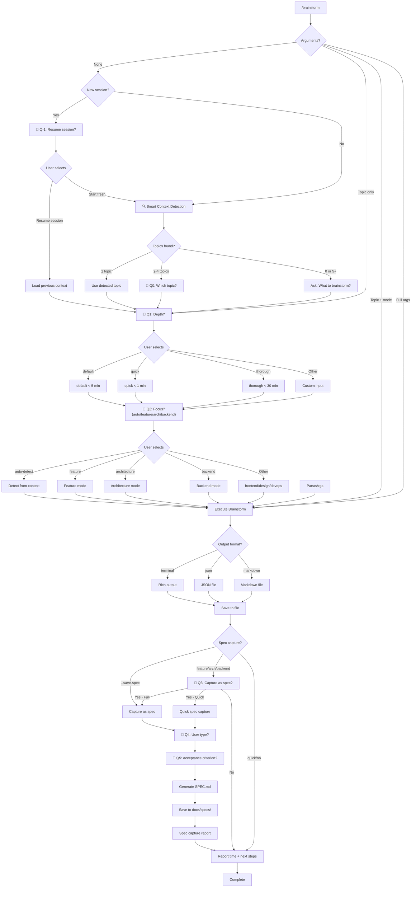

# /workflow:brainstorm - Enhanced Brainstorm

ADHD-friendly brainstorming with smart mode detection, time budgets, agent delegation, and **spec capture for implementation**.

## Arguments

| Argument | What it does |
|----------|--------------|
| (none) | Show interactive mode menu |
| `feature` | User stories, MVP scope, acceptance criteria |
| `architecture` | System design, scalability, component diagrams |
| `design` | UI/UX wireframes, accessibility, user flows |
| `backend` | API endpoints, database schema, auth patterns |
| `frontend` | Component tree, state management, performance |
| `devops` | CI/CD pipelines, deployment, infrastructure |
| `quick` | < 1 min, 5-7 ideas, no agents |
| `thorough` | < 30 min, 2-4 agents for deep analysis |
| `--save-spec` | Capture brainstorm as formal spec after completion |
| `--save-spec=full` | Full spec: user stories + technical + UI/UX |
| `--save-spec=quick` | Quick spec: user stories + key requirements only |

## When Invoked

### Step 0: Parse Arguments

```
Topic provided?       → Show menus (Q1: Depth, Q2: Focus), then execute
Topic + mode?         → Skip menus, execute with that mode
Full args?            → Execute directly
No arguments?         → Smart context detection (Step 0.5)
```

**Examples:**
| Input | Behavior |
|-------|----------|
| `/brainstorm "auth system"` | Shows menus → executes |
| `/brainstorm feature "auth"` | Skips menus → feature mode |
| `/brainstorm quick feature "auth"` | Skips menus → quick + feature |
| `/brainstorm` | Smart detect → maybe ask → menus → execute |

### Step 0.5: Smart Context Detection (No Arguments)

When no arguments provided, automatically detect topic from context:

#### New Session Detection

If this is a **new session** (no prior conversation), first check for resumable sessions:

```
1. Check if conversation history is empty (new session)
2. If new session → Invoke /resume behavior
3. Show recent sessions from before current session started
4. Let user pick a session to continue, or start fresh
```

```
AskUserQuestion:
  question: "Continue from a previous session or start fresh?"
  header: "Session"
  multiSelect: false
  options:
    - label: "Resume: [latest session topic]"
      description: "[project] - [time ago]"
    - label: "Resume: [2nd latest session]"
      description: "[project] - [time ago]"
    - label: "Start fresh"
      description: "New brainstorm in current context"
```

If user selects a previous session → load that context, then proceed to Q1: Depth.
If user selects "Start fresh" → proceed with normal detection below.

#### Detection Sources

| Source | What to look for | Priority |
|--------|------------------|----------|
| **Previous sessions** | Recent brainstorm sessions (new session only) | Highest |
| **Conversation** | Topics discussed, problems mentioned, features planned | High |
| **Git branch** | Branch name (e.g., `feature/oauth-login`) | Medium |
| **Recent commits** | Commit messages from last 24h | Medium |
| **Project .STATUS** | Current task, next steps | High |
| **Open discussion** | Questions asked, decisions pending | High |

#### Decision Logic

```python
topics = detect_topics_from_context()

if len(topics) == 1:
    # Clear single topic - use it directly
    topic = topics[0]
    → Proceed to Q1: Depth

elif len(topics) >= 2 and len(topics) <= 4:
    # Multiple topics - ask user to pick
    → AskUserQuestion: "Which topic?"
      options: [topic1, topic2, ..., "Other"]
    → Proceed to Q1: Depth

else:  # 0 topics or too many
    # No clear context - ask free-form
    → "What would you like to brainstorm?"
    → Proceed to Q1: Depth
```

#### Context Detection AskUserQuestion

When multiple topics detected:

```
AskUserQuestion:
  question: "Which topic should we brainstorm?"
  header: "Topic"
  multiSelect: false
  options:
    - label: "[Topic from conversation]"
      description: "Mentioned earlier in chat"
    - label: "[Topic from git branch]"
      description: "Current branch: feature/xyz"
    - label: "[Topic from .STATUS]"
      description: "Current project focus"
```

#### Example: Clear Context

```
[Earlier in conversation]
User: "I need to add user notifications to the app"

[Later]
User: /brainstorm

Claude: (detects single topic: "user notifications")
  → Skips topic question
  → Shows Q1: Depth
  → Shows Q2: Focus
  → Executes brainstorm for "user notifications"
```

#### Example: Multiple Topics

```
[Earlier in conversation]
User: "Working on OAuth and also need to refactor the DB"

[Later]
User: /brainstorm

Claude: [AskUserQuestion - Topic]
  "Which topic should we brainstorm?"
  ○ OAuth integration - Mentioned in conversation
  ○ Database refactoring - Mentioned in conversation
  ○ feature/auth-system - Current git branch

User: Selects "OAuth integration"

Claude: [Q1: Depth] → [Q2: Focus] → Execute
```

#### Example: No Context

```
[New conversation, no prior discussion]
User: /brainstorm

Claude: "What would you like to brainstorm?"
User: "A new caching layer"

Claude: [Q1: Depth] → [Q2: Focus] → Execute
```

### Step 1: Interactive Menu (Topic Provided, No Mode)

When topic is provided but no mode, show **two sequential AskUserQuestion calls** (max 4 options each).

#### Question 1: Depth Selection

```
AskUserQuestion:
  question: "How deep should the analysis be?"
  header: "Depth"
  multiSelect: false
  options:
    - label: "default (Recommended)"
      description: "< 5 min, comprehensive with options"
    - label: "quick"
      description: "< 1 min, fast ideation, no agents"
    - label: "thorough"
      description: "< 30 min, 2-4 agents for deep analysis"
```

#### Question 2: Focus Area Selection

```
AskUserQuestion:
  question: "What's the focus area?"
  header: "Focus"
  multiSelect: false
  options:
    - label: "auto-detect (Recommended)"
      description: "Detect from project context"
    - label: "feature"
      description: "User stories, MVP scope"
    - label: "architecture"
      description: "System design, diagrams"
    - label: "backend"
      description: "API, database, auth"
```

**Note:** Users wanting `frontend`, `design`, or `devops` select "Other" and type the mode name.

#### Menu Constraints

| Constraint | Value |
|------------|-------|
| **Max options per question** | 4 (AskUserQuestion limit) |
| **Max questions per call** | 4 |
| **Order** | Depth first, then Focus |
| **Default** | "(Recommended)" suffix on first option |
| **Overflow** | "Other" allows typing any mode |

#### Example Flow

```
User: /brainstorm "new auth system"

Claude: [AskUserQuestion - Depth]
  "How deep should the analysis be?"
  ○ default (Recommended) - < 5 min, comprehensive
  ○ quick - < 1 min, fast ideation
  ○ thorough - < 30 min, deep analysis

User: Selects "quick"

Claude: [AskUserQuestion - Focus]
  "What's the focus area?"
  ○ auto-detect (Recommended) - Detect from context
  ○ feature - User stories, MVP scope
  ○ architecture - System design, diagrams
  ○ backend - API, database, auth

User: Selects "feature"

Claude: Executes quick + feature brainstorm for "new auth system"
```

#### Direct Invocation (Skip Menus)

```bash
/brainstorm quick feature auth     # Explicit: depth + focus + topic
/brainstorm feature auth           # Focus + topic (default depth)
/brainstorm "my topic"             # Topic only (auto-detect all)
```

---

## ⏱️ Time Budget Guarantees

| Depth | Time Budget | Delegation | Output |
|-------|-------------|------------|--------|
| **quick** | < 60s (MUST) | None | 5-7 ideas, quick wins |
| **default** | < 300s (SHOULD) | Optional | Comprehensive with options |
| **thorough** | < 1800s (MAX) | 2-4 agents | Deep analysis with synthesis |

---

### Step 2: Gather Context

If topic not provided, analyze conversation context:

```bash
# Detect project type
ls DESCRIPTION package.json pyproject.toml go.mod 2>/dev/null

# Get current directory context
pwd
git branch --show-current 2>/dev/null
```

### Step 3: Execute Brainstorm

Based on selected mode + depth:

---

#### Mode: Feature

**Focus:** User value, functionality, MVP scope
**Default Depth:** default (< 5 min)
**Agent (thorough):** product-strategist

Output includes:
- User stories with acceptance criteria
- MVP vs Nice-to-have split
- Quick wins vs Long-term features
- Recommended implementation order

---

#### Mode: Architecture

**Focus:** System design, scalability, technical trade-offs
**Default Depth:** default or thorough
**Agents (thorough):** backend-architect, database-architect

Output includes:
- Component diagram (Mermaid)
- Data flow analysis
- Scalability considerations
- Trade-offs table

---

#### Mode: Design

**Focus:** UI/UX, accessibility, user experience
**Default Depth:** default
**Agent (thorough):** ux-ui-designer

Output includes:
- Wireframes (ASCII art)
- Component structure
- Accessibility checklist
- User flow diagram

---

#### Mode: Backend

**Focus:** API design, database schema, auth patterns
**Default Depth:** default
**Agents (thorough):** backend-architect, security-specialist

Output includes:
- API endpoints
- Schema design
- Security checklist
- Integration patterns

---

#### Mode: Frontend

**Focus:** Component architecture, state management, performance
**Default Depth:** default
**Agents (thorough):** frontend-specialist, performance-engineer

Output includes:
- Component tree
- State management strategy
- Bundle optimization
- Performance budget

---

#### Mode: DevOps

**Focus:** CI/CD, deployment, infrastructure
**Default Depth:** quick or default
**Agent (thorough):** devops-engineer

Output includes:
- Deployment pipeline
- Platform recommendations
- Cost estimates
- Monitoring strategy

---

### Step 4: Format Output

**Terminal Format (Default):**
```
┌─────────────────────────────────────────────────────────────┐
│ 🧠 BRAINSTORM: [Topic]                                      │
│ Mode: [mode] │ Depth: [depth] │ Duration: [time]            │
├─────────────────────────────────────────────────────────────┤
│                                                             │
│ ## Quick Wins (< 30 min each)                               │
│   ⚡ [Action 1] - [Benefit]                                  │
│   ⚡ [Action 2] - [Benefit]                                  │
│                                                             │
│ ## Medium Effort (1-2 hours)                                │
│   □ [Task with clear outcome]                               │
│                                                             │
│ ## Long-term (Future sessions)                              │
│   □ [Strategic item]                                        │
│                                                             │
│ ## Recommended Path                                         │
│   → [Clear recommendation with reasoning]                   │
│                                                             │
├─────────────────────────────────────────────────────────────┤
│ ✅ Completed in [time]s (within [depth] budget)             │
└─────────────────────────────────────────────────────────────┘
```

**JSON Format (`--format json`):**
```json
{
  "metadata": {
    "timestamp": "2024-12-24T10:30:00Z",
    "mode": "feature",
    "depth": "quick",
    "duration_seconds": 45,
    "agents_used": []
  },
  "content": {
    "topic": "User notifications",
    "quick_wins": [],
    "medium_effort": [],
    "long_term": []
  },
  "recommendations": {
    "recommended_path": "...",
    "next_steps": []
  }
}
```

**Markdown Format (`--format markdown`):**
Saves to `BRAINSTORM-[topic]-[date].md`

---

### Step 5: Save & Show Results

Always save output to file:
- **Location:** Project root or `~/brainstorms/`
- **Filename:** `BRAINSTORM-[topic]-[date].md` or `.json`

Show footer:
```
┌─────────────────────────────────────────────────────────────┐
│ ✅ Done: [summary of brainstorm]                            │
├─────────────────────────────────────────────────────────────┤
│                                                             │
│ 💡 Quick tip:                                               │
│    /workflow:brainstorm quick auth  ← skip menu             │
│                                                             │
│ 🔗 Related commands:                                        │
│    /workflow:focus       ← start focused work               │
│    /workflow:next        ← get next step                    │
│    /workflow:done        ← complete session                 │
│                                                             │
│ 📄 Files:                                                   │
│    BRAINSTORM-[topic]-[date].md  ← saved output             │
│                                                             │
└─────────────────────────────────────────────────────────────┘
```

---

### Step 5.5: Spec Capture (Optional)

After showing results, offer to capture as formal spec for implementation.

#### When to Trigger

| Condition | Trigger |
|-----------|---------|
| `--save-spec` flag provided | Always capture |
| Mode is `feature`, `architecture`, `backend` | Prompt to capture |
| Mode is `quick` | Skip (too brief for spec) |
| User selects "Yes" in prompt | Capture |

#### Spec Capture Question

```
AskUserQuestion:
  question: "Capture this brainstorm as a formal spec for implementation?"
  header: "Spec"
  multiSelect: false
  options:
    - label: "Yes - Full Spec (Recommended)"
      description: "User stories, technical requirements, UI/UX specs"
    - label: "Yes - Quick Spec"
      description: "User stories + key requirements only"
    - label: "No - Keep as Brainstorm"
      description: "Save brainstorm file only"
```

#### If User Selects Yes

Ask clarifying questions to fill spec template:

```
AskUserQuestion:
  question: "Who is the primary user for this feature?"
  header: "User Type"
  multiSelect: false
  options:
    - label: "Developer"
      description: "Building/integrating the feature"
    - label: "End User"
      description: "Using the feature directly"
    - label: "Admin"
      description: "Managing/configuring the feature"
```

Then ask for acceptance criteria:

```
AskUserQuestion:
  question: "What's the primary acceptance criterion?"
  header: "Acceptance"
  multiSelect: false
  options:
    - label: "Feature works as described"
      description: "Basic functionality complete"
    - label: "Tests pass"
      description: "Automated tests validate behavior"
    - label: "Documentation complete"
      description: "Usage docs available"
    - label: "Custom criterion"
      description: "Enter your own"
```

#### Generate Spec

1. Load spec template from `workflow/templates/SPEC-TEMPLATE.md`
2. Fill in values from brainstorm output + user answers
3. Save to `docs/specs/SPEC-[topic]-[date].md`
4. Create `docs/specs/` directory if needed
5. Show confirmation with file path

#### Spec Capture Output

```
┌─────────────────────────────────────────────────────────────┐
│ 📋 SPEC CAPTURED                                            │
├─────────────────────────────────────────────────────────────┤
│                                                             │
│ Spec: SPEC-auth-system-2025-12-30.md                        │
│ Type: Full Spec                                             │
│ From: BRAINSTORM-auth-system-2025-12-30.md                  │
│                                                             │
│ Sections:                                                   │
│   ✓ User Stories (1 primary, 2 secondary)                   │
│   ✓ Technical Requirements                                  │
│   ✓ UI/UX Specifications                                    │
│   ⚠ Open Questions (2 items need review)                    │
│                                                             │
│ Status: draft                                               │
│                                                             │
├─────────────────────────────────────────────────────────────┤
│ 🔗 Next steps:                                              │
│    /spec:review auth-system   ← review & approve spec       │
│    /craft:do "implement auth" ← will use this spec          │
│                                                             │
└─────────────────────────────────────────────────────────────┘
```

#### Skip Spec Capture

If user selects "No" or mode is `quick`:
- Save only the brainstorm file
- Show standard footer (Step 5)

---

## Agent Delegation (Thorough Mode)

When depth is `thorough`, launch relevant agents in background:

```python
# When thorough mode is active
if depth == "thorough":
    # Launch agents in background (non-blocking)
    backend_analysis = Task(
        subagent_type="backend-architect",
        prompt="Analyze backend architecture for [topic]",
        run_in_background=True,
        description="Backend analysis"
    )

    ux_analysis = Task(
        subagent_type="ux-ui-designer",
        prompt="Review UX design for [topic]",
        run_in_background=True,
        description="UX analysis"
    )

    # Continue with initial brainstorm while agents work
    initial_ideas = generate_initial_ideas()

    # Wait for agents to complete, then synthesize
    backend_results = TaskOutput(backend_analysis.task_id, block=True, timeout=1200000)
    ux_results = TaskOutput(ux_analysis.task_id, block=True, timeout=1200000)

    # Synthesize comprehensive plan
    synthesize_comprehensive_plan(initial_ideas, backend_results, ux_results)
```

### Agent Selection by Mode

| Mode | Agents Launched |
|------|-----------------|
| feature | product-strategist |
| architecture | backend-architect, database-architect |
| design | ux-ui-designer |
| backend | backend-architect, security-specialist |
| frontend | frontend-specialist, performance-engineer |
| devops | devops-engineer |

---

## Examples

### Example 1: Interactive Mode Selection

```
User: /workflow:brainstorm

Claude: Shows mode menu...
User: Selects "Feature (Recommended)"

Claude: Shows depth menu...
User: Selects "Quick (Recommended)"

Claude: "What topic would you like to brainstorm?"
User: "user authentication"

→ Runs feature + quick brainstorm for auth
→ Completes in 42s
→ Saves to BRAINSTORM-user-auth-2024-12-24.md
```

### Example 2: Direct Invocation (Skip Menu)

```
User: /workflow:brainstorm quick feature auth

→ Skips menus entirely
→ Runs feature mode with quick depth
→ Completes in 38s
```

### Example 3: Thorough Architecture Analysis

```
User: /workflow:brainstorm thorough architecture "multi-tenant SaaS"

→ Launches backend-architect agent (background)
→ Launches database-architect agent (background)
→ Generates initial ideas while agents work
→ Synthesizes comprehensive plan
→ Completes in 3m 24s
→ Saves detailed analysis with agent findings
```

### Example 4: JSON Output

```
User: /workflow:brainstorm feature notifications --format json

→ Runs feature brainstorm
→ Outputs JSON structure
→ Saves to BRAINSTORM-notifications-2024-12-24.json
```

---

## Mode Selection Flowchart



---

## Version History

### v2.2.0 (Current)

**Spec Capture Integration:**
- ✅ Added `--save-spec` flag for automatic spec capture
- ✅ Step 5.5: Spec capture flow after brainstorm
- ✅ Prompts for Full Spec or Quick Spec
- ✅ User type and acceptance criteria questions
- ✅ Saves to `docs/specs/SPEC-[topic]-[date].md`
- ✅ Links to `/spec:review` for approval workflow
- ✅ Updated flowchart with spec capture branch

**Triggers:**
- `--save-spec` flag → always capture
- `feature`, `architecture`, `backend` modes → prompt to capture
- `quick` mode → skip (too brief)

### v2.1.3

**AskUserQuestion Compliance:**
- ✅ Two-question flow (max 4 options each)
- ✅ Q1: Depth (default/quick/thorough)
- ✅ Q2: Focus (auto-detect/feature/architecture/backend)
- ✅ "Other" option for overflow modes (frontend/design/devops)
- ✅ Updated flowchart to match implementation

### v2.1.2

**Tab-Completion Menu Spec:**
- Tab-completion dropdown design (aspirational)
- Menu navigation spec

### v2.1.0

**Interactive Menu UX:**
- ✅ Two-step mode selection (depth + focus)
- ✅ Separated "depth" from "mode" for clarity
- ✅ Quick tip showing direct invocation
- ✅ Related commands in footer

**Backward Compatible:**
- ✅ All v2.0 direct invocations work unchanged
- ✅ `quick` and `thorough` still work as modes
- ✅ Default behavior preserved

**Migration:**
```bash
# Direct invocation (skip menus)
/brainstorm quick feature auth     # Explicit: depth + focus + topic
/brainstorm feature auth           # Focus + topic (default depth)
/brainstorm "my topic"             # Topic only (auto-detect all)

# Interactive (shows menus)
/brainstorm                        # Q1: Depth → Q2: Focus → Execute
```

---

## Integration

**Part of workflow command family:**
- `/workflow:brainstorm` - Brainstorm ideas ← this command
- `/workflow:focus` - Start focused work session
- `/workflow:next` - Get next step
- `/workflow:stuck` - Get unstuck help
- `/workflow:done` - Complete session

**Uses:**
- AskUserQuestion for mode and depth selection
- Task tool for agent delegation (thorough mode)
- Write tool for saving output
- Read tool for context gathering
