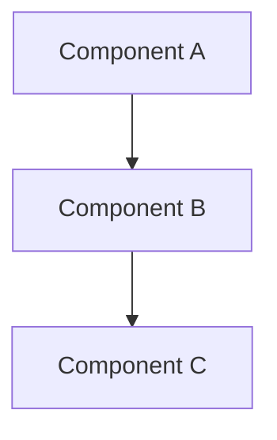
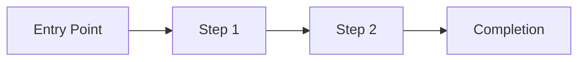

# Spec: {{TOPIC}}

**Status:** draft
**Created:** {{DATE}}
**Updated:** {{DATE}}
**Author:** {{AUTHOR}}
**From Brainstorm:** {{BRAINSTORM_LINK}}

---

## Overview

{{OVERVIEW}}

---

## User Stories

### Primary User Story

**As a** {{USER_TYPE}}
**I want** {{GOAL}}
**So that** {{BENEFIT}}

#### Acceptance Criteria

- [ ] {{CRITERION_1}}
- [ ] {{CRITERION_2}}
- [ ] {{CRITERION_3}}

### Secondary User Stories

{{SECONDARY_STORIES}}

---

## Technical Requirements

### Architecture

{{ARCHITECTURE_DESCRIPTION}}



### API Design

| Endpoint | Method | Description |
|----------|--------|-------------|
| `/api/{{RESOURCE}}` | GET | Get {{RESOURCE}} |
| `/api/{{RESOURCE}}` | POST | Create {{RESOURCE}} |
| `/api/{{RESOURCE}}/:id` | PUT | Update {{RESOURCE}} |
| `/api/{{RESOURCE}}/:id` | DELETE | Delete {{RESOURCE}} |

### Data Models

```
Model: {{MODEL_NAME}}
Fields:
  - id: uuid (primary key)
  - {{FIELD_1}}: {{TYPE_1}}
  - {{FIELD_2}}: {{TYPE_2}}
  - created_at: timestamp
  - updated_at: timestamp
```

### Dependencies

- [ ] {{DEPENDENCY_1}} - {{PURPOSE_1}}
- [ ] {{DEPENDENCY_2}} - {{PURPOSE_2}}

---

## UI/UX Specifications

### User Flow



### Wireframes

```
+---------------------------------------+
|  Header                               |
+---------------------------------------+
|                                       |
|  [Main Content Area]                  |
|                                       |
|  +-------------------------------+    |
|  | Input Field                   |    |
|  +-------------------------------+    |
|                                       |
|  [Primary Action Button]              |
|                                       |
+---------------------------------------+
|  Footer                               |
+---------------------------------------+
```

### Accessibility Checklist

- [ ] Keyboard navigation supported
- [ ] Screen reader compatible (ARIA labels)
- [ ] Color contrast meets WCAG AA (4.5:1 text, 3:1 UI)
- [ ] Focus indicators visible
- [ ] Touch targets >= 44x44px
- [ ] Error messages descriptive

---

## Open Questions

- [ ] {{QUESTION_1}}
- [ ] {{QUESTION_2}}

---

## Review Checklist

- [ ] All acceptance criteria are testable
- [ ] Technical requirements are complete and unambiguous
- [ ] Dependencies identified and available
- [ ] No blocking questions remain
- [ ] UI/UX flow validated
- [ ] Security considerations addressed
- [ ] Performance requirements defined
- [ ] Stakeholder approval obtained

---

## Implementation Notes

{{IMPLEMENTATION_NOTES}}

---

## History

| Date | Change | Author |
|------|--------|--------|
| {{DATE}} | Initial draft from brainstorm | {{AUTHOR}} |
